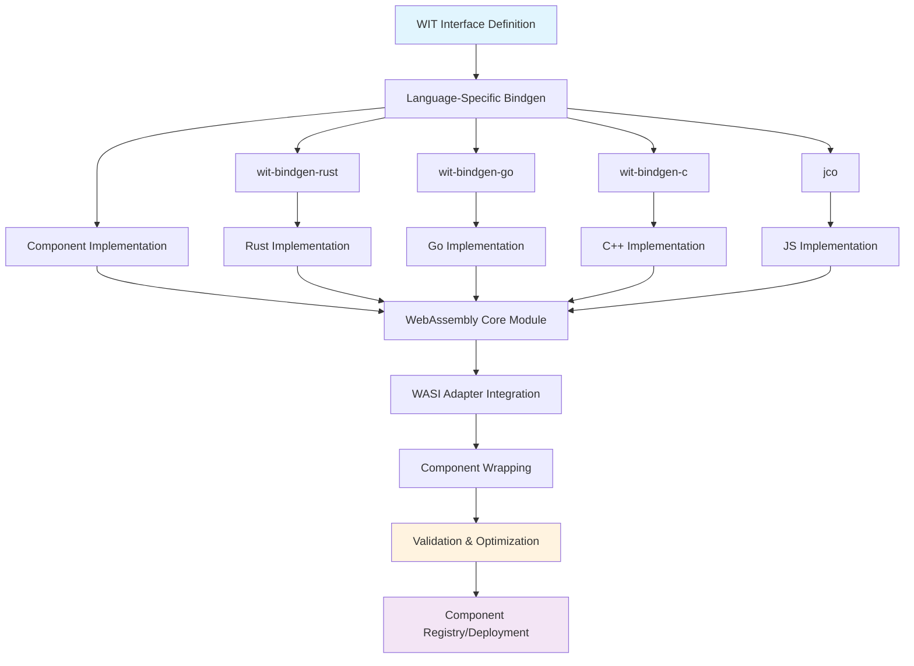
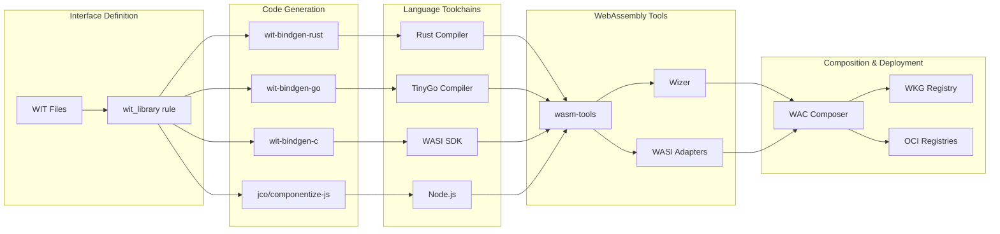
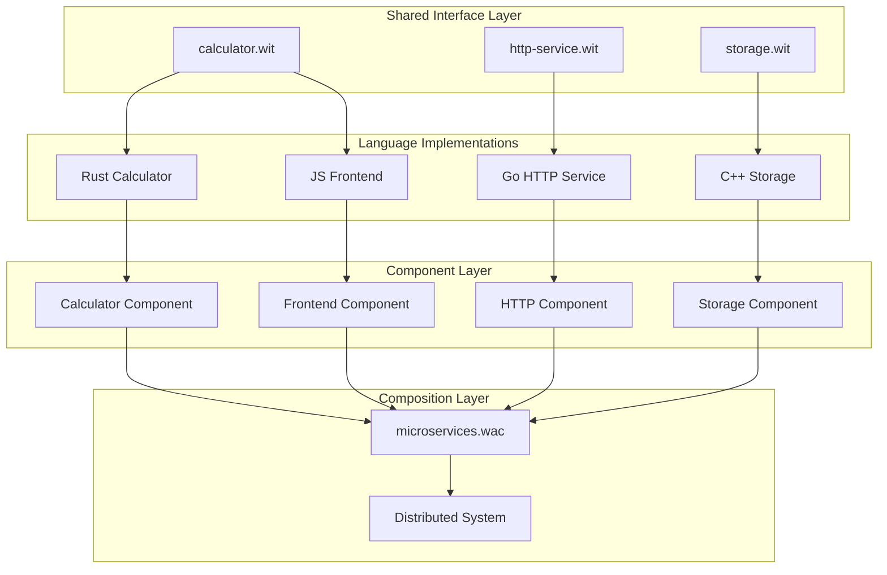
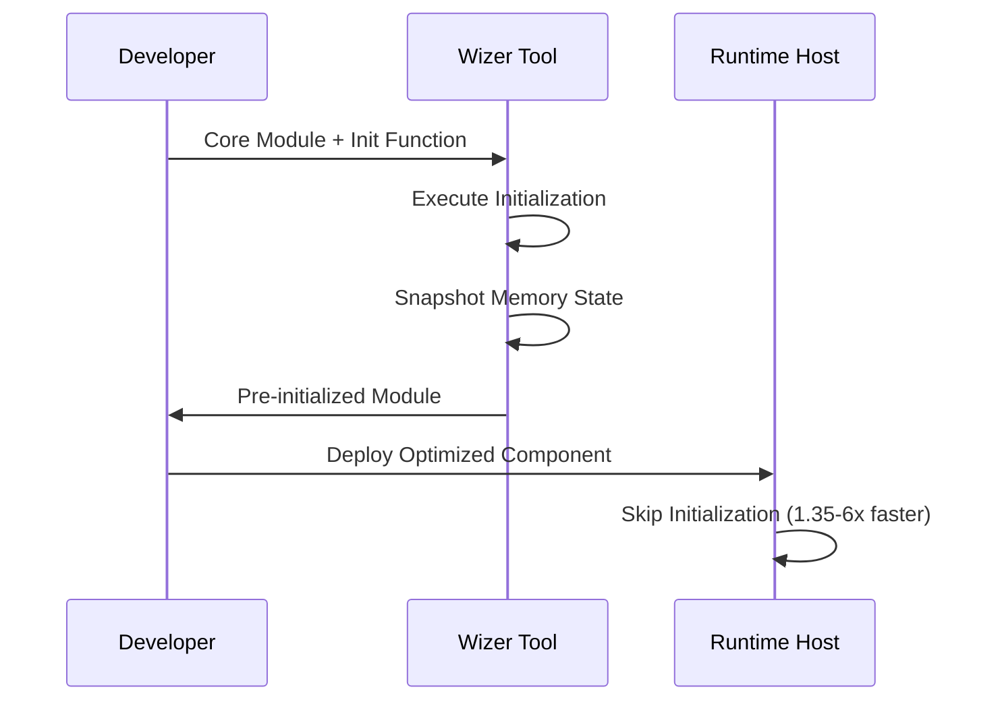
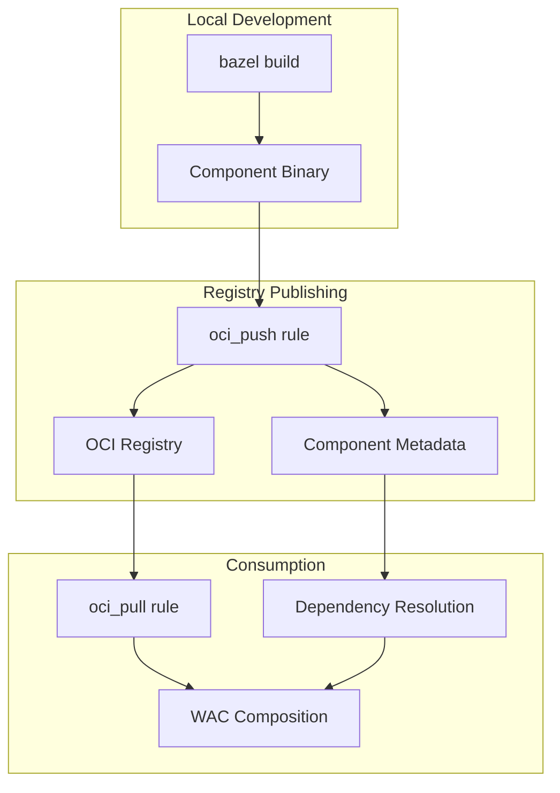

# WebAssembly Component Architecture

Understanding the complete development workflow from WIT interfaces to deployed components, including multi-language support and advanced composition patterns.

## Development Workflow Overview

The WebAssembly Component Model development process follows a structured pipeline that transforms high-level interface definitions into optimized, deployable components.

### Core Development Pipeline

### Tool Ecosystem

The build system orchestrates multiple specialized tools, each handling specific aspects of the component lifecycle:

## Language-Specific Implementation Flows

### Rust Component Development

The Rust workflow follows this pattern from the `examples/basic/BUILD.bazel` file:

1. **WIT Interface Processing**: The `wit_library` rule processes WIT files and validates interface definitions
2. **Binding Generation**: `rust_wasm_component_bindgen` generates Rust traits and types
3. **Component Implementation**: Developer implements the generated traits
4. **Module Compilation**: Rust compiler produces WebAssembly core module
5. **Component Wrapping**: `wasm-tools component new` wraps the module with component metadata
6. **Validation**: `wasm-tools validate` ensures component compliance

### Go Component Development

The Go workflow leverages TinyGo's WebAssembly support from the `examples/go_component/BUILD.bazel` file:

1. **WIT Processing**: Same `wit_library` rule as other languages
2. **Go Binding Generation**: `go_wit_bindgen` creates Go interfaces and types
3. **TinyGo Compilation**: TinyGo compiler with WASI Preview 2 target
4. **Adapter Integration**: WASI snapshot preview1 adapter for compatibility
5. **Component Assembly**: Same component wrapping process as Rust

### Multi-Language Architecture

## Advanced Features Integration

### Wizer Pre-initialization

The Wizer integration optimizes component startup by pre-initializing runtime state:

### Component Composition with WAC

The WebAssembly Composition (WAC) format enables building complex systems, as demonstrated in `examples/multi_profile/production.wac`:

1. **Component Registry**: Components stored in OCI registries or local builds
2. **Composition Definition**: WAC files describe component relationships
3. **Dependency Resolution**: Automatic component and dependency fetching
4. **Runtime Assembly**: Dynamic component linking and instantiation

### OCI Registry Integration

## Key Architectural Principles

### Hermetic Builds

All toolchains are automatically downloaded and cached by Bazel:

- **Language Toolchains**: Rust, TinyGo, WASI SDK managed as Bazel toolchains
- **WebAssembly Tools**: wasm-tools, wizer, wit-bindgen downloaded from releases
- **Cross-Platform**: Automatic platform detection and tool selection
- **Reproducible**: Exact version pinning ensures consistent builds

### Component Model Compliance

Every component produced follows WebAssembly Component Model specifications:

- **Interface Types**: Rich type system with records, variants, and resources
- **World Isolation**: Clear component boundaries and capabilities
- **WASI Integration**: Standardized system interface support
- **Versioning**: Semantic versioning for component interfaces

### Performance Optimization

Multiple optimization strategies are available:

- **Build-time**: Release optimizations, dead code elimination
- **Runtime**: Wizer pre-initialization, efficient memory layouts
- **Composition**: Lazy loading, dynamic linking strategies
- **Deployment**: Container registry caching, bandwidth optimization

This architecture enables building scalable, maintainable WebAssembly applications while preserving the benefits of strong typing, component isolation, and cross-language interoperability.