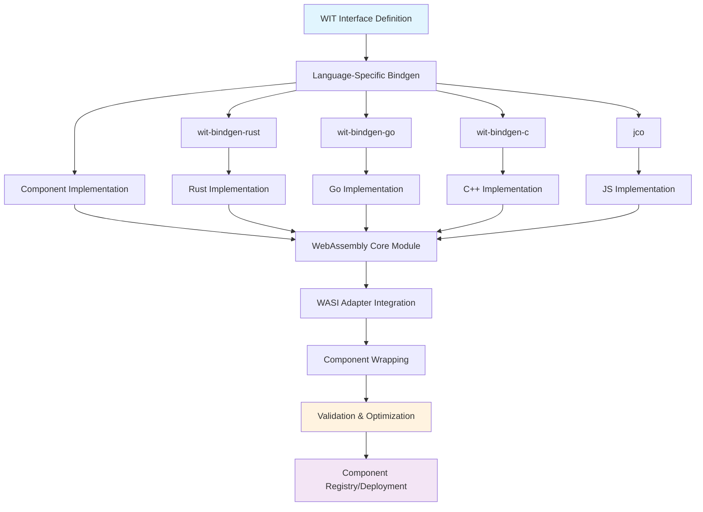
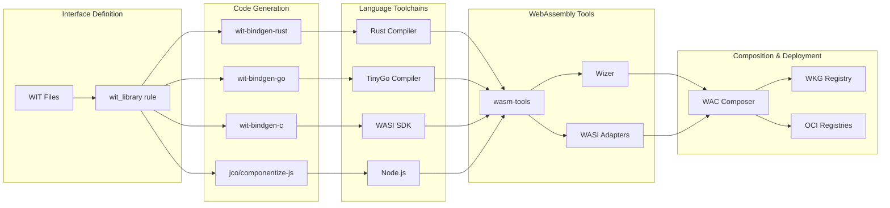
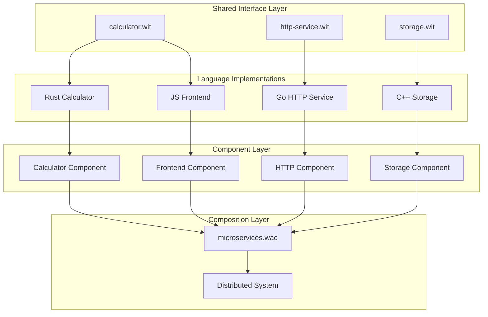
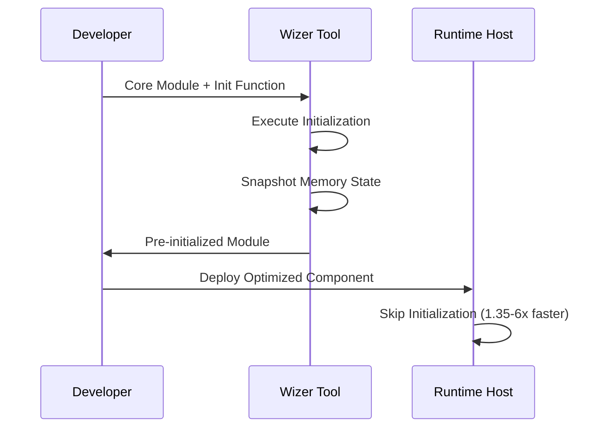
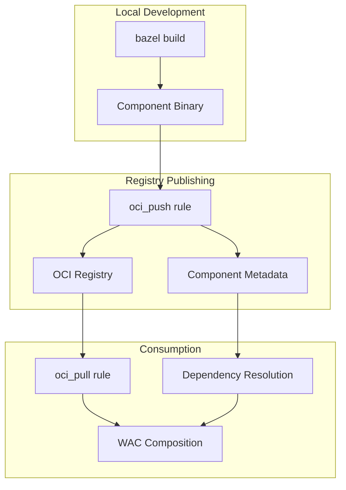

# WebAssembly Component Architecture

## The Big Picture

Think of WebAssembly components as **intelligent LEGO blocks for software**. Each block has clear interfaces (the "studs" and "holes"), can be built in any language, and connects perfectly with blocks built in other languages.

**What makes this architecture special:**
- **Language Freedom** - Write each component in the best language for the job
- **True Portability** - Same component runs everywhere WebAssembly is supported
- **Safe Composition** - Components can't interfere with each other
- **Easy Distribution** - Components are just files that can be stored anywhere

**Real-world analogy:** Imagine building a house where the foundation is written in Rust (for performance), the plumbing in Go (for simplicity), the electrical system in C++ (for hardware access), and the smart home controls in JavaScript (for web integration). All these parts work together perfectly because they follow the same "building code" (WebAssembly Component Model).

## How It All Works Together

Understanding the complete development workflow from WIT interfaces to deployed components, including multi-language support and advanced composition patterns.

## Development Workflow Overview

**The journey from code to component** follows a predictable path, regardless of which language you use. Here's what happens behind the scenes when you build a component.

### Core Development Pipeline

**This diagram shows the transformation process** - from your interface definition to a deployed component. Notice how different languages all converge to the same WebAssembly format:

### Tool Ecosystem

**Behind every component build is an orchestra of specialized tools.** Each tool has one job and does it well - the build system coordinates them all so you don't have to think about it:

**How the tools work together:**
- **Interface tools** parse your WIT files and validate the API contracts
- **Code generators** create language-specific bindings so your code can implement the interfaces
- **Language compilers** turn your implementation into WebAssembly modules
- **WebAssembly tools** package modules into components and optimize them
- **Composition tools** connect components together into applications

## Language-Specific Implementation Flows

**Each language has its own path to WebAssembly,** but they all end up at the same destination. Understanding these flows helps you pick the right language for your components and debug issues when they arise.

### Rust Component Development

**Rust has the most mature WebAssembly toolchain** and produces the smallest, fastest components. The process follows this pattern:

1. **WIT Interface Processing**: The `wit_library` rule processes WIT files and validates interface definitions
2. **Binding Generation**: `rust_wasm_component_bindgen` generates Rust traits and types
3. **Component Implementation**: Developer implements the generated traits
4. **Module Compilation**: Rust compiler produces WebAssembly core module
5. **Component Wrapping**: `wasm-tools component new` wraps the module with component metadata
6. **Validation**: `wasm-tools validate` ensures component compliance

### Go Component Development

**Go components use TinyGo instead of the standard Go compiler** because TinyGo is specifically designed for WebAssembly and embedded systems. The workflow is similar to Rust but with Go-specific tooling:

1. **WIT Processing**: Same `wit_library` rule as other languages
2. **Go Binding Generation**: `go_wit_bindgen` creates Go interfaces and types
3. **TinyGo Compilation**: TinyGo compiler with WASI Preview 2 target
4. **Adapter Integration**: WASI snapshot preview1 adapter for compatibility
5. **Component Assembly**: Same component wrapping process as Rust

### Multi-Language Architecture

**This is where the magic happens** - different languages implementing the same interfaces, creating components that can work together seamlessly. Each language brings its strengths to the table:

## Advanced Features Integration

**Beyond basic components,** the architecture supports sophisticated patterns for production systems.

### Wizer Pre-initialization

**Think of Wizer as "instant coffee" for WebAssembly components.** Instead of going through the startup process every time, Wizer "pre-brews" your component so it starts instantly:

**How it works:** Wizer runs your component's initialization code once during the build, takes a snapshot of the initialized state, and bakes that into the final component. When the component starts in production, it skips all the initialization and jumps straight to the ready state.

### Component Composition with WAC

**WAC (WebAssembly Composition) is like a blueprint for connecting components.** Just as an architect draws plans showing how rooms connect in a building, WAC files describe how components connect in an application:

1. **Component Registry**: Components stored in OCI registries or local builds
2. **Composition Definition**: WAC files describe component relationships
3. **Dependency Resolution**: Automatic component and dependency fetching
4. **Runtime Assembly**: Dynamic component linking and instantiation

### OCI Registry Integration

**Components can be stored and shared just like Docker images,** but without the container overhead. This enables easy distribution and version management:

## Key Architectural Principles

**These principles make the architecture reliable and predictable** for teams building production systems.

### Hermetic Builds

**"Hermetic" means completely self-contained - no surprises from different environments.** Your builds work the same way on your laptop, in CI, and on your teammate's machine:

- **Language Toolchains**: Rust, TinyGo, WASI SDK managed as Bazel toolchains
- **WebAssembly Tools**: wasm-tools, wizer, wit-bindgen downloaded from releases
- **Cross-Platform**: Automatic platform detection and tool selection
- **Reproducible**: Exact version pinning ensures consistent builds

### Component Model Compliance

**Standards compliance ensures your components work everywhere.** Following the WebAssembly Component Model spec means your components can interoperate with any other compliant component, regardless of language or toolchain:

- **Interface Types**: Rich type system with records, variants, and resources
- **World Isolation**: Clear component boundaries and capabilities
- **WASI Integration**: Standardized system interface support
- **Versioning**: Semantic versioning for component interfaces

### Performance Optimization

**The architecture is designed for performance at every level** - from build time to runtime. These optimizations happen automatically or can be configured based on your needs:

- **Build-time**: Release optimizations, dead code elimination
- **Runtime**: Wizer pre-initialization, efficient memory layouts
- **Composition**: Lazy loading, dynamic linking strategies
- **Deployment**: Container registry caching, bandwidth optimization

This architecture enables building scalable, maintainable WebAssembly applications while preserving the benefits of strong typing, component isolation, and cross-language interoperability.
