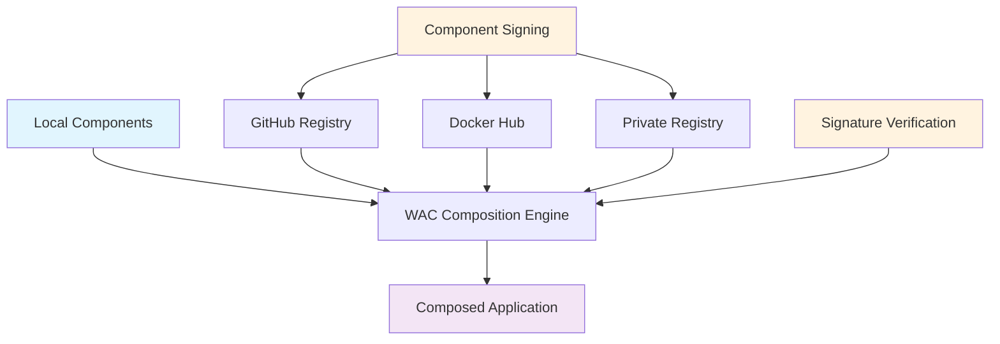

# WAC + OCI Registry Integration

Learn how to build sophisticated distributed WebAssembly applications by composing local components with remote components sourced from OCI (Open Container Initiative) registries.

## Overview

WAC + OCI integration enables:
- **🌐 Distributed Architecture** - Compose local and remote components seamlessly
- **📦 Component Reuse** - Share components across teams and organizations
- **🔐 Secure Distribution** - Cryptographic verification of remote components
- **⚡ Production Ready** - Enterprise-grade component distribution and composition

## Architecture Overview



**Key Insight:** WAC composition seamlessly integrates local build artifacts with remote registry components, enabling true distributed microservices architecture.

---

## Quick Start: Basic OCI Composition

### Step 1: Configure Registries

```python title="BUILD.bazel"
load("@rules_wasm_component//wkg:defs.bzl", "wkg_registry_config")

# Basic registry configuration
wkg_registry_config(
    name = "registries",
    default_registry = "github",
    registries = [
        "local|localhost:5000|oci",
        "github|ghcr.io|oci|env|GITHUB_TOKEN",
        "docker|docker.io|oci|env|DOCKER_TOKEN",
    ],
)
```

### Step 2: Pull Remote Components

```python title="BUILD.bazel"
load("@rules_wasm_component//wkg:defs.bzl", "wasm_component_from_oci")

# Pull authentication service from GitHub
wasm_component_from_oci(
    name = "auth_service",
    registry = "ghcr.io",
    namespace = "my-org",
    component_name = "auth-service",
    tag = "v1.0.0",
    registry_config = ":registries",
)

# Pull data service from Docker Hub
wasm_component_from_oci(
    name = "data_service",
    registry = "docker.io",
    namespace = "my-org",
    component_name = "data-service",
    tag = "latest",
    registry_config = ":registries",
)
```

### Step 3: Compose Local + Remote

```python title="BUILD.bazel"
load("@rules_wasm_component//wac:defs.bzl", "wac_compose_with_oci")

wac_compose_with_oci(
    name = "distributed_app",
    local_components = {
        "frontend": ":frontend_component",  # Built locally
        "gateway": ":gateway_component",    # Built locally
    },
    oci_components = {
        "auth": "ghcr.io/my-org/auth-service:v1.0.0",
        "data": "docker.io/my-org/data-service:latest",
    },
    composition = """
        package distributed:app@1.0.0;

        let frontend = new frontend:ui { ... };
        let gateway = new gateway:service { ... };
        let auth = new auth:service { ... };
        let data = new data:service { ... };

        // Connect frontend to gateway
        connect frontend.make-request -> gateway.handle-request;

        // Connect gateway to services
        connect gateway.authenticate -> auth.verify-token;
        connect gateway.fetch-data -> data.query;
        connect gateway.store-data -> data.save;

        // Export frontend as main interface
        export frontend as main;
    """,
    registry_config = ":registries",
)
```

---

## Advanced Composition Patterns

### Microservices Architecture

**Complete E-commerce System:**
```python title="BUILD.bazel"
wac_microservices_app(
    name = "ecommerce_platform",
    frontend_component = ":web_frontend",
    services = {
        # Core services from GitHub Container Registry
        "user_service": "ghcr.io/ecommerce/users:v2.0.0",
        "product_service": "ghcr.io/ecommerce/products:v1.8.0",
        "order_service": "ghcr.io/ecommerce/orders:v1.2.0",

        # Payment from Docker Hub
        "payment_service": "docker.io/payments/processor:v3.1.0",

        # Analytics from private registry
        "analytics_service": "registry.company.com/analytics:v1.0.0",
    },
    registry_config = ":production_registries",
    verify_signatures = True,
    trusted_keys = ":production_keys",
)
```

### Multi-Registry IoT Platform

**Edge + Cloud Architecture:**
```python title="BUILD.bazel"
wac_distributed_system(
    name = "iot_platform",
    components = {
        "local": {
            "gateway": ":edge_gateway_component",
            "device_manager": ":device_manager_component",
        },
        "oci": {
            # Core platform from GitHub
            "data_processor": "ghcr.io/iot/processor:v2.3.0",
            "alert_system": "ghcr.io/iot/alerts:v1.1.0",

            # Storage from AWS ECR
            "time_series_db": "123456789.dkr.ecr.us-west-2.amazonaws.com/timeseries:v2.0.0",

            # Analytics from Azure
            "ml_analytics": "myregistry.azurecr.io/iot/ml-engine:v1.5.0",
        },
    },
    composition_file = "compositions/iot-platform.wac",
    registry_config = ":multi_cloud_registries",
)
```

### Enterprise System with External Composition

**Using External WAC Files:**
```python title="BUILD.bazel"
wac_compose_with_oci(
    name = "enterprise_system",
    composition_file = "compositions/enterprise.wac",
    local_components = {
        "gateway": ":api_gateway_component",
        "frontend": ":admin_dashboard_component",
    },
    oci_components = {
        # Enterprise services
        "auth": "ghcr.io/enterprise/sso:v3.0.0",
        "audit": "ghcr.io/enterprise/audit-log:v1.5.0",
        "backup": "registry.company.com/backup:v2.0.0",
        "monitoring": "registry.company.com/monitoring:v1.8.0",
    },
    verify_signatures = True,
    trusted_keys = ":enterprise_keys",
)
```

---

## Registry Configuration

### Multi-Cloud Registry Setup

```python title="BUILD.bazel"
wkg_registry_config(
    name = "production_registries",
    cache_dir = "/tmp/wkg_cache",
    default_registry = "github",
    enable_mirror_fallback = True,
    registries = [
        # Local development
        "local|localhost:5000|oci",

        # GitHub Container Registry
        "github|ghcr.io|oci|env|GITHUB_TOKEN",

        # Docker Hub
        "docker|docker.io|oci|env|DOCKER_TOKEN",

        # AWS Elastic Container Registry
        "aws|123456789.dkr.ecr.us-west-2.amazonaws.com|oci|oauth|client_id|client_secret",

        # Azure Container Registry
        "azure|myregistry.azurecr.io|oci|basic|username|password",

        # Private corporate registry
        "corp|registry.company.com|oci|env|CORP_REGISTRY_TOKEN",
    ],
    timeout_seconds = 60,
)
```

### Development vs Production Registries

```python title="BUILD.bazel"
# Development configuration
wkg_registry_config(
    name = "dev_registries",
    default_registry = "local",
    registries = [
        "local|localhost:5000|oci",
        "github|ghcr.io|oci|env|GITHUB_TOKEN",
    ],
)

# Production configuration with enhanced security
wkg_registry_config(
    name = "prod_registries",
    default_registry = "corp",
    enable_signature_verification = True,
    registries = [
        "corp|registry.company.com|oci|env|CORP_TOKEN",
        "github|ghcr.io|oci|env|GITHUB_TOKEN",
        "docker|docker.io|oci|env|DOCKER_TOKEN",
    ],
    timeout_seconds = 30,
)
```

---

## Component Interface Design for Composition

### Service Interface Definition

```wit title="wit/services.wit"
package enterprise:services@1.0.0;

// Authentication service interface
interface auth {
    verify-token: func(token: string) -> result<user-info, auth-error>;
    refresh-token: func(refresh-token: string) -> result<string, auth-error>;

    record user-info {
        id: string,
        email: string,
        roles: list<string>,
    }

    variant auth-error {
        invalid-token,
        expired-token,
        service-unavailable,
    }
}

// Data service interface
interface data {
    query: func(sql: string) -> result<list<record>, data-error>;
    save: func(data: record) -> result<string, data-error>;

    record record {
        id: string,
        data: string,
        timestamp: u64,
    }

    variant data-error {
        invalid-query,
        connection-failed,
        permission-denied,
    }
}

// Gateway service exports
interface gateway {
    handle-request: func(request: http-request) -> http-response;

    record http-request {
        method: string,
        path: string,
        headers: list<tuple<string, string>>,
        body: option<list<u8>>,
    }

    record http-response {
        status: u32,
        headers: list<tuple<string, string>>,
        body: option<list<u8>>,
    }
}

// Complete service world
world service {
    export gateway;
    import auth;
    import data;
}
```

### External Composition File

```shell title="compositions/enterprise.wac"
// Enterprise-grade system composition
package enterprise:system@1.0.0;

// Instantiate local components
let gateway = new gateway:service {
    // Gateway configuration
    max_connections: 1000,
    timeout_seconds: 30,
    ...
};

let frontend = new frontend:ui {
    // Frontend configuration
    theme: "corporate",
    api_endpoint: "https://api.company.com",
    ...
};

// Instantiate OCI components
let auth = new auth:service {
    // SSO configuration
    provider: "active-directory",
    domain: "company.com",
    ...
};

let audit = new audit:service {
    // Audit configuration
    retention_days: 2555,  // 7 years
    encryption: true,
    ...
};

let backup = new backup:service {
    // Backup configuration
    schedule: "0 2 * * *",  // Daily at 2 AM
    retention: "30d",
    ...
};

let monitoring = new monitoring:service {
    // Monitoring configuration
    metrics_interval: 60,
    alert_threshold: 0.95,
    ...
};

// Core application flow
connect frontend.api-request -> gateway.handle-request;
connect gateway.authenticate -> auth.verify-token;

// Security and compliance
connect gateway.audit-log -> audit.log-request;
connect auth.audit-event -> audit.log-auth-event;

// Data protection
connect gateway.backup-trigger -> backup.schedule-backup;
connect backup.backup-complete -> audit.log-system-event;

// Monitoring and alerting
connect gateway.metrics -> monitoring.collect-metrics;
connect auth.health-check -> monitoring.service-health;
connect backup.health-check -> monitoring.service-health;

// Health monitoring endpoints
connect monitoring.alert -> gateway.send-alert;

// Export main interfaces
export frontend as main;
export {
    gateway.health-check as health,
    audit.get-logs as audit-logs,
    backup.get-status as backup-status,
    monitoring.get-metrics as metrics,
} as admin;
```

---

## Security and Verification

### Signature Verification for OCI Components

```python title="BUILD.bazel"
# Compose with mandatory signature verification
wac_compose_with_oci(
    name = "secure_system",
    oci_components = {
        "auth": "ghcr.io/trusted-org/auth:v1.0.0",
        "data": "ghcr.io/trusted-org/data:v1.0.0",
    },
    verify_signatures = True,
    trusted_keys = ":production_verification_keys",

    # Reject any unsigned components
    require_signed_components = True,

    # Additional security policies
    allowed_registries = [
        "ghcr.io/trusted-org/*",
        "registry.company.com/*",
    ],
)
```

### Multi-Stage Verification

```python title="BUILD.bazel"
# Development - permissive verification
wac_compose_with_oci(
    name = "dev_system",
    oci_components = {
        "auth": "localhost:5000/auth:latest",
    },
    verify_signatures = False,  # Development convenience
    registry_config = ":dev_registries",
)

# Staging - partial verification
wac_compose_with_oci(
    name = "staging_system",
    oci_components = {
        "auth": "ghcr.io/org/auth:staging",
    },
    verify_signatures = True,
    trusted_keys = ":staging_keys",
    registry_config = ":staging_registries",
)

# Production - strict verification
wac_compose_with_oci(
    name = "prod_system",
    oci_components = {
        "auth": "ghcr.io/org/auth:v1.0.0",
    },
    verify_signatures = True,
    trusted_keys = ":production_keys",
    require_signed_components = True,
    allowed_registries = ["ghcr.io/org/*"],
    registry_config = ":prod_registries",
)
```

---

## Development Workflow

### Local Development with Mock Services

```python title="BUILD.bazel"
# Development composition with local mocks
wac_compose(
    name = "dev_app",
    components = {
        ":frontend_component": "frontend:ui",
        ":mock_auth": "mock:auth",
        ":mock_data": "mock:data",
    },
    composition = """
        package dev:app@1.0.0;

        let frontend = new frontend:ui { ... };
        let auth = new mock:auth { ... };
        let data = new mock:data { ... };

        connect frontend.authenticate -> auth.dev-login;
        connect frontend.fetch-data -> data.mock-query;

        export frontend as main;
    """,
)
```

### Integration Testing with Real Services

```python title="BUILD.bazel"
# Integration testing composition
wac_compose_with_oci(
    name = "integration_test",
    local_components = {
        "frontend": ":frontend_component",
    },
    oci_components = {
        "auth": "ghcr.io/org/auth:integration",
        "data": "ghcr.io/org/data:integration",
    },
    registry_config = ":integration_registries",
    verify_signatures = True,
    trusted_keys = ":integration_keys",
)
```

### Deployment Pipeline

```bash title="scripts/deploy.sh"
#!/bin/bash

# Build local components
bazel build //src:frontend_component //src:gateway_component

# Integration test with OCI services
bazel build //deploy:integration_test

# Build production composition
bazel build //deploy:prod_system

# Validate complete system
bazel build //deploy:validate_prod_system

# Deploy to production
bazel run //deploy:push_to_production
```

---

## Performance and Optimization

### Caching Strategy

```python title="BUILD.bazel"
wkg_registry_config(
    name = "optimized_registries",
    # Local cache for faster rebuilds
    cache_dir = "/var/cache/wkg",

    # Enable aggressive caching
    cache_ttl_hours = 24,

    # Parallel downloads
    max_concurrent_downloads = 10,

    # Enable compression
    enable_compression = True,

    registries = [
        "github|ghcr.io|oci|env|GITHUB_TOKEN",
        "docker|docker.io|oci|env|DOCKER_TOKEN",
    ],
)
```

### Selective Component Updates

```python title="BUILD.bazel"
# Update only specific services
wac_compose_with_oci(
    name = "partial_update",
    local_components = {
        "frontend": ":frontend_component",  # Always latest local build
    },
    oci_components = {
        "auth": "ghcr.io/org/auth:v1.0.0",      # Pinned stable version
        "data": "ghcr.io/org/data:v1.2.0",      # Updated version
        "legacy": "ghcr.io/org/legacy:v0.8.0",  # Legacy stable version
    },
    # Only pull updated components
    update_policy = "changed",
)
```

---

## Monitoring and Observability

### Component Health Monitoring

```wit title="wit/monitoring.wit"
package monitoring:health@1.0.0;

interface health {
    // Health check for composed systems
    check-component-health: func(component-id: string) -> health-status;
    check-system-health: func() -> system-health;

    record health-status {
        status: health-state,
        message: string,
        timestamp: u64,
        metrics: list<metric>,
    }

    record system-health {
        overall-status: health-state,
        component-statuses: list<tuple<string, health-status>>,
        composition-info: composition-metadata,
    }

    variant health-state {
        healthy,
        degraded,
        unhealthy,
        unknown,
    }

    record metric {
        name: string,
        value: f64,
        unit: string,
    }

    record composition-metadata {
        local-components: list<string>,
        oci-components: list<string>,
        registries: list<string>,
        signature-verified: bool,
    }
}
```

### Distributed Tracing

```python title="BUILD.bazel"
# Add tracing to composition
wac_compose_with_oci(
    name = "traced_system",
    oci_components = {
        "auth": "ghcr.io/org/auth:v1.0.0",
        "data": "ghcr.io/org/data:v1.0.0",
        "tracing": "ghcr.io/observability/jaeger:v1.0.0",
    },
    composition = """
        // Add tracing connections
        connect auth.trace-event -> tracing.collect-trace;
        connect data.trace-event -> tracing.collect-trace;
        connect gateway.trace-event -> tracing.collect-trace;
    """,
)
```

---

## Troubleshooting

### Common Issues

**Issue 1: Registry Authentication Failure**
```bash
# Check environment variables
echo $GITHUB_TOKEN
echo $DOCKER_TOKEN

# Test registry connectivity
curl -H "Authorization: Bearer $GITHUB_TOKEN" https://ghcr.io/v2/

# Verify registry configuration
bazel build //config:registries --verbose_failures
```

**Issue 2: Component Interface Mismatch**
```bash
# Compare component interfaces
wasm-tools component wit local_component.wasm
wasm-tools component wit remote_component.wasm

# Check composition compatibility
wac compose --dry-run composition.wac
```

**Issue 3: Signature Verification Failure**
```bash
# Check component signatures
wasm-tools component section remote_component.wasm

# Manually verify signature
wasmsign2 verify remote_component.wasm --public-key public.pem

# Debug registry pulling
export WKG_LOG_LEVEL=debug
bazel build //app:pull_component --verbose_failures
```

### Performance Debugging

```bash
# Enable detailed logging
export WAC_LOG_LEVEL=debug
export WKG_LOG_LEVEL=debug

# Profile composition performance
time bazel build //app:complex_composition

# Check cache utilization
ls -la /var/cache/wkg/
```

WAC + OCI integration provides a powerful foundation for building distributed, secure, and scalable WebAssembly applications that span multiple registries and deployment environments.
