# Multi-Language System

A comprehensive example demonstrating how to compose WebAssembly components written in different programming languages into a cohesive system.

## Architecture Overview

This example showcases a microservices-like architecture where each component is written in a different language:

```mermaid
graph TB
    subgraph "Multi-Language Component System"
        A[Rust Authentication] --> D[Go HTTP Gateway]
        B[C++ Math Engine] --> D
        C[JavaScript UI Handler] --> D
        D --> E[Database Service]
        D --> F[External APIs]
    end

    subgraph "Languages Used"
        G[🦀 Rust - Auth & Security]
        H[🐹 Go - HTTP & Networking]
        I[⚡ C++ - Performance Critical]
        J[🟨 JavaScript - UI Logic]
    end
```



## Components

### 1. Authentication Service (Rust)

High-security authentication with cryptographic operations:

```rust
// auth-service/src/lib.rs
use jwt_simple::prelude::*;
use argon2::{Argon2, PasswordHash, PasswordHasher, PasswordVerifier};

wit_bindgen::generate!({
    world: "auth-service",
    path: "wit/auth.wit"
});

export!(AuthService);

struct AuthService;

impl Guest for AuthService {
    fn authenticate(username: String, password: String) -> Result<String, AuthError> {
        // Verify password using Argon2
        let parsed_hash = PasswordHash::new(&get_stored_hash(&username)?)
            .map_err(|_| AuthError::InvalidCredentials)?;

        Argon2::default()
            .verify_password(password.as_bytes(), &parsed_hash)
            .map_err(|_| AuthError::InvalidCredentials)?;

        // Generate JWT token
        let claims = JWTClaims {
            subject: username,
            issued_at: now(),
            expires_at: now() + Duration::from_hours(24),
        };

        let key = HS256Key::from_bytes(&get_secret_key());
        key.authenticate(claims)
            .map_err(|_| AuthError::TokenGeneration)
    }
}
```

### 2. Math Engine (C++)

Performance-critical mathematical computations:

```cpp
// math-engine/src/math_engine.cpp
#include <cmath>
#include <vector>
#include <algorithm>
#include <execution>

#include "math_engine.h"

extern "C" {
    // Matrix operations with SIMD optimization
    double* matrix_multiply(const double* a, const double* b,
                           size_t rows_a, size_t cols_a, size_t cols_b) {
        auto result = new double[rows_a * cols_b]();

        // Parallel matrix multiplication
        std::transform(
            std::execution::par_unseq,
            a, a + (rows_a * cols_a),
            result,
            [&](const double& val) -> double {
                // Vectorized operations here
                return compute_element(a, b, /* indices */);
            }
        );

        return result;
    }

    // Statistical functions
    double compute_stddev(const double* data, size_t len) {
        double mean = std::reduce(
            std::execution::par_unseq,
            data, data + len
        ) / len;

        double variance = std::transform_reduce(
            std::execution::par_unseq,
            data, data + len,
            0.0,
            std::plus<double>(),
            [mean](double x) { return (x - mean) * (x - mean); }
        ) / (len - 1);

        return std::sqrt(variance);
    }
}
```

### 3. HTTP Gateway (Go)

High-performance HTTP routing and middleware:

```go
// http-gateway/src/main.go
package main

import (
    "encoding/json"
    "fmt"
    "context"
    "time"
)

//go:export handle-request
func handleRequest(method, path string, headers []Header, body []byte) *Response {
    ctx := context.Background()

    // Route to appropriate service
    switch {
    case path == "/api/auth/login":
        return handleAuth(ctx, method, body)
    case path == "/api/math/compute":
        return handleMath(ctx, method, body)
    case path == "/api/ui/render":
        return handleUI(ctx, method, body)
    default:
        return notFoundResponse()
    }
}

func handleAuth(ctx context.Context, method string, body []byte) *Response {
    if method != "POST" {
        return methodNotAllowedResponse()
    }

    var req AuthRequest
    if err := json.Unmarshal(body, &req); err != nil {
        return badRequestResponse("Invalid JSON")
    }

    // Call Rust authentication service
    token, err := authService.Authenticate(req.Username, req.Password)
    if err != nil {
        return unauthorizedResponse(err.Error())
    }

    return jsonResponse(200, AuthResponse{Token: token})
}

func handleMath(ctx context.Context, method string, body []byte) *Response {
    // Call C++ math engine
    result := mathEngine.Compute(/* parameters */)
    return jsonResponse(200, result)
}
```

### 4. UI Handler (JavaScript)

Client-side logic and DOM manipulation:

```javascript
// ui-handler/src/main.js
import { render, html } from 'lit-html';

// Export functions for the component interface
export function renderDashboard(userData, mathResults) {
    const template = html`
        <div class="dashboard">
            <header class="user-info">
                <h1>Welcome, ${userData.username}!</h1>
                <button @click=${logout}>Logout</button>
            </header>

            <section class="math-results">
                <h2>Computation Results</h2>
                ${mathResults.map(result => html`
                    <div class="result-card">
                        <h3>${result.operation}</h3>
                        <p>Result: ${result.value}</p>
                        <small>Computed in ${result.duration}ms</small>
                    </div>
                `)}
            </section>
        </div>
    `;

    return template.strings.join('');
}

export function handleUserAction(action, data) {
    switch (action) {
        case 'compute':
            return { type: 'math-request', payload: data };
        case 'refresh':
            return { type: 'data-refresh' };
        default:
            return { type: 'unknown-action', error: 'Unknown action' };
    }
}

function logout() {
    // Clear local state and redirect
    return { type: 'logout' };
}
```

## WAC Composition

The system is composed using WAC (WebAssembly Compositions):

```yaml
# composition.wac
package multi-language:system@1.0.0;

world composed-system {
  import auth-service: auth-service;
  import math-engine: math-engine;
  import ui-handler: ui-handler;

  export gateway: gateway;
}

instantiate auth = auth-service-component with [];
instantiate math = math-engine-component with [];
instantiate ui = ui-handler-component with [];
instantiate gateway = http-gateway-component with [
  (import "auth" (instance auth))
  (import "math" (instance math))
  (import "ui" (instance ui))
];

export gateway;
```

## BUILD Configuration

```starlark
load("@rules_wasm_component//rust:defs.bzl", "rust_wasm_component")
load("@rules_wasm_component//cpp:defs.bzl", "cpp_component")
load("@rules_wasm_component//go:defs.bzl", "go_wasm_component")
load("@rules_wasm_component//js:defs.bzl", "js_wasm_component")
load("@rules_wasm_component//wac:defs.bzl", "wac_compose")

# Individual language components
rust_wasm_component(
    name = "auth_service_component",
    srcs = ["auth-service/src/lib.rs"],
    wit = "wit/auth.wit",
    world = "auth-service",
    optimization = "release",
    features = ["crypto", "jwt"],
)

cpp_component(
    name = "math_engine_component",
    srcs = ["math-engine/src/math_engine.cpp"],
    wit = "wit/math.wit",
    world = "math-engine",
    cxx_std = "c++20",
    optimize = True,
    copts = ["-march=native", "-O3"],
)

go_wasm_component(
    name = "http_gateway_component",
    srcs = ["http-gateway/src/main.go"],
    wit = "wit/gateway.wit",
    world = "gateway",
    optimize = True,
)

js_wasm_component(
    name = "ui_handler_component",
    srcs = ["ui-handler/src/main.js"],
    wit = "wit/ui.wit",
    world = "ui-handler",
    npm_deps = ["lit-html"],
)

# Composed system
wac_compose(
    name = "multi_language_system",
    composition = "composition.wac",
    components = [
        ":auth_service_component",
        ":math_engine_component",
        ":http_gateway_component",
        ":ui_handler_component",
    ],
)
```

## Building and Testing

```bash
# Build individual components
bazel build //examples/multi-language:auth_service_component
bazel build //examples/multi-language:math_engine_component
bazel build //examples/multi-language:http_gateway_component
bazel build //examples/multi-language:ui_handler_component

# Build composed system
bazel build //examples/multi-language:multi_language_system

# Run integration tests
bazel test //examples/multi-language:integration_test

# Validate composition
bazel run //tools:wac -- validate \\
  bazel-bin/examples/multi-language/multi_language_system.wasm
```

## Performance Characteristics

### Language-Specific Optimizations

| Language | Use Case | Performance Benefit |
|----------|----------|-------------------|
| **Rust** | Security, Memory Safety | Zero-cost abstractions, memory safety |
| **C++** | Compute-Heavy Operations | Native performance, SIMD optimization |
| **Go** | Networking, Concurrency | Efficient HTTP handling, fast compilation |
| **JavaScript** | UI Logic, DOM Operations | Familiar APIs, rapid development |

### System-Level Benefits

- **Modularity**: Each component can be developed, tested, and deployed independently
- **Language Expertise**: Teams can use their preferred languages for specific tasks
- **Performance**: Critical paths use optimal languages (C++ for math, Rust for security)
- **Maintainability**: Clear component boundaries and interfaces

## Production Considerations

### Monitoring and Observability

```starlark
# Add telemetry to each component
wac_compose(
    name = "production_system",
    composition = "composition.wac",
    components = [...],
    telemetry = True,
    metrics = ["latency", "memory", "cpu"],
)
```

### Security

- Rust component handles all cryptographic operations
- C++ component runs in isolated memory space
- JavaScript component has limited system access
- Go component provides secure HTTP boundaries

## Next Steps

- [Performance Optimization](/production/performance/) - Add Wizer pre-initialization
- [OCI Publishing](/production/publishing/) - Distribute composed systems
- [Component Signing](/security/component-signing/) - Secure multi-component deployments
