# External WIT Dependencies

Learn how to add and manage external WebAssembly Interface Type (WIT) dependencies in your component projects using Bazel-native dependency management.

## Overview

When building WebAssembly components, you often need to import external WIT interfaces such as:

- **WASI interfaces** (io, filesystem, http, etc.)
- **Third-party component APIs**
- **Shared interface definitions** across projects
- **Standardized protocols** and schemas

This guide shows how to manage these dependencies using Bazel's hermetic, reproducible approach instead of external package managers.

## Overview: How to Get WIT Files

There are several ways to obtain and use external WIT files in your project. Choose the method that best fits your source and requirements:

### Method 1: Local WIT Files
**Best for:** Your own interfaces, local development, vendored dependencies

```python title="BUILD.bazel"
# Simple local WIT files
wit_library(
    name = "my_interfaces",
    srcs = ["interfaces/my-api.wit"],
    package_name = "myorg:api@1.0.0",
)
```

### Method 2: HTTP Archive (http_archive)
**Best for:** GitHub releases, public repositories, versioned archives

```python title="MODULE.bazel or WORKSPACE"
load("@bazel_tools//tools/build_defs/repo:http.bzl", "http_archive")

http_archive(
    name = "external_wit_interfaces",
    urls = ["https://github.com/org/wit-interfaces/archive/v1.0.0.tar.gz"],
    sha256 = "abcd1234...",
    strip_prefix = "wit-interfaces-1.0.0",
    build_file_content = '''
load("@rules_wasm_component//wit:defs.bzl", "wit_library")
wit_library(
    name = "api",
    srcs = glob(["**/*.wit"]),
    package_name = "org:api@1.0.0",
    visibility = ["//visibility:public"],
)
''',
)
```

### Method 3: WKG Registry
**Best for:** Published component packages, official WASI interfaces, component ecosystem

```python title="BUILD.bazel"
# Pull from WKG registry (WebAssembly Component Registry)
load("@rules_wasm_component//wkg:defs.bzl", "wkg_wit_deps")

wkg_wit_deps(
    name = "registry_interfaces",
    packages = [
        "wasi:io@0.2.3",
        "wasi:http@0.2.3",
        "bytecodealliance:preview2-adapter@0.1.0",
    ],
    registry = "registry.wasm.org",  # Default WKG registry
)
```

### Method 4: Git Repository
**Best for:** Development versions, internal repositories, specific commits

```python title="MODULE.bazel"
load("@bazel_tools//tools/build_defs/repo:git.bzl", "git_repository")

git_repository(
    name = "wit_from_git",
    remote = "https://github.com/org/interfaces.git",
    branch = "main",  # or commit = "abc123..."
    build_file_content = '''
load("@rules_wasm_component//wit:defs.bzl", "wit_library")
wit_library(
    name = "interfaces",
    srcs = glob(["wit/**/*.wit"]),
    package_name = "org:interfaces@dev",
    visibility = ["//visibility:public"],
)
''',
)
```

### Method 5: HTTP File (Single WIT Files)
**Best for:** Individual interface files, simple dependencies

```python title="MODULE.bazel"
load("@bazel_tools//tools/build_defs/repo:http.bzl", "http_file")

http_file(
    name = "single_wit_interface",
    urls = ["https://raw.githubusercontent.com/org/repo/main/interface.wit"],
    sha256 = "def5678...",
    downloaded_file_path = "interface.wit",
)

# In BUILD.bazel:
wit_library(
    name = "single_interface",
    srcs = ["@single_wit_interface//file:interface.wit"],
    package_name = "org:interface@1.0.0",
)
```

### Comparison Matrix

| Method | Use Case | Pros | Cons |
|--------|----------|------|------|
| **Local Files** | Own interfaces, development | Simple, fast iteration | No versioning, not shared |
| **HTTP Archive** | GitHub releases, public repos | Versioned, cacheable, reproducible | Manual setup, SHA256 required |
| **WKG Registry** | Published components | Official packages, automatic deps | Limited to published packages |
| **Git Repository** | Development, internal repos | Latest code, flexible | Can break, slower builds |
| **HTTP File** | Single files | Simple for single interfaces | Not suitable for packages |

### WIT Dependencies Flow

This diagram shows where WIT files come from and how they integrate into your project:

```mermaid
graph TB
    subgraph "External Sources"
        LOCAL["📁 Local Files"]
        GITHUB["🐙 GitHub Archives"]
        WKG["📦 WKG Registry"]
        GIT["🌿 Git Repos"]
        HTTP["🌐 HTTP Files"]
    end

    subgraph "Bazel Workspace"
        subgraph "External Repositories"
            EXT1["@external_wit_interfaces"]
            EXT2["@wasi_interfaces"]
            EXT3["@company_apis"]
            EXT4["@single_interface"]
        end

        subgraph "Your Project"
            BUILD["BUILD.bazel"]
            WIT["your-component.wit"]
            COMP["Component Implementation"]
        end
    end

    subgraph "Build Process"
        BINDGEN["wit-bindgen"]
        RUSTC["Rust Compiler"]
        WASMTOOLS["wasm-tools"]
        FINAL["📦 Final Component"]
    end

    %% Source to External Repo flows
    GITHUB -->|http_archive| EXT1
    WKG -->|wkg_wit_deps| EXT2
    GIT -->|git_repository| EXT3
    HTTP -->|http_file| EXT4
    LOCAL -->|Direct reference| BUILD

    %% External repos to project
    EXT1 --> BUILD
    EXT2 --> BUILD
    EXT3 --> BUILD
    EXT4 --> BUILD

    %% Project internal flow
    BUILD --> WIT
    WIT --> COMP

    %% Build process
    BUILD --> BINDGEN
    BINDGEN --> RUSTC
    RUSTC --> WASMTOOLS
    WASMTOOLS --> FINAL

    %% Styling
    style LOCAL fill:#e1f5fe
    style GITHUB fill:#f3e5f5
    style WKG fill:#fff3e0
    style GIT fill:#e8f5e8
    style HTTP fill:#fce4ec
    style FINAL fill:#e8f5e8,stroke:#4caf50,stroke-width:3px
```



**Key Insights:**
- **Multiple sources** can feed into the same project
- **External repositories** (@name) isolate dependencies
- **BUILD files** wire everything together with `wit_library` rules
- **Import statements** in WIT files reference the external interfaces
- **Build process** resolves all dependencies automatically

## Quick Start

### 1. Built-in WASI Dependencies

The most common external dependencies are WASI interfaces. These are pre-configured and ready to use:

```python title="MODULE.bazel"
# Enable WASI WIT interfaces
wasi_wit_ext = use_extension("@rules_wasm_component//wasm:extensions.bzl", "wasi_wit")
wasi_wit_ext.init()
use_repo(wasi_wit_ext,
    "wasi_io", "wasi_cli", "wasi_clocks", "wasi_random",           # Core WASI
    "wasi_filesystem", "wasi_sockets", "wasi_http",               # Advanced WASI
    "wasi_nn", "wasi_nn_v0_2_0_rc_2024_08_19", "wasi_nn_v0_2_0_rc_2024_06_25"  # Neural Network
)
```

```starlark title="BUILD.bazel"
load("@rules_wasm_component//wit:defs.bzl", "wit_library")

wit_library(
    name = "my_component_wit",
    srcs = ["my-component.wit"],
    deps = ["@wasi_io//:streams"],  # Use WASI IO streams
)
```

```wit title="my-component.wit"
package example:my-component@1.0.0;

world my-world {
    import wasi:io/streams@0.2.3;  // Import external interface
    export my-api;
}
```

### 2. Adding Custom External Dependencies

For your own external WIT packages:

```python title="your-project-deps.bzl"
load("@bazel_tools//tools/build_defs/repo:http.bzl", "http_archive")

def load_my_wit_deps():
    http_archive(
        name = "my_external_wit",
        urls = ["https://github.com/myorg/wit-interfaces/archive/v1.0.0.tar.gz"],
        sha256 = "abcd1234...",  # Calculate with: curl -L url | sha256sum
        strip_prefix = "wit-interfaces-1.0.0",
        build_file_content = '''
load("@rules_wasm_component//wit:defs.bzl", "wit_library")

wit_library(
    name = "api",
    srcs = glob(["**/*.wit"]),
    package_name = "myorg:api@1.0.0",
    visibility = ["//visibility:public"],
)
''',
    )
```

## Available WASI Interfaces

The following WASI interfaces are pre-configured and available with dual version support for maximum compatibility:

### WASI 0.2.3 (Latest - Full Feature Set)

| Package | Target | Interfaces | Description |
|---------|--------|-------------|-------------|
| `@wasi_io//:streams` | `wasi:io@0.2.3` | `error`, `poll`, `streams` | I/O streams, error handling, polling |
| `@wasi_cli//:cli` | `wasi:cli@0.2.3` | `environment`, `exit`, `stdin`, `stdout`, `stderr`, `terminal-*` | CLI environment, standard I/O streams |
| `@wasi_clocks//:clocks` | `wasi:clocks@0.2.3` | `wall-clock`, `monotonic-clock` | System time and timing operations |
| `@wasi_random//:random` | `wasi:random@0.2.3` | `random`, `insecure`, `insecure-seed` | Random number generation |
| `@wasi_filesystem//:filesystem` | `wasi:filesystem@0.2.3` | `types`, `preopens` | File system operations ⚠️ |
| `@wasi_sockets//:sockets` | `wasi:sockets@0.2.3` | `network`, `udp`, `tcp`, `ip-name-lookup` | Network operations ⚠️ |
| `@wasi_http//:http` | `wasi:http@0.2.3` | `types`, `handler`, `outgoing-handler`, `proxy` | HTTP client/server ⚠️ |

### WASI-NN (Neural Network / Machine Learning)

| Package | Target | Interfaces | Description |
|---------|--------|-------------|-------------|
| `@wasi_nn//:nn` | `wasi:nn@0.2.0-rc-2024-10-28` | `tensor`, `graph`, `inference`, `errors` | Neural network inference (latest) |
| `@wasi_nn_v0_2_0_rc_2024_08_19//:nn` | `wasi:nn@0.2.0-rc-2024-08-19` | `tensor`, `graph`, `inference`, `errors` | Neural network inference |
| `@wasi_nn_v0_2_0_rc_2024_06_25//:nn` | `wasi:nn@0.2.0-rc-2024-06-25` | `tensor`, `graph`, `inference`, `errors` | Neural network inference (initial) |

### WASI 0.2.0 (Original - Maximum Compatibility)

| Package | Target | Interfaces | Description |
|---------|--------|-------------|-------------|
| `@wasi_io_v020//:streams` | `wasi:io@0.2.0` | `error`, `poll`, `streams` | I/O streams (compatible version) |
| `@wasi_cli_v020//:cli` | `wasi:cli@0.2.0` | `environment`, `exit`, `stdin`, `stdout`, `stderr` | CLI environment (compatible version) |
| `@wasi_clocks_v020//:clocks` | `wasi:clocks@0.2.0` | `wall-clock`, `monotonic-clock` | System time (compatible version) |

### Status & Recommendations

- ✅ **Core WASI (IO, CLI, Clocks, Random)**: Work perfectly with current toolchain
- ⚠️ **Advanced WASI (Filesystem, Sockets, HTTP)**: Complete architecture but may have toolchain compatibility issues
- ✅ **WASI-NN (Neural Networks)**: All versions supported, stable interface across releases
- 🔄 **Use 0.2.0 versions**: For maximum compatibility with older toolchains
- 📈 **Use 0.2.3 versions**: For latest features when toolchain supports
- 🧠 **Use latest WASI-NN**: `@wasi_nn//:nn` recommended for new projects

### Usage Examples

**Simple component (recommended start):**
```starlark
wit_library(
    name = "basic_component",
    srcs = ["basic.wit"],
    deps = [
        "@wasi_io//:streams",      # Basic I/O
        "@wasi_clocks//:clocks",   # Timing
    ],
)
```

**CLI application:**
```starlark
wit_library(
    name = "cli_app",
    srcs = ["cli.wit"],
    deps = [
        "@wasi_cli//:cli",         # CLI environment
        "@wasi_io//:streams",      # Standard I/O
        "@wasi_random//:random",   # Random numbers
    ],
)
```

**Machine learning component:**
```starlark
wit_library(
    name = "ml_service",
    srcs = ["ml.wit"],
    deps = [
        "@wasi_nn//:nn",           # Neural network inference (latest)
        "@wasi_io//:streams",      # I/O operations
        "@wasi_filesystem//:filesystem", # Model file access
    ],
)
```

**Advanced component (when toolchain supports):**
```starlark
wit_library(
    name = "web_service",
    srcs = ["service.wit"],
    deps = [
        "@wasi_http//:http",           # HTTP operations
        "@wasi_filesystem//:filesystem", # File access
        "@wasi_sockets//:sockets",     # Network sockets
    ],
)
```

**Maximum compatibility:**
```starlark
wit_library(
    name = "compat_component",
    srcs = ["compat.wit"],
    deps = [
        "@wasi_cli_v020//:cli",
        "@wasi_io_v020//:streams",
        "@wasi_clocks_v020//:clocks",
    ],
)
```

**WASI-NN version selection:**
```starlark
# Latest features (recommended)
wit_library(
    name = "ml_latest",
    deps = ["@wasi_nn//:nn"],  # v0.2.0-rc-2024-10-28
)

# Specific version for compatibility
wit_library(
    name = "ml_stable",
    deps = ["@wasi_nn_v0_2_0_rc_2024_06_25//:nn"],  # Initial stable version
)

# Multiple versions for migration testing
wit_library(
    name = "ml_migration_test",
    deps = [
        "@wasi_nn_v0_2_0_rc_2024_06_25//:nn",  # Old version
        "@wasi_nn//:nn",                        # New version
    ],
)
```

## Working with WKG (WebAssembly Component Registry)

WKG is the standard registry for WebAssembly components and interfaces, similar to npm for JavaScript or crates.io for Rust.

### Setting Up WKG Dependencies

```python title="MODULE.bazel"
# Configure WKG registry access
wkg_ext = use_extension("@rules_wasm_component//wkg:extensions.bzl", "wkg_registry")
wkg_ext.configure(
    registry_url = "https://registry.wasm.org",  # Default WKG registry
    auth_token = None,  # Use environment variable WKG_TOKEN for private registries
)
```

### Using WKG Packages

```python title="BUILD.bazel"
load("@rules_wasm_component//wkg:defs.bzl", "wkg_component", "wkg_wit_deps")

# Pull WIT interfaces from WKG registry
wkg_wit_deps(
    name = "wasi_interfaces",
    packages = [
        "wasi:io@0.2.3",
        "wasi:http@0.2.3",
        "wasi:filesystem@0.2.3",
        "wasi:cli@0.2.3",
    ],
)

# Pull complete components from WKG
wkg_component(
    name = "external_auth_service",
    package = "auth-corp:oauth-service@2.1.0",
    registry = "registry.wasm.org",
)
```

### Using WKG in WIT Files

```wit title="my-service.wit"
package myorg:web-service@1.0.0;

// Import from WKG registry (these are resolved automatically)
import wasi:http@0.2.3;
import wasi:io@0.2.3;

interface web-handler {
    handle-request: func(
        request: wasi:http.request
    ) -> result<wasi:http.response, string>;
}

world web-service {
    import wasi:http@0.2.3;
    import wasi:io@0.2.3;
    export web-handler;
}
```

### Private WKG Registries

For organization-specific registries:

```python title="MODULE.bazel"
# Configure private WKG registry
wkg_ext = use_extension("@rules_wasm_component//wkg:extensions.bzl", "wkg_registry")
wkg_ext.configure(
    registry_url = "https://wkg.company.com",
    auth_token_env = "COMPANY_WKG_TOKEN",  # Environment variable with auth token
)

# Use packages from private registry
wkg_wit_deps(
    name = "company_interfaces",
    packages = [
        "company:common-types@3.0.0",
        "company:auth-interfaces@2.1.0",
        "company:data-interfaces@1.5.0",
    ],
    registry = "https://wkg.company.com",
)
```

### Publishing to WKG

You can also publish your own WIT interfaces to WKG registries:

```python title="BUILD.bazel"
load("@rules_wasm_component//wkg:defs.bzl", "wkg_publish")

# Publish WIT interfaces to registry
wkg_publish(
    name = "publish_interfaces",
    wit_library = ":my_interfaces",
    package_name = "myorg:api@1.0.0",
    registry = "registry.wasm.org",
    # Uses WKG_TOKEN environment variable for authentication
)
```

## Practical Examples

Here are real-world scenarios showing when and how to use each method:

### Scenario 1: Building a Machine Learning Inference Service
**Goal:** Create an ML service that processes data using neural network models

```python title="MODULE.bazel"
# Enable WASI-NN interfaces
wasi_wit_ext = use_extension("@rules_wasm_component//wasm:extensions.bzl", "wasi_wit")
wasi_wit_ext.init()
use_repo(wasi_wit_ext, "wasi_nn", "wasi_io", "wasi_filesystem")
```

```starlark title="BUILD.bazel"
wit_library(
    name = "ml_inference_wit",
    srcs = ["ml-inference.wit"],
    deps = [
        "@wasi_nn//:nn",                    # Neural network operations
        "@wasi_io//:streams",               # Data I/O
        "@wasi_filesystem//:filesystem",    # Model file loading
    ],
)

rust_wasm_component_bindgen(
    name = "ml_inference_service",
    srcs = ["src/lib.rs"],
    wit = ":ml_inference_wit",
)
```

```wit title="ml-inference.wit"
package example:ml-inference@1.0.0;

world ml-inference {
    // Import WASI-NN for neural network operations
    import wasi:nn/graph@0.2.0-rc-2024-10-28;
    import wasi:nn/tensor@0.2.0-rc-2024-10-28;
    import wasi:nn/inference@0.2.0-rc-2024-10-28;
    import wasi:nn/errors@0.2.0-rc-2024-10-28;

    // Import WASI for file and I/O operations
    import wasi:filesystem/types@0.2.3;
    import wasi:io/streams@0.2.3;

    // Export inference API
    export infer: func(model-path: string, input-data: list<u8>) -> result<list<f32>, string>;
}
```

```rust title="src/lib.rs"
use crate::bindings::wasi::nn::{graph, tensor, inference};

impl Guest for Component {
    fn infer(model_path: String, input_data: Vec<u8>) -> Result<Vec<f32>, String> {
        // 1. Load the neural network model
        let graph_builder = graph::load(&model_path)
            .map_err(|e| format!("Failed to load model: {:?}", e))?;

        // 2. Create input tensor from raw data
        let tensor_data = tensor::TensorData {
            data: input_data,
            dimensions: vec![1, 784], // Example: 28x28 image flattened
        };

        // 3. Execute inference
        let outputs = inference::compute(&graph_builder, &[tensor_data])
            .map_err(|e| format!("Inference failed: {:?}", e))?;

        // 4. Extract and return results
        Ok(outputs[0].data.iter().map(|&x| x as f32).collect())
    }
}
```

### Scenario 2: Building a Web Service
**Goal:** Create a web service that handles HTTP requests and accesses a database

```python title="MODULE.bazel"
# Get WASI HTTP interfaces from WKG
wkg_ext = use_extension("@rules_wasm_component//wkg:extensions.bzl", "wkg_registry")
wkg_ext.configure(registry_url = "https://registry.wasm.org")

# Get database interfaces from GitHub
load("@bazel_tools//tools/build_defs/repo:http.bzl", "http_archive")
http_archive(
    name = "database_wit",
    urls = ["https://github.com/wasm-db/interfaces/archive/v1.2.0.tar.gz"],
    sha256 = "abc123...",
    strip_prefix = "interfaces-1.2.0",
    build_file_content = '''
load("@rules_wasm_component//wit:defs.bzl", "wit_library")
wit_library(
    name = "sql",
    srcs = ["sql.wit"],
    package_name = "db:sql@1.2.0",
    visibility = ["//visibility:public"],
)
''',
)
```

```python title="BUILD.bazel"
# Use both WKG and HTTP archive dependencies
wit_library(
    name = "web_service_wit",
    srcs = ["web-service.wit"],
    deps = [
        "@wasi_http//:types",      # From WKG
        "@database_wit//:sql",     # From HTTP archive
    ],
)
```

### Scenario 2: Internal Company APIs
**Goal:** Use shared interfaces from your company's internal systems

```python title="company-deps.bzl"
load("@bazel_tools//tools/build_defs/repo:git.bzl", "git_repository")

def company_wit_dependencies():
    # Latest development version of company APIs
    git_repository(
        name = "company_apis",
        remote = "https://github.com/company/wasm-apis.git",
        branch = "main",
        build_file_content = '''
load("@rules_wasm_component//wit:defs.bzl", "wit_library")

wit_library(
    name = "auth",
    srcs = ["auth/interfaces.wit"],
    package_name = "company:auth@dev",
    visibility = ["//visibility:public"],
)

wit_library(
    name = "data",
    srcs = ["data/interfaces.wit"],
    package_name = "company:data@dev",
    deps = [":auth"],
    visibility = ["//visibility:public"],
)
''',
    )
```

### Scenario 3: Rapid Prototyping
**Goal:** Quickly grab a single interface file for experimentation

```python title="MODULE.bazel"
# Download a single WIT file directly
load("@bazel_tools//tools/build_defs/repo:http.bzl", "http_file")

http_file(
    name = "experimental_interface",
    urls = ["https://raw.githubusercontent.com/experiment/new-protocol/main/protocol.wit"],
    sha256 = "def456...",
    downloaded_file_path = "protocol.wit",
)
```

```python title="BUILD.bazel"
# Use the single file
wit_library(
    name = "prototype",
    srcs = ["@experimental_interface//file:protocol.wit"],
    package_name = "experiment:protocol@0.1.0",
)
```

### Scenario 4: Production System with Multiple Sources
**Goal:** Enterprise system using interfaces from multiple sources with proper versioning

```python title="production-deps.bzl"
def production_wit_dependencies():
    # Stable WASI from WKG
    wkg_wit_deps(
        name = "production_wasi",
        packages = [
            "wasi:io@0.2.3",           # Stable release
            "wasi:http@0.2.3",         # Stable release
            "wasi:filesystem@0.2.3",   # Stable release
        ],
        registry = "registry.wasm.org",
    )

    # Vendor-specific interfaces from HTTP archive (pinned version)
    http_archive(
        name = "vendor_interfaces",
        urls = ["https://releases.vendor.com/wasm-interfaces/v3.1.0.tar.gz"],
        sha256 = "production123...",
        strip_prefix = "interfaces-3.1.0",
        build_file_content = '''
load("@rules_wasm_component//wit:defs.bzl", "wit_library")
wit_library(
    name = "payment",
    srcs = ["payment/*.wit"],
    package_name = "vendor:payment@3.1.0",
    visibility = ["//visibility:public"],
)
''',
    )

    # Internal company interfaces (specific stable commit)
    git_repository(
        name = "company_stable_apis",
        remote = "https://github.com/company/stable-apis.git",
        commit = "a1b2c3d4e5f6...",  # Pinned stable commit
        build_file_content = '''
load("@rules_wasm_component//wit:defs.bzl", "wit_library")
wit_library(
    name = "core",
    srcs = glob(["core/**/*.wit"]),
    package_name = "company:core@2.0.0",
    visibility = ["//visibility:public"],
)
''',
    )
```

### Scenario 5: Local Development with External Testing
**Goal:** Develop interfaces locally but test against external implementations

```python title="BUILD.bazel"
wit_library(
    name = "my_interface_dev",
    srcs = ["local/my-interface.wit"],
    package_name = "myorg:interface@dev",
)

# Test against external implementation
wkg_component(
    name = "reference_implementation",
    package = "reference:implementation@1.0.0",
    registry = "registry.wasm.org",
)

# Test compatibility
genrule(
    name = "compatibility_test",
    srcs = [":my_interface_dev", ":reference_implementation"],
    outs = ["compatibility_result.txt"],
    cmd = "$(location //tools:wit-compat-checker) $(SRCS) > $@",
    tools = ["//tools:wit-compat-checker"],
)
```

## Adding External Dependencies

### Method 1: Project-Specific Dependencies

For dependencies specific to your project, create a dependency file:

```python title="external-wit-deps.bzl"
load("@bazel_tools//tools/build_defs/repo:http.bzl", "http_archive")

def my_project_wit_dependencies():
    """Load external WIT dependencies for this project"""

    # Third-party HTTP client interfaces
    http_archive(
        name = "http_client_wit",
        urls = ["https://github.com/wasm-http/interfaces/archive/v2.1.0.tar.gz"],
        sha256 = "ef123456...",
        strip_prefix = "interfaces-2.1.0",
        build_file_content = '''
load("@rules_wasm_component//wit:defs.bzl", "wit_library")

wit_library(
    name = "client",
    srcs = ["wit/http-client.wit"],
    package_name = "wasm:http-client@2.1.0",
    deps = ["@wasi_io//:streams"],
    visibility = ["//visibility:public"],
)
''',
    )

    # Database interfaces from another organization
    http_archive(
        name = "database_wit",
        urls = ["https://github.com/db-wasm/wit-specs/archive/refs/tags/stable.tar.gz"],
        sha256 = "gh789012...",
        strip_prefix = "wit-specs-stable",
        build_file_content = '''
load("@rules_wasm_component//wit:defs.bzl", "wit_library")

wit_library(
    name = "sql",
    srcs = glob(["sql/**/*.wit"]),
    package_name = "db:sql@1.0.0",
    visibility = ["//visibility:public"],
)

wit_library(
    name = "nosql",
    srcs = glob(["nosql/**/*.wit"]),
    package_name = "db:nosql@1.0.0",
    deps = [":sql"],
    visibility = ["//visibility:public"],
)
''',
    )
```

Load in your `WORKSPACE` or `MODULE.bazel`:

```python title="WORKSPACE"
load("//:external-wit-deps.bzl", "my_project_wit_dependencies")
my_project_wit_dependencies()
```

### Method 2: Organization-Wide Dependencies

For dependencies shared across multiple projects, add to the central configuration:

```python title="wit/wasi_deps.bzl"
def wasi_wit_dependencies():
    # ... existing WASI dependencies ...

    # Add your organization's shared interfaces
    http_archive(
        name = "company_shared_wit",
        urls = ["https://internal-git.company.com/wit/shared-interfaces/archive/v3.0.0.tar.gz"],
        sha256 = "company123...",
        strip_prefix = "shared-interfaces-3.0.0",
        build_file_content = '''
load("@rules_wasm_component//wit:defs.bzl", "wit_library")

wit_library(
    name = "common",
    srcs = glob(["common/**/*.wit"]),
    package_name = "company:common@3.0.0",
    visibility = ["//visibility:public"],
)
''',
    )
```

Update `MODULE.bazel`:

```python title="MODULE.bazel"
use_repo(wasi_wit_ext, "wasi_io", "wasi_nn", "company_shared_wit")
```

## Calculating SHA256 Checksums

For reproducible builds, all external dependencies require SHA256 checksums:

```bash
# Method 1: Direct download
curl -L https://github.com/myorg/wit-interfaces/archive/v1.0.0.tar.gz | sha256sum

# Method 2: Use Bazel to calculate (get wrong checksum first, then copy correct one from error)
bazel build //your:target  # Will show actual checksum in error message
```

## Using External Dependencies

### In WIT Files

Import external interfaces in your WIT definitions:

```wit title="my-component.wit"
package example:my-app@1.0.0;

// Import external interfaces
import wasi:io/streams@0.2.3;
import wasm:http-client@2.1.0;
import db:sql@1.0.0;
import company:common@3.0.0;

interface my-service {
    // Use imported types
    process-request: func(
        input: wasi:io/streams.input-stream,
        request: wasm:http-client.request
    ) -> result<company:common.response>;

    query-data: func(sql: string) -> db:sql.result-set;
}

world my-service-world {
    import wasi:io/streams@0.2.3;
    import wasm:http-client@2.1.0;
    import db:sql@1.0.0;
    import company:common@3.0.0;

    export my-service;
}
```

### In BUILD Files

Reference external dependencies in your build targets:

```starlark title="BUILD.bazel"
load("@rules_wasm_component//wit:defs.bzl", "wit_library", "wit_markdown")
load("@rules_wasm_component//rust:defs.bzl", "rust_wasm_component_bindgen")

# WIT library with external dependencies
wit_library(
    name = "my_service_wit",
    srcs = ["my-component.wit"],
    world = "my-service-world",
    deps = [
        "@wasi_io//:streams",           # WASI streams
        "@http_client_wit//:client",    # HTTP client interfaces
        "@database_wit//:sql",          # Database interfaces
        "@company_shared_wit//:common", # Company shared types
    ],
)

# Generate documentation including all dependencies
wit_markdown(
    name = "docs",
    wit = ":my_service_wit",
)

# Build component with all dependencies resolved
rust_wasm_component_bindgen(
    name = "my_service",
    srcs = ["src/lib.rs"],
    wit = ":my_service_wit",
)
```

## Best Practices

### Version Management

- **Pin specific versions** in URLs: `v1.2.3` not `main` or `latest`
- **Use semantic versioning** in package names: `@1.2.3`
- **Update dependencies systematically** across all consuming projects
- **Test compatibility** when upgrading dependency versions

### Security & Reproducibility

- **Always specify SHA256 checksums** for external archives
- **Use HTTPS URLs** for all external dependencies
- **Pin exact commits** for git dependencies when possible
- **Vendor critical dependencies** for air-gapped environments

### Organization

- **Group related interfaces** in single repositories
- **Use consistent naming** across package and target names
- **Document breaking changes** when updating interface versions
- **Provide migration guides** for major version updates

### Performance

- **Minimize dependency depth** to reduce build complexity
- **Use glob patterns efficiently** in `srcs` attributes
- **Cache frequently-used dependencies** in CI/CD systems
- **Consider dependency size** impact on build times

## Troubleshooting

### Common Issues

**Package version mismatch:**
```
Error: package 'myorg:api@1.0.0' not found. known packages: myorg:api@1.1.0
```
Solution: Update version in WIT import or dependency definition.

**Missing dependency:**
```
Error: failed to resolve directory while parsing WIT
```
Solution: Add missing dependency to `deps` attribute in `wit_library`.

**Checksum validation failed:**
```
Error: Checksum was abc123... but wanted def456...
```
Solution: Recalculate SHA256 checksum and update in `http_archive`.

### Debugging Steps

1. **Verify package names** match between WIT imports and `package_name` in `wit_library`
2. **Check dependency graph** with `bazel query 'deps(//your:target)'`
3. **Inspect WIT structure** in generated directories under `bazel-bin/`
4. **Use `--sandbox_debug`** to examine failed build details

## Migration from wit-deps

If migrating from the `wit-deps` tool:

1. **Convert `deps.toml`** entries to `http_archive` rules
2. **Move WIT files** from `wit/deps/` to Bazel external repositories
3. **Update imports** to use new package names/versions
4. **Remove `wit-deps` tooling** and use Bazel dependency management

## Advanced Usage

### Custom Build Scripts

For WIT packages that need preprocessing:

```starlark
http_archive(
    name = "generated_wit",
    urls = ["https://example.com/wit-schemas.tar.gz"],
    sha256 = "...",
    build_file_content = '''
load("@rules_wasm_component//wit:defs.bzl", "wit_library")

genrule(
    name = "process_schemas",
    srcs = glob(["schemas/**/*.proto"]),
    outs = ["generated/api.wit"],
    cmd = "$(location //tools:proto-to-wit) $(SRCS) > $@",
    tools = ["//tools:proto-to-wit"],
)

wit_library(
    name = "generated_api",
    srcs = [":process_schemas"],
    package_name = "generated:api@1.0.0",
    visibility = ["//visibility:public"],
)
''',
)
```

### Multi-Package Repositories

For repositories containing multiple WIT packages:

```starlark
http_archive(
    name = "multi_wit_repo",
    urls = ["https://github.com/org/multi-wit/archive/v2.0.0.tar.gz"],
    sha256 = "...",
    strip_prefix = "multi-wit-2.0.0",
    build_file_content = '''
load("@rules_wasm_component//wit:defs.bzl", "wit_library")

# Core types package
wit_library(
    name = "core",
    srcs = glob(["core/wit/*.wit"]),
    package_name = "org:core@2.0.0",
    visibility = ["//visibility:public"],
)

# HTTP package depending on core
wit_library(
    name = "http",
    srcs = glob(["http/wit/*.wit"]),
    package_name = "org:http@2.0.0",
    deps = [":core", "@wasi_io//:streams"],
    visibility = ["//visibility:public"],
)

# Database package depending on core
wit_library(
    name = "database",
    srcs = glob(["database/wit/*.wit"]),
    package_name = "org:database@2.0.0",
    deps = [":core"],
    visibility = ["//visibility:public"],
)
''',
)
```

This approach provides a Bazel-native, reproducible way to manage external WIT dependencies without relying on external package managers or shell scripts.
