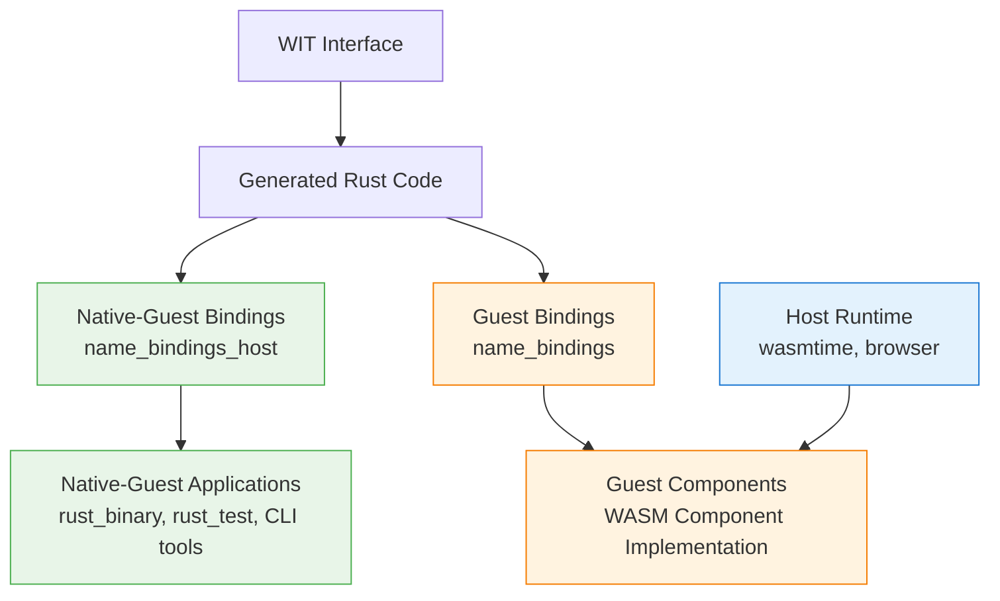

# Guest vs Native-Guest Bindings

When you generate WIT bindings with `rust_wasm_component_bindgen`, you actually get **two different versions** of the same bindings compiled for different platforms. Understanding the distinction is crucial for building effective WebAssembly component ecosystems.

> **Key Terminology**: We build **guest** components (WASM) and **native-guest** applications (native). We do NOT build "host" components - those are runtimes like wasmtime that execute guest components.

## The Two Binding Types



### Native-Guest Bindings (`{name}_bindings_host`)

**Target Platform**: Your development machine (e.g., `aarch64-apple-darwin`, `x86_64-unknown-linux-gnu`)
**Runtime**: Native execution, no WebAssembly runtime required
**Purpose**: Native applications that understand component interfaces - testing, tooling, mock implementations
**Role**: "Native-guest" applications that can work with component interfaces natively

### Guest Bindings (`{name}_bindings`)

**Target Platform**: WebAssembly (`wasm32-wasip2`)
**Runtime**: WebAssembly host runtime (wasmtime, web browsers, etc.)
**Purpose**: Actual WebAssembly component implementations
**Role**: "Guest" components that run inside host runtimes

## Key Insight: Same Source, Different Targets

Both binding types are generated from **identical WIT-derived Rust source code**. The only difference is the compilation target:

```rust
// Same generated Rust code from WIT
wit_bindgen::generate!({
    path: "interfaces.wit",
    world: "my-world",
});

// Compiled for two different targets:
// 1. Native-Guest Platform (aarch64-apple-darwin) → {name}_bindings_host
// 2. Guest Platform         (wasm32-wasip2)        → {name}_bindings
```

## WebAssembly Component Model Context

To understand this architecture, it's important to know the WebAssembly Component Model terminology:

- **Host Runtime**: The runtime environment (wasmtime, browser, etc.) that executes WebAssembly components  
- **Guest Component**: The WebAssembly component implementation that runs inside the host runtime
- **Native-Guest Application**: A native application that works with component interfaces but runs natively
- **WIT**: WebAssembly Interface Type definitions that describe component interfaces

Our binding system creates:
- **Native-guest bindings**: For native applications that need to understand component interfaces
- **Guest bindings**: For actual guest component implementations that run in a host runtime

**Important**: We don't build "host" components - host runtimes like wasmtime are separate applications that execute our guest components.

## When to Use Native-Guest Bindings

Use `{name}_bindings_host` for native-guest applications:

### Test Applications
```python
rust_test(
    name = "component_integration_test",
    srcs = ["tests/integration.rs"],
    deps = [":calculator_bindings_host"],  # Native-guest bindings for tests
)
```

### Benchmarking Tools
```python
rust_binary(
    name = "component_benchmark",
    srcs = ["bench/benchmark.rs"],
    deps = [":calculator_bindings_host"],  # Native-guest bindings for benchmarks
)
```

### Development Utilities
```python
rust_binary(
    name = "schema_validator",
    srcs = ["tools/validate.rs"],
    deps = [":calculator_bindings_host"],  # Native-guest bindings for tooling
)
```

### Mock Implementations
```rust
// Native-guest test - runs natively, understands component interfaces
use calculator_bindings_host::exports::calculator::math::Guest;

struct MockCalculator;
impl Guest for MockCalculator {
    fn add(a: i32, b: i32) -> i32 {
        a + b  // Simple mock implementation for testing
    }
}
```

## When to Use Guest Bindings

Use `{name}_bindings` for guest components:

### Guest Component Implementations
```rust
// Guest component source code (src/lib.rs) - compiles to WebAssembly
use calculator_bindings::exports::calculator::math::Guest;

struct Calculator;
impl Guest for Calculator {
    fn add(a: i32, b: i32) -> i32 {
        a + b
    }
}

// Export the guest component implementation
calculator_bindings::export!(Calculator with_types_in calculator_bindings);
```

This is automatically handled by `rust_wasm_component_bindgen`:
```python
rust_wasm_component_bindgen(
    name = "calculator",
    srcs = ["src/lib.rs"],         # Uses calculator_bindings (guest)
    wit = ":calculator_interfaces",
)
```

## Capabilities and Limitations

### Native-Guest Bindings Can Do

- **Run natively** on your development machine
- **Access component interfaces** and type definitions
- **Import and use** WIT-generated traits and types
- **Create mock implementations** for testing
- **Build development tools** that understand component interfaces
- **Serialize/deserialize** component data types

### Native-Guest Bindings Cannot Do

- **Run as WebAssembly components** in host runtimes like wasmtime
- **Export component functions** to other languages via WebAssembly
- **Participate in WAC compositions** or component graphs
- **Use WASI Preview 2** or component model features
- **Be executed by host runtimes** as guest components

### Guest Bindings Can Do

- **Run in host runtimes** (wasmtime, browsers, etc.)
- **Export component functions** to any language via WebAssembly
- **Participate in component compositions** via WAC
- **Use WASI Preview 2** filesystem, networking, etc.
- **Be distributed** via OCI registries
- **Provide secure sandboxing** and portability

### Guest Bindings Cannot Do

- **Run natively** on native platforms
- **Be used directly** in native applications
- **Access native system resources** outside WASI sandbox

## Common Error and Solution

### The Error
```bash
error[E0461]: couldn't find crate 'my_component_bindings' with expected target triple aarch64-apple-darwin

note: the following crate versions were found:
      crate 'my_component_bindings', target triple wasm32-wasip2
```

### The Problem
You're trying to use guest component bindings (`my_component_bindings`) in a native application that expects native platform target triples.

### The Solution
Use native-guest bindings instead:

```python
# ❌ Wrong: Native application using guest bindings
rust_binary(
    name = "test_runner",
    deps = [":my_component_bindings"],  # wasm32-wasip2 target
)

# ✅ Correct: Native application using native-guest bindings
rust_binary(
    name = "test_runner",
    deps = [":my_component_bindings_host"],  # aarch64-apple-darwin target
)
```

## Complete Example

Here's a complete example showing both binding types in action:

```python title="BUILD.bazel"
load("@rules_wasm_component//wit:defs.bzl", "wit_library")
load("@rules_wasm_component//rust:defs.bzl", "rust_wasm_component_bindgen")
load("@rules_rust//rust:defs.bzl", "rust_binary", "rust_test")

# WIT interface definition
wit_library(
    name = "calculator_interfaces",
    srcs = ["calculator.wit"],
    package_name = "example:calculator@1.0.0",
)

# Component with bindings (creates both native-guest and guest bindings)
rust_wasm_component_bindgen(
    name = "calculator_component",
    srcs = ["src/lib.rs"],            # Uses calculator_component_bindings (guest)
    wit = ":calculator_interfaces",
)

# Native-guest application using native-guest bindings
rust_binary(
    name = "calculator_cli",
    srcs = ["tools/cli.rs"],
    deps = [":calculator_component_bindings_host"],  # Native-guest bindings
)

# Test using native-guest bindings
rust_test(
    name = "calculator_test",
    srcs = ["tests/integration.rs"],
    deps = [":calculator_component_bindings_host"],  # Native-guest bindings
)
```

```rust title="src/lib.rs (Guest Component Implementation)"
// Component uses guest bindings automatically
use calculator_component_bindings::exports::example::calculator::math::Guest;

struct Calculator;
impl Guest for Calculator {
    fn add(a: i32, b: i32) -> i32 { a + b }
    fn multiply(a: i32, b: i32) -> i32 { a * b }
}

calculator_component_bindings::export!(Calculator with_types_in calculator_component_bindings);
```

```rust title="tools/cli.rs (Native-Guest Application)"
// Native-guest application uses native-guest bindings
use calculator_component_bindings_host::exports::example::calculator::math::Guest;

struct MockCalculator;
impl Guest for MockCalculator {
    fn add(a: i32, b: i32) -> i32 { a + b }
    fn multiply(a: i32, b: i32) -> i32 { a * b }
}

fn main() {
    println!("Calculator CLI using native-guest bindings");
    let calc = MockCalculator;
    println!("2 + 3 = {}", calc.add(2, 3));
}
```

```rust title="tests/integration.rs (Native-Guest Test)"
// Test uses native-guest bindings for native execution
use calculator_component_bindings_host::exports::example::calculator::math::Guest;

struct TestCalculator;
impl Guest for TestCalculator {
    fn add(a: i32, b: i32) -> i32 { a + b }
    fn multiply(a: i32, b: i32) -> i32 { a * b }
}

#[test]
fn test_calculator_interface() {
    let calc = TestCalculator;
    assert_eq!(calc.add(2, 3), 5);
    assert_eq!(calc.multiply(4, 5), 20);
}
```

## Best Practices

### 1. Choose the Right Binding Type
- **Native-guest bindings** for development tools, tests, benchmarks
- **Guest bindings** for component implementations (handled automatically)

### 2. Naming Convention
- Native-guest bindings: `{name}_bindings_host`
- Guest bindings: `{name}_bindings`
- Component: `{name}`

### 3. Testing Strategy
```python
# Test the component interface with native-guest bindings
rust_test(
    name = "interface_test",
    deps = [":component_bindings_host"],
)

# Test the actual component with wasmtime
rust_wasm_component_test(
    name = "component_test",
    component = ":component",
)
```

### 4. Development Workflow
1. **Design**: Define WIT interfaces
2. **Implement**: Create guest components with guest bindings
3. **Test**: Build test tools with native-guest bindings
4. **Deploy**: Distribute guest components to host runtimes

## Summary

Guest and native-guest bindings enable a rich development ecosystem around WebAssembly components:

- **Native-guest bindings** provide native access to component interfaces for development tools
- **Guest bindings** enable actual component execution in WebAssembly host runtimes
- **Both are generated** from the same WIT interfaces, ensuring consistency
- **Choose based on context**: native applications use native-guest bindings, guest components use guest bindings

This dual binding architecture resolves target triple mismatches while enabling powerful tooling and testing capabilities for WebAssembly component development.

> **Key Takeaway**: Don't confuse our "native-guest bindings" with the WebAssembly Component Model "host runtime" (wasmtime). Native-guest bindings are for native applications, host runtimes are separate executables that run guest components.