# WIT Bindgen Advanced Concepts

<div class="complexity-badge advanced">
  <span class="badge-icon">🎓</span>
  <div class="badge-content">
    <strong>ADVANCED</strong>
    <p>Deep language-specific concepts and architectural patterns</p>
  </div>
</div>

This guide explains the sophisticated concepts behind the enhanced `wit_bindgen` rule, with focus on language-specific implications and architectural patterns.

## The WebAssembly Component Model Architecture

Understanding why we need interface mapping requires understanding the Component Model's architecture:


**The Problem**: Each component generates its own copy of WASI interfaces (yellow boxes), leading to:
- **Code duplication** across components
- **Type incompatibility** between components
- **Binary bloat** from redundant implementations

## Why Interface Mapping Matters: A Language Perspective

### Type System Boundaries

Different languages have different type systems, and WIT acts as the universal translator:


### Language-Specific Mapping Requirements

#### Rust: Zero-Cost Abstractions

```mermaid
flowchart LR
    subgraph "WIT Type"
        W[list of u8]
    end
    
    subgraph "Rust Mappings"
        direction TB
        R1["Vec&lt;u8&gt;<br/>ownership = owning"]
        R2["&amp;[u8]<br/>ownership = borrowing"]
        R3["Cow&lt;[u8]&gt;<br/>ownership = borrowing-duplicate-if-necessary"]
    end
    
    W --> R1
    W --> R2
    W --> R3
    
    R1 --> P1[Heap Allocation<br/>✅ Simple<br/>❌ Performance]
    R2 --> P2[Zero-Copy<br/>✅ Fast<br/>❌ Lifetime complexity]
    R3 --> P3[Flexible<br/>✅ Adaptive<br/>⚠️ Runtime overhead]
```



**Why Rust needs ownership control:**
- **Memory safety**: Rust's borrow checker requires explicit ownership
- **Performance**: Zero-copy operations depend on borrowing patterns
- **FFI boundaries**: Component boundaries need clear ownership transfer

#### TypeScript/JavaScript: Dynamic Type Handling


**Why JavaScript needs different handling:**
- **Dynamic typing**: Runtime type checking required
- **Memory model**: No direct memory access, needs marshalling
- **Async by default**: Promise-based patterns natural

#### Go: Structured Simplicity


**Why Go needs resource tables:**
- **No classes**: Struct-based with methods
- **Error handling**: Explicit error returns, not exceptions
- **GC interaction**: Resource lifetime management with GC

## The `with_mappings` Architecture

### How Interface Mapping Works


### Mapping Decision Tree


## Language-Specific Ownership Models

### Rust: The Ownership Trichotomy


**Language-Specific Implications:**

| Language | Owning | Borrowing | Borrowing-Duplicate |
|----------|--------|-----------|---------------------|
| **Rust** | `String`, `Vec<T>` | `&str`, `&[T]` | `Cow<'a, T>` |
| **C++** | `std::string`, `std::vector` | `const char*`, `span<T>` | `std::variant` |
| **Go** | `string`, `[]byte` (copies) | N/A (no references) | N/A |
| **JavaScript** | All values (GC'd) | N/A | N/A |
| **Python** | All objects (ref counted) | N/A | N/A |

### Memory Layout Implications


## Derive Attributes: Language-Specific Needs

### Why Different Languages Need Different Derives


### Language-Specific Derive Equivalents

| Rust Derive | C++ Equivalent | Go Equivalent | Purpose |
|-------------|----------------|---------------|---------|
| `Clone` | Copy constructor | Value semantics | Duplication |
| `Debug` | `operator<<` | `String()` method | Printing |
| `PartialEq` | `operator==` | `Equals()` method | Comparison |
| `Hash` | `std::hash` | Hash interface | Map keys |
| `Serialize` | Custom serialization | `json.Marshal` | Persistence |

### Derive Impact Analysis

```mermaid
flowchart TD
    subgraph "Compilation Impact"
        D[Derives Added] --> CT[Compile Time ↑]
        D --> BS[Binary Size ↑]
        D --> DC[Dependencies ↑]
    end
    
    subgraph "Runtime Impact"
        D --> MU[Memory Usage ±]
        D --> PF[Performance ±]
        D --> FX[Flexibility ↑]
    end
    
    subgraph "Development Impact"
        D --> DX[Developer Experience ↑]
        D --> TB[Testability ↑]
        D --> DB[Debuggability ↑]
    end
    
    style CT fill:#ffeb3b
    style BS fill:#ffeb3b
    style DC fill:#ffeb3b
    style DX fill:#4caf50
    style TB fill:#4caf50
    style DB fill:#4caf50
```



## Async Patterns Across Languages

### Language-Specific Async Models


### Why Async Configuration Matters by Language


**Language-Specific Async Needs:**

| Language | Natural Pattern | Component Model | Configuration Need |
|----------|----------------|-----------------|-------------------|
| **Rust** | `Future` + executor | Pollable futures | `async_interfaces` for tokio integration |
| **JavaScript** | Promises everywhere | Native async | Usually all async |
| **Go** | Goroutines + channels | Blocking with go routines | Rarely needs async |
| **Python** | asyncio | Event loop based | Selective async |
| **C++** | std::async/coroutines | Callbacks or coroutines | Complex async setup |

## Complete Architecture: Putting It All Together


## Practical Example: Multi-Language Component System

Let's see how the same WIT interface generates different code for different languages with our configuration:

### WIT Definition
```wit
interface data-processor {
    record config {
        threads: u32,
        timeout-ms: u64,
    }
    
    process-batch: func(
        config: config,
        data: list<u8>
    ) -> result<list<u8>, string>;
}
```

### Rust Configuration and Output
```starlark
wit_bindgen(
    name = "processor_rust",
    language = "rust",
    with_mappings = {},  # Generate everything
    ownership = "borrowing",  # Optimize for performance
    additional_derives = ["Clone", "Debug"],
    async_interfaces = ["data-processor#process-batch"],
)
```

**Generated Rust:**
```rust
#[derive(Clone, Debug)]
pub struct Config {
    pub threads: u32,
    pub timeout_ms: u64,
}

pub async fn process_batch(
    config: &Config,  // Borrowing ownership
    data: &[u8],      // Zero-copy slice
) -> Result<Vec<u8>, String> {
    // Async processing with zero-copy input
}
```

### JavaScript Configuration and Output
```starlark
wit_bindgen(
    name = "processor_js",
    language = "js",
    # No ownership concept in JS
    # No derives in JS
    # JS is naturally async
)
```

**Generated JavaScript:**
```javascript
export class Config {
    constructor(threads, timeoutMs) {
        this.threads = threads;
        this.timeoutMs = timeoutMs;
    }
}

export async function processBatch(config, data) {
    // Returns Promise<Uint8Array>
    // Automatic memory management via GC
}
```

### Go Configuration and Output
```starlark
wit_bindgen(
    name = "processor_go",
    language = "go",
    # Go has different patterns
)
```

**Generated Go:**
```go
type Config struct {
    Threads   uint32
    TimeoutMs uint64
}

func ProcessBatch(config Config, data []byte) ([]byte, error) {
    // Synchronous by default
    // Error as second return value
    // Value semantics (copies)
}
```

## Performance and Binary Size Analysis


## Summary: Why These Features Matter

The enhanced `wit_bindgen` rule provides language-aware configuration because:

1. **Different languages have different type systems** - Interface mapping allows reusing language-idiomatic types
2. **Memory models vary** - Ownership configuration matches language memory patterns
3. **Trait/interface systems differ** - Derives enable language-specific capabilities
4. **Async models are language-specific** - Async configuration adapts to each language's concurrency model
5. **Performance characteristics vary** - Configuration allows optimization for each language's strengths

Understanding these language-specific implications helps you configure `wit_bindgen` optimally for your component's implementation language and use case.