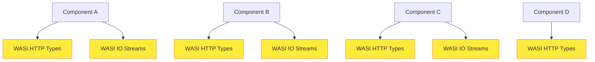
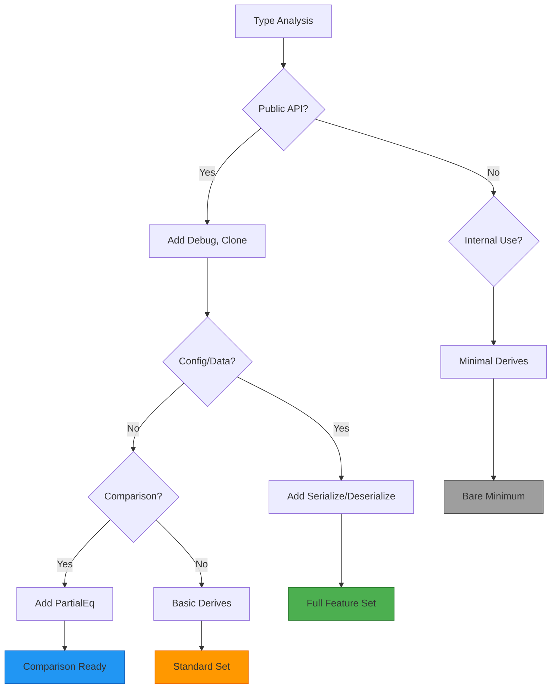
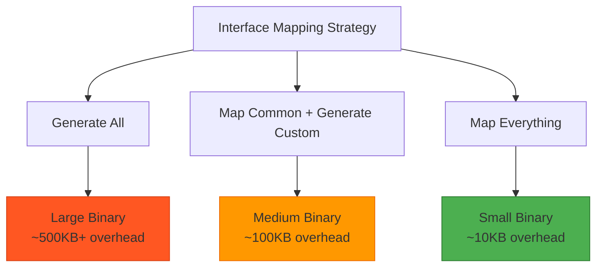
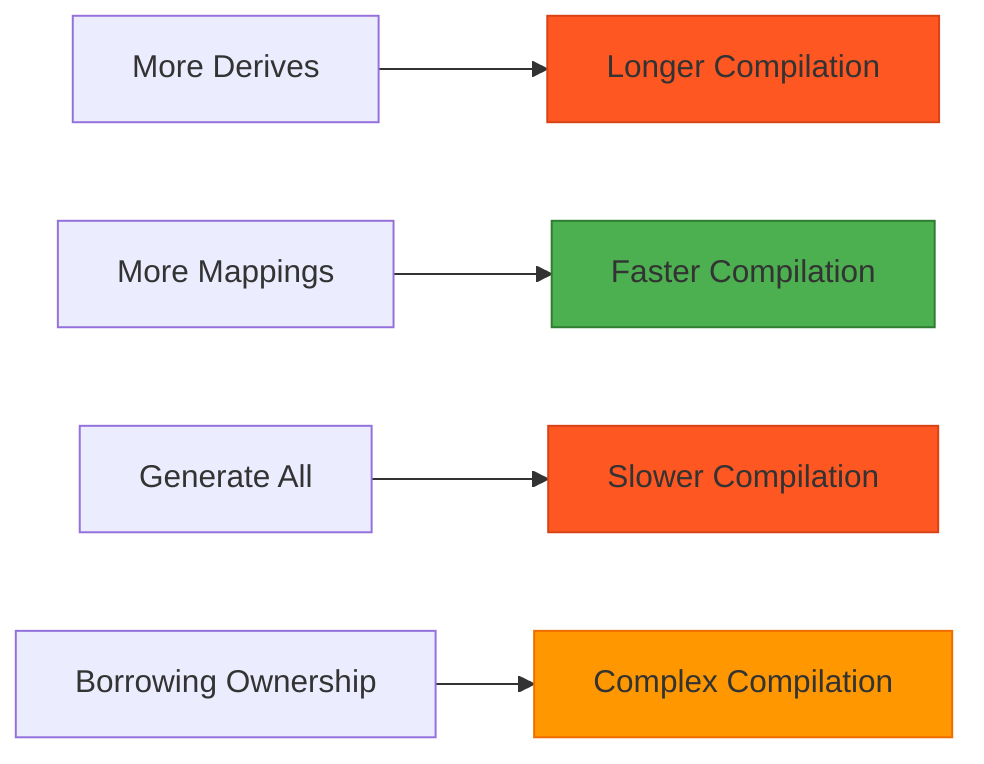

# WIT Bindgen Interface Mapping

The enhanced `wit_bindgen` rule provides sophisticated interface mapping capabilities that go far beyond basic code generation. Understanding these features is crucial for building efficient, maintainable WebAssembly component ecosystems.

## Overview: The Interface Mapping Problem

When building WebAssembly components, you often encounter the same interfaces across multiple components:



**Problems with naive generation:**

- **Code duplication**: Each component generates identical WASI interface code
- **Dependency conflicts**: Different versions of generated interfaces
- **Binary bloat**: Redundant code in every component
- **Type incompatibility**: Generated types don't work with ecosystem crates

**Solution: Interface Mapping**

- **Map common interfaces** to existing ecosystem crates
- **Generate only custom interfaces** specific to your component
- **Reuse established implementations** for better compatibility
- **Reduce binary size** and compilation time

## The `with_mappings` Attribute

The `with_mappings` attribute is the core of interface mapping:

```starlark
wit_bindgen(
    name = "my_bindings",
    language = "rust",
    wit = ":interfaces",
    with_mappings = {
        # Map to existing crate
        "wasi:http/types": "wasi::http::types",
        "wasi:io/streams": "wasi::io::streams",

        # Generate custom interface
        "my:pkg/custom": "generate",

        # Map to custom module
        "my:pkg/auth": "crate::auth::types",
    },
)
```

### Mapping Strategies

#### 1. **Ecosystem Crate Mapping**

```starlark
"wasi:http/types": "wasi::http::types"
```

**Use when:**

- Standard WASI interfaces exist as published crates
- You want ecosystem compatibility
- Multiple components share the same interfaces

**Implications:**

- ✅ Smaller binaries (no duplicate code generation)
- ✅ Better ecosystem integration
- ✅ Consistent type definitions across components
- ⚠️ Dependency on external crate versions
- ⚠️ Must match interface versions exactly

#### 2. **Custom Module Mapping**

```starlark
"my:company/auth": "crate::auth::types"
```

**Use when:**

- You have existing type definitions
- Sharing types across multiple components
- Custom business logic types

**Implications:**

- ✅ Code reuse across your components
- ✅ Centralized type definitions
- ✅ Custom derive implementations
- ⚠️ Must maintain interface compatibility manually
- ⚠️ Breaking changes affect multiple components

#### 3. **Generate Fresh**

```starlark
"my:pkg/service": "generate"
```

**Use when:**

- Component-specific interfaces
- Rapid prototyping
- No existing implementation available

**Implications:**

- ✅ Full control over generated code
- ✅ No external dependencies
- ✅ Optimal for component-specific logic
- ⚠️ Duplicated across components if reused
- ⚠️ No ecosystem integration

## Ownership Models Deep Dive

The `ownership` attribute controls how wit-bindgen handles memory management and borrowing:

### `owning` (Default)

```starlark
ownership = "owning"
```

**Generated code pattern:**

```rust
pub fn process_data(data: String) -> Vec<u8> {
    // Takes ownership of input, returns owned output
}
```

**Use when:**

- Simple ownership patterns
- Component boundaries require ownership transfer
- Performance is not critical
- Learning/prototyping

**Implications:**

- ✅ Simplest to use and understand
- ✅ No lifetime management complexity
- ⚠️ More memory allocations
- ⚠️ Cannot zero-copy in many cases

### `borrowing`

```starlark
ownership = "borrowing"
```

**Generated code pattern:**

```rust
pub fn process_data(data: &str) -> &[u8] {
    // Borrows input, returns borrowed output where possible
}
```

**Use when:**

- Performance-critical applications
- Large data processing
- Memory-constrained environments
- Zero-copy patterns desired

**Implications:**

- ✅ Minimal memory allocations
- ✅ Zero-copy optimizations possible
- ✅ Better performance characteristics
- ⚠️ Complex lifetime management
- ⚠️ May require lifetime annotations in calling code
- ⚠️ Compilation can be more complex

### `borrowing-duplicate-if-necessary`

```starlark
ownership = "borrowing-duplicate-if-necessary"
```

**Generated code pattern:**

```rust
pub fn process_data(data: &str) -> String {
    // Borrows when possible, clones when necessary
}
```

**Use when:**

- Balancing performance and simplicity
- Mixed usage patterns in same component
- Gradual optimization approach
- Complex interface requirements

**Implications:**

- ✅ Best of both worlds approach
- ✅ Optimizes where possible, works everywhere
- ✅ Easier migration from owning model
- ⚠️ Less predictable performance characteristics
- ⚠️ May hide performance issues

## Custom Derives and Their Impact

The `additional_derives` attribute adds derive macros to generated types:

```starlark
additional_derives = ["Clone", "Debug", "PartialEq", "Serialize", "Deserialize"]
```

### Common Derives and Use Cases

#### `Clone`

```rust
#[derive(Clone)]
pub struct ApiConfig { ... }
```

**Use when:**

- Types need to be duplicated
- Shared between multiple component instances
- Caching/memoization patterns

**Implications:**

- ✅ Flexible data sharing patterns
- ⚠️ Potential memory overhead if overused
- ⚠️ Deep cloning of nested structures

#### `Debug`

```rust
#[derive(Debug)]
pub struct ApiConfig { ... }
```

**Use when:**

- Development and debugging
- Logging and error reporting
- Testing and diagnostics

**Implications:**

- ✅ Better debugging experience
- ✅ Easier troubleshooting
- ⚠️ May expose sensitive data in logs
- ⚠️ Small code size increase

#### `PartialEq` / `Eq`

```rust
#[derive(PartialEq, Eq)]
pub struct ApiConfig { ... }
```

**Use when:**

- Comparing instances for equality
- Using types in collections (HashMap keys)
- Testing and validation

**Implications:**

- ✅ Enables comparison operations
- ✅ Hashmap/set usage possible
- ⚠️ Structural equality only
- ⚠️ Performance impact for large types

#### `Serialize` / `Deserialize` (serde)

```rust
#[derive(Serialize, Deserialize)]
pub struct ApiConfig { ... }
```

**Use when:**

- JSON/YAML/TOML configuration
- Network protocol serialization
- Persistent storage requirements
- API integration

**Implications:**

- ✅ Easy serialization to multiple formats
- ✅ Network and storage integration
- ⚠️ Additional dependency on serde
- ⚠️ Increased compilation time
- ⚠️ Binary size increase

### Derive Selection Strategy



## Async Interface Configuration

The `async_interfaces` attribute enables async/await patterns:

```starlark
async_interfaces = [
    "my:pkg/service#async-method",  # Specific method
    "my:pkg/service",               # Entire interface
    "all"                           # All interfaces
]
```

### Async Patterns and Implications

#### Specific Method Async

```starlark
async_interfaces = ["my:pkg/service#process-data"]
```

**Generated code:**

```rust
impl Guest for MyService {
    async fn process_data(&self, input: &str) -> String {
        // Method is async, others remain sync
    }

    fn get_version(&self) -> String {
        // This method stays synchronous
    }
}
```

**Use when:**

- Only specific operations are inherently async
- Mixed sync/async patterns in same interface
- Gradual async adoption

#### Interface-Level Async

```starlark
async_interfaces = ["my:pkg/service"]
```

**Generated code:**

```rust
impl Guest for MyService {
    async fn process_data(&self, input: &str) -> String { ... }
    async fn get_version(&self) -> String { ... }
    // All methods in interface become async
}
```

**Use when:**

- Entire interface involves async operations
- Consistent async patterns
- Future-proofing for async adoption

#### Global Async

```starlark
async_interfaces = ["all"]
```

**Use when:**

- Component is entirely async-first
- Integration with async runtime (tokio)
- Modern async/await patterns throughout

**Implications of Async:**

- ✅ Non-blocking operations
- ✅ Better concurrency patterns
- ✅ Integration with async ecosystem
- ⚠️ Requires async runtime
- ⚠️ More complex error handling
- ⚠️ Different execution model

## Real-World Configuration Patterns

### Pattern 1: Microservice Component

```starlark
wit_bindgen(
    name = "api_service_bindings",
    language = "rust",
    wit = ":service_interfaces",

    # Map standard interfaces to ecosystem crates
    with_mappings = {
        "wasi:http/types": "wasi::http::types",
        "wasi:io/streams": "wasi::io::streams",
        "wasi:logging/logger": "log",
        "my:service/api": "generate",  # Custom business logic
    },

    # Optimize for performance
    ownership = "borrowing-duplicate-if-necessary",

    # Enable debugging and serialization
    additional_derives = ["Clone", "Debug", "Serialize", "Deserialize"],

    # Async-first service
    async_interfaces = ["all"],

    format_code = True,
    generate_all = False,  # Only generate unmapped interfaces
)
```

**Benefits:**

- Reuses WASI ecosystem types
- Optimizes for performance with borrowing
- Full debugging and serialization support
- Modern async patterns throughout

### Pattern 2: Library Component

```starlark
wit_bindgen(
    name = "crypto_lib_bindings",
    language = "rust",
    wit = ":crypto_interfaces",

    # Generate everything fresh (no external deps)
    with_mappings = {},

    # Optimize for zero-copy
    ownership = "borrowing",

    # Minimal derives for security
    additional_derives = ["Clone"],  # No Debug to avoid exposing secrets

    # Synchronous crypto operations
    async_interfaces = [],

    format_code = True,
    generate_all = True,
)
```

**Benefits:**

- No external dependencies
- Zero-copy optimizations
- Security-conscious (no Debug derive)
- Predictable synchronous behavior

### Pattern 3: Integration Component

```starlark
wit_bindgen(
    name = "integration_bindings",
    language = "rust",
    wit = ":integration_interfaces",

    # Mix of mapped and generated
    with_mappings = {
        "wasi:http/types": "http::types",      # Use http crate
        "wasi:sockets/tcp": "tokio::net",      # Use tokio networking
        "my:integration/adapter": "generate",   # Custom integration logic
    },

    # Simple ownership for integration code
    ownership = "owning",

    # Full debugging support for integration
    additional_derives = ["Clone", "Debug", "PartialEq"],

    # Mixed async patterns
    async_interfaces = ["my:integration/adapter#connect"],

    format_code = True,
    generate_all = False,
)
```

**Benefits:**

- Leverages existing networking crates
- Simple ownership for easier integration
- Selective async for connection logic
- Good debugging support

## Performance Implications

### Binary Size Impact



### Compilation Time Impact



### Runtime Performance

| Configuration                                         | Memory Usage | CPU Usage          | Complexity |
| ----------------------------------------------------- | ------------ | ------------------ | ---------- |
| `owning` + `Clone`                                    | High         | Medium             | Low        |
| `borrowing` + No derives                              | Low          | Low                | High       |
| `borrowing-duplicate-if-necessary` + Selected derives | Medium       | Low-Medium         | Medium     |
| Async everywhere                                      | Medium       | Low (with runtime) | Medium     |

## Migration Strategies

### From Basic to Enhanced

```diff
# Before: Basic wit-bindgen
wit_bindgen(
    name = "basic_bindings",
    language = "rust",
    wit = ":interfaces",
)

# After: Enhanced with gradual improvements
wit_bindgen(
    name = "enhanced_bindings",
    language = "rust",
    wit = ":interfaces",
+
+   # Start with simple mappings
+   with_mappings = {
+       "wasi:io/streams": "wasi::io::streams",
+   },
+
+   # Add basic debugging
+   additional_derives = ["Debug"],
+
+   # Keep simple ownership initially
+   ownership = "owning",
)
```

### Performance Optimization Path

1. **Phase 1: Add mappings**

   ```starlark
   with_mappings = {
       "wasi:http/types": "wasi::http::types",  # Reduce duplication
   }
   ```

2. **Phase 2: Optimize ownership**

   ```starlark
   ownership = "borrowing-duplicate-if-necessary"  # Performance boost
   ```

3. **Phase 3: Add selective derives**

   ```starlark
   additional_derives = ["Clone", "Debug"]  # As needed
   ```

4. **Phase 4: Enable async where beneficial**
   ```starlark
   async_interfaces = ["my:pkg/service#slow-operation"]  # Specific methods
   ```

## Common Pitfalls and Solutions

### Pitfall 1: Over-mapping

```starlark
# ❌ Mapping everything might not help
with_mappings = {
    "my:unique/interface": "some::random::crate",  # Probably wrong
}
```

**Solution:** Only map interfaces that truly benefit from existing implementations.

### Pitfall 2: Derive Overload

```starlark
# ❌ Adding every derive "just in case"
additional_derives = ["Clone", "Debug", "PartialEq", "Eq", "PartialOrd", "Ord", "Hash", "Serialize", "Deserialize"]
```

**Solution:** Add derives only when you need the functionality.

### Pitfall 3: Async Everything

```starlark
# ❌ Making everything async without reason
async_interfaces = ["all"]
```

**Solution:** Use async only where you have genuinely async operations.

### Pitfall 4: Wrong Ownership Model

```starlark
# ❌ Using borrowing for simple cases
ownership = "borrowing"  # When you don't need the complexity
```

**Solution:** Start with `owning`, optimize to `borrowing` when needed.

## Best Practices Summary

1. **Start Simple**: Begin with basic configuration, add features incrementally
2. **Map Strategically**: Only map interfaces that provide real benefits
3. **Choose Derives Carefully**: Each derive adds complexity and compile time
4. **Ownership by Use Case**: Match ownership model to your performance needs
5. **Async When Needed**: Don't make everything async by default
6. **Test Performance**: Measure the impact of your configuration choices
7. **Document Decisions**: Complex configurations need explanation for team members

The enhanced `wit_bindgen` rule provides powerful capabilities, but with great power comes great responsibility. Understanding the implications of each configuration choice enables you to build efficient, maintainable WebAssembly component ecosystems.
