# WIT Bindgen Troubleshooting

This guide covers common issues you might encounter with the enhanced `wit_bindgen` rule and provides language-specific solutions.

## Common Configuration Errors

### Error 1: Unused Remappings

```bash
Error: unused remappings provided via `with`: ["example:api/service"]
```

#### Root Cause Analysis

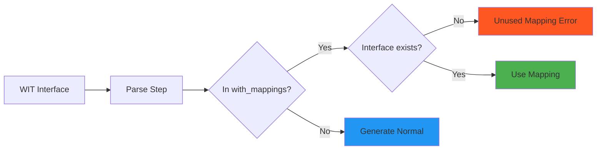

**Why this happens:**
- Interface name doesn't match exactly
- Interface is not actually in the WIT file
- Typo in interface path

#### Solutions

**Check interface names exactly:**
```bash
# Debug: See what interfaces are actually available
bazel build //your:target --verbose_failures
# Look for "known packages:" in error output
```

**Correct interface paths:**
```starlark
# ❌ Wrong: Missing package name
with_mappings = {
    "service": "generate",
}

# ✅ Correct: Full interface path
with_mappings = {
    "example:api/service": "generate",
}
```

**Debug with WIT inspection:**
```bash
# Use wasm-tools to inspect WIT files
wasm-tools component wit your_component.wasm
```

### Error 2: Unused Async Options

```bash
Error: unused async option: example:api/service#async-process
```

#### Language-Specific Async Patterns

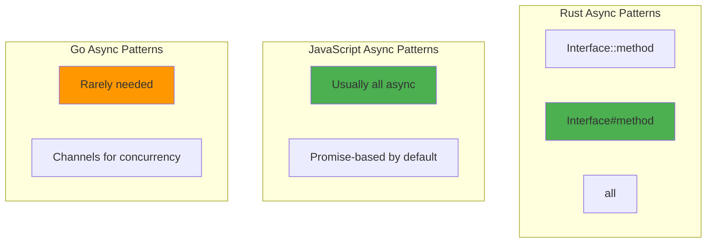

**Solutions by language:**

**Rust - Check function names:**
```starlark
# ❌ Wrong: Function name mismatch
async_interfaces = ["example:api/service#async-process"]

# ✅ Correct: Match WIT function name exactly
async_interfaces = ["example:api/service#process-async"]  # Note hyphen
```

**JavaScript - Use broad async:**
```starlark
# ✅ JavaScript is naturally async
async_interfaces = ["all"]
```

**Go - Usually avoid async:**
```starlark
# ✅ Go uses goroutines, not async interfaces
async_interfaces = []
```

### Error 3: Ownership Model Conflicts

```bash
Error: cannot borrow value as mutable
```

#### Rust Ownership Debugging

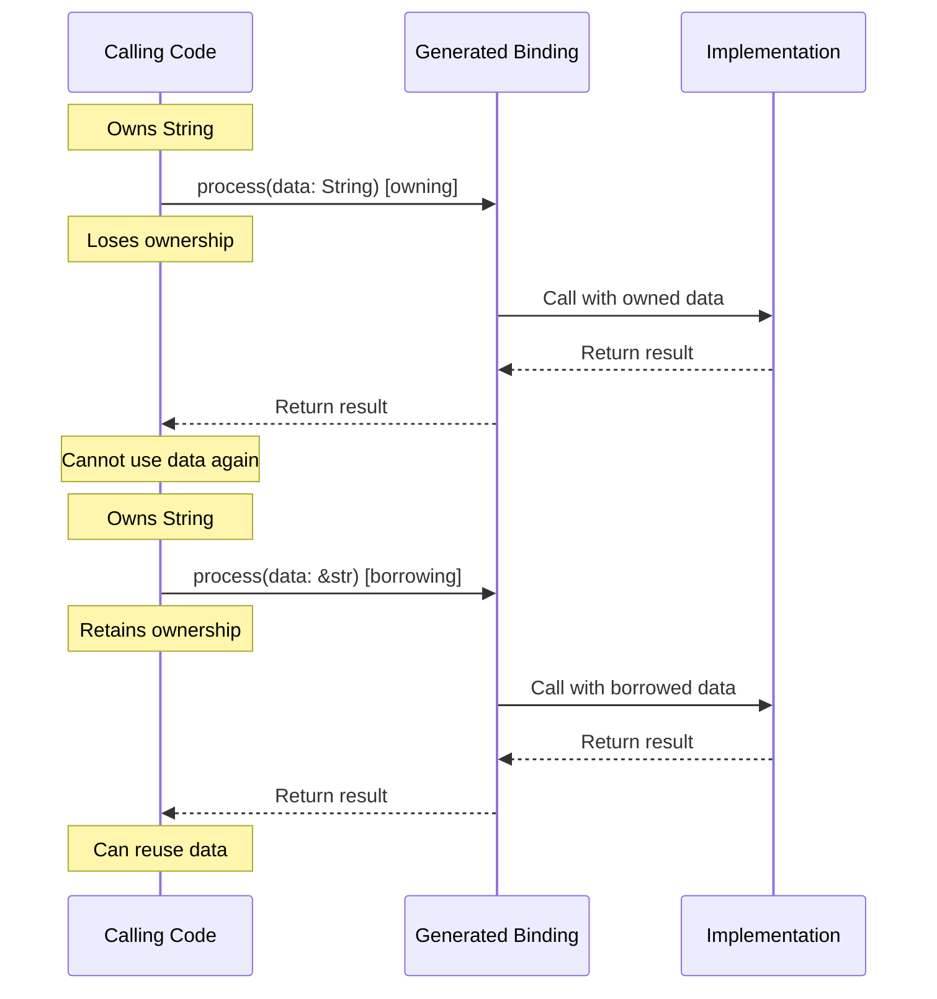

**Solutions:**

**For Rust beginners - use owning:**
```starlark
# ✅ Simple but potentially slower
ownership = "owning"
```

**For performance - use borrowing correctly:**
```starlark
# ✅ Fast but requires lifetime management
ownership = "borrowing"
```

**For mixed patterns - use adaptive:**
```starlark
# ✅ Balances performance and simplicity
ownership = "borrowing-duplicate-if-necessary"
```

### Error 4: Derive Compilation Failures

```bash
Error: cannot find derive macro `Serialize` in this scope
```

#### Language-Specific Derive Dependencies

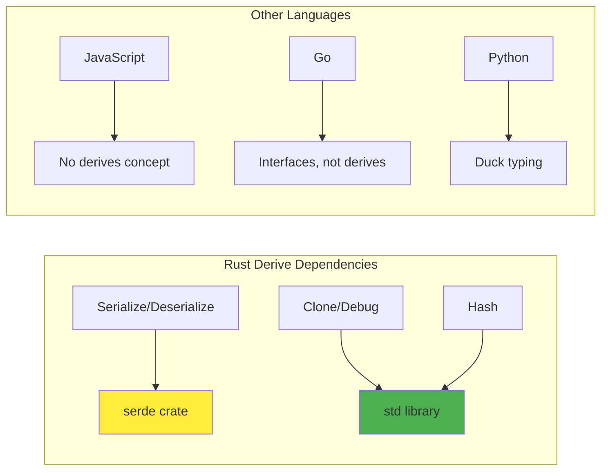

**Solutions:**

**Add serde dependency for Rust:**
```starlark
rust_library(
    name = "my_component",
    deps = [
        ":my_bindings",
        "@crates//:serde",  # Add this
        "@crates//:serde_json",  # If needed
    ],
)
```

**Use only std derives:**
```starlark
# ✅ Safe - always available in Rust std
additional_derives = ["Clone", "Debug", "PartialEq"]

# ❌ Requires extra dependencies
additional_derives = ["Serialize", "Deserialize"]
```

## Language-Specific Troubleshooting

### Rust-Specific Issues

#### Issue: Lifetime Compilation Errors
```rust
error[E0621]: explicit lifetime required
```

**Root cause - borrowing ownership:**


**Solutions:**

**Option 1: Use owning model:**
```starlark
ownership = "owning"  # Eliminates lifetime issues
```

**Option 2: Add explicit lifetimes:**
```rust
// In your calling code
fn process_data<'a>(input: &'a str) -> Result<SomeType<'a>, Error> {
    my_bindings::process(input)
}
```

**Option 3: Use Cow pattern:**
```starlark
ownership = "borrowing-duplicate-if-necessary"  # Handles lifetimes automatically
```

#### Issue: Resource Management
```rust
error: resource handle not properly managed
```

**Understanding WIT resources in Rust:**
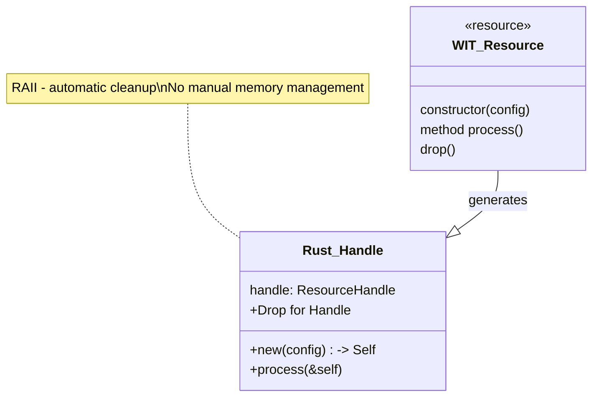

**Solution - let Rust handle resources:**
```rust
// ✅ Correct - RAII pattern
{
    let resource = MyResource::new(config);
    resource.process();
    // Automatically dropped here
}

// ❌ Wrong - manual management not needed
let resource = MyResource::new(config);
resource.drop(); // Not necessary in Rust
```

### JavaScript-Specific Issues

#### Issue: Promise Handling
```javascript
TypeError: Cannot read property 'then' of undefined
```

**Understanding JS async generation:**
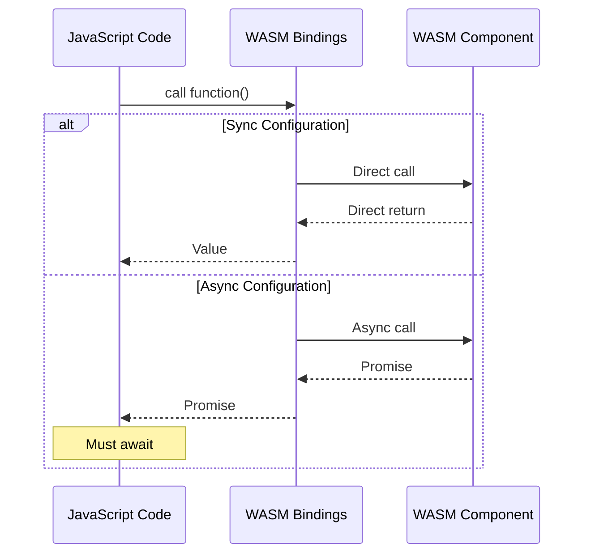

**Solutions:**

**Configure all interfaces as async:**
```starlark
wit_bindgen(
    name = "js_bindings",
    language = "js",
    async_interfaces = ["all"],  # JS is naturally async
)
```

**Handle promises correctly:**
```javascript
// ✅ Correct - await the result
const result = await myBindings.process(data);

// ❌ Wrong - not awaiting Promise
const result = myBindings.process(data);  // Returns Promise object
```

#### Issue: Memory Management
```javascript
RangeError: Invalid array buffer length
```

**Understanding JS/WASM memory boundary:**
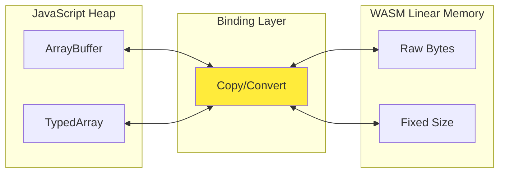

**Solution - handle large data properly:**
```javascript
// ✅ Correct - check sizes
if (data.byteLength > MAX_WASM_MEMORY) {
    // Process in chunks
    const chunks = chunkArray(data, CHUNK_SIZE);
    for (const chunk of chunks) {
        await processChunk(chunk);
    }
}

// ❌ Wrong - passing huge arrays
const hugeArray = new Uint8Array(1e9);  // 1GB
await process(hugeArray);  // May fail
```

### Go-Specific Issues

#### Issue: Error Handling Patterns
```go
panic: interface conversion: interface {} is nil, not string
```

**Understanding Go error patterns:**
```mermaid
graph TB
    subgraph "WIT Result Type"
        W[result~T, E~]
    end

    subgraph "Go Implementation"
        G1[func() (T, error)]
        G2[if error != nil]
        G3[handle error]
    end

    W --> G1
    G1 --> G2
    G2 --> G3

    style G2 fill:#ff9800
```

**Solution - handle errors explicitly:**
```go
// ✅ Correct - check errors
result, err := myBinding.Process(data)
if err != nil {
    return fmt.Errorf("processing failed: %w", err)
}
// Use result safely

// ❌ Wrong - ignoring errors
result, _ := myBinding.Process(data)  // Dangerous
```

#### Issue: Resource Lifecycle
```go
resource finalized while still in use
```

**Go GC vs WASM resources:**
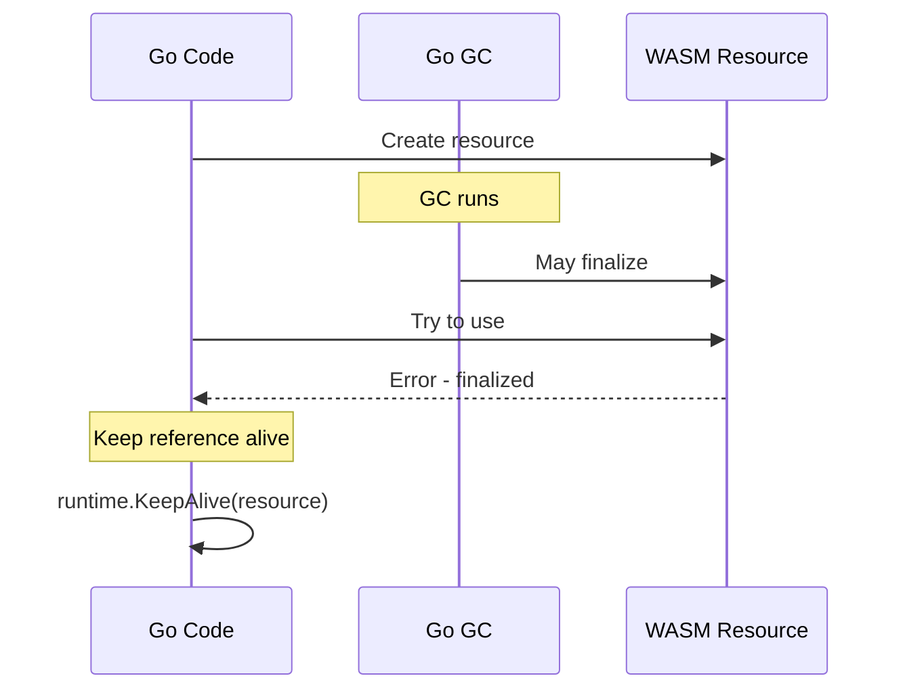

**Solution - manage resource lifetime:**
```go
func processWithResource(data []byte) error {
    resource := NewMyResource(config)
    defer resource.Close()  // Explicit cleanup

    result := resource.Process(data)

    // Keep resource alive until here
    runtime.KeepAlive(resource)
    return nil
}
```

## Performance Troubleshooting

### Binary Size Issues

#### Problem: Component too large

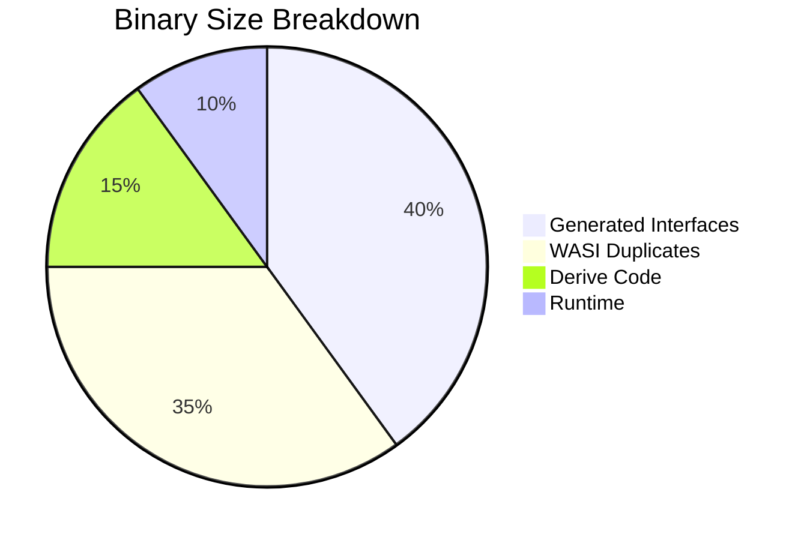

**Solutions by configuration:**

**Reduce interface duplication:**
```starlark
# Before: 500KB binary
with_mappings = {}

# After: 150KB binary
with_mappings = {
    "wasi:io/streams": "wasi::io::streams",
    "wasi:http/types": "wasi::http::types",
}
```

**Optimize derives:**
```starlark
# Before: Every derive adds ~5KB
additional_derives = ["Clone", "Debug", "PartialEq", "Eq", "Hash", "Serialize", "Deserialize"]

# After: Only what you need
additional_derives = ["Clone", "Debug"]
```

### Runtime Performance Issues

#### Problem: Slow component startup

**Performance analysis:**
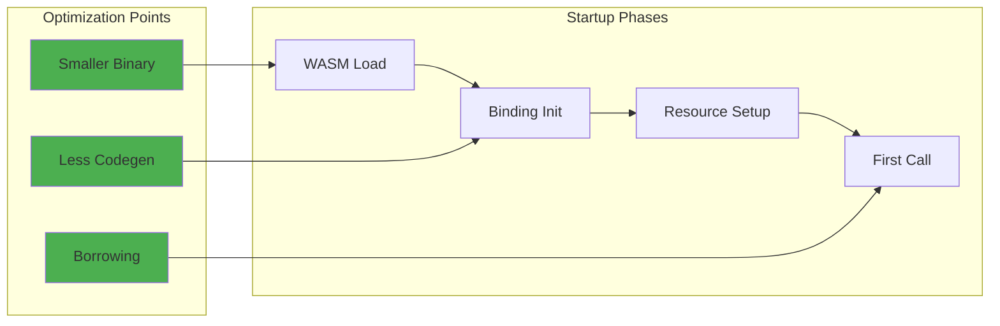

**Solutions:**

**Optimize for startup:**
```starlark
wit_bindgen(
    name = "fast_startup",
    with_mappings = {
        # Map everything possible to reduce codegen
        "wasi:io/streams": "wasi::io::streams",
        "wasi:http/types": "wasi::http::types",
    },
    ownership = "owning",  # Simpler, faster to initialize
    additional_derives = [],  # Minimal derives for faster compilation
    generate_all = False,  # Only generate what's needed
)
```

#### Problem: High memory usage

**Memory usage patterns by ownership:**
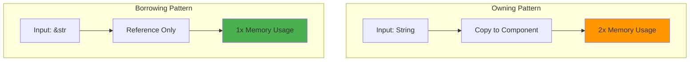

**Solution - optimize ownership:**
```starlark
# For memory-constrained environments
ownership = "borrowing"  # Reduces memory copies

# For large data processing
ownership = "borrowing-duplicate-if-necessary"  # Adaptive
```

## Best Practices by Use Case

### Library Component
```starlark
wit_bindgen(
    name = "library_bindings",
    language = "rust",

    # Pure generation - no external dependencies
    with_mappings = {},

    # Optimize for zero-copy
    ownership = "borrowing",

    # Minimal derives for library code
    additional_derives = ["Clone"],  # Only what's needed

    # Libraries usually synchronous
    async_interfaces = [],

    # Clean code for library users
    format_code = True,
    generate_all = True,
)
```

### Service Component
```starlark
wit_bindgen(
    name = "service_bindings",
    language = "rust",

    # Map common interfaces
    with_mappings = {
        "wasi:http/types": "wasi::http::types",
        "wasi:io/streams": "wasi::io::streams",
        "my:service/api": "generate",  # Custom logic only
    },

    # Balance performance and simplicity
    ownership = "borrowing-duplicate-if-necessary",

    # Full debugging for services
    additional_derives = ["Clone", "Debug", "Serialize", "Deserialize"],

    # Services often async
    async_interfaces = ["my:service/api"],

    format_code = True,
    generate_all = False,
)
```

### Integration Component
```starlark
wit_bindgen(
    name = "integration_bindings",
    language = "rust",

    # Map external systems to existing crates
    with_mappings = {
        "wasi:http/types": "http::types",       # Use http crate
        "wasi:sockets/tcp": "tokio::net",       # Use tokio
        "my:integration/bridge": "generate",     # Custom bridge logic
    },

    # Simple ownership for integration code
    ownership = "owning",

    # Full debugging support
    additional_derives = ["Clone", "Debug", "PartialEq"],

    # Mixed async patterns
    async_interfaces = ["my:integration/bridge#connect"],

    format_code = True,
    generate_all = False,
)
```

## Debugging Tools and Techniques

### Inspect Generated Code
```bash
# See what actually gets generated
bazel build //your:target
cat bazel-bin/your/target_bindings.rs

# Check component structure
wasm-tools component wit bazel-bin/your/target.wasm
```

### Validate Configuration
```bash
# Verbose build to see wit-bindgen command
bazel build //your:target --verbose_failures

# Check for unused options
# Look for "unused" warnings in build output
```

### Performance Profiling
```bash
# Component size analysis
wasm-tools component size bazel-bin/your/component.wasm

# Runtime profiling (if supported by host)
wasmtime --profile=jitdump your/component.wasm
```

The enhanced `wit_bindgen` rule is powerful but requires understanding these language-specific patterns and performance implications to use effectively.
