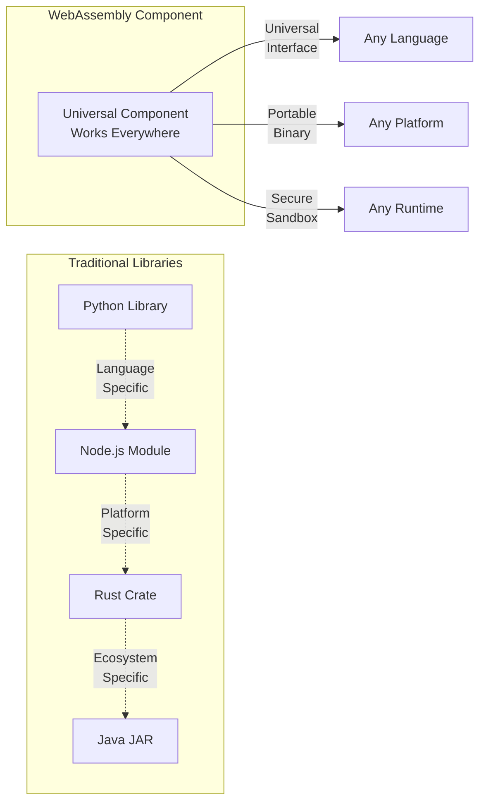
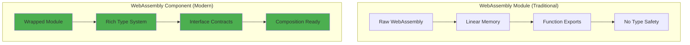
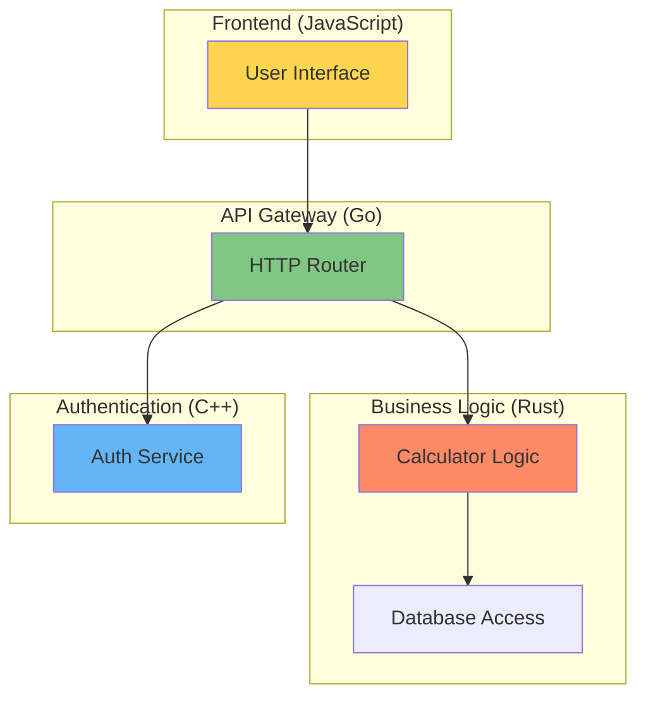
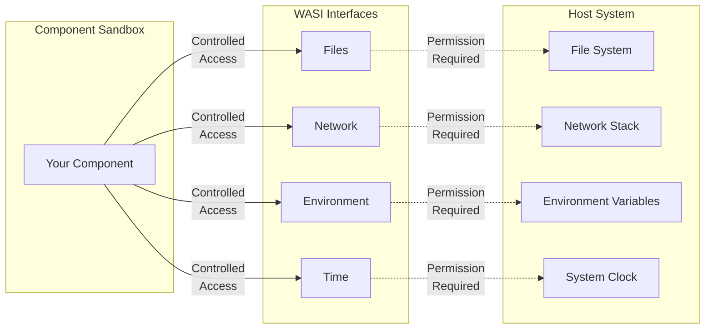
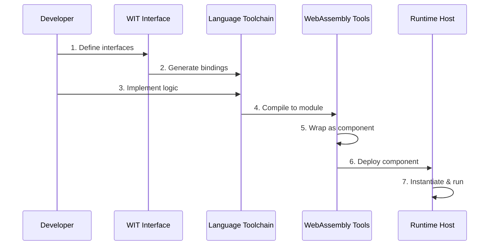

# WebAssembly Component Fundamentals

<div class="complexity-badge beginner">
  <span class="badge-icon">📚</span>
  <div class="badge-content">
    <strong>BEGINNER</strong>
    <p>Learn WebAssembly concepts independent of build tools</p>
  </div>
</div>

**Before learning Bazel rules, understand what you're building.** This page explains WebAssembly components independently of any build system, so you understand the concepts before learning the tools.

## What is a WebAssembly Component?

**Think of a WebAssembly component as a secure, portable function** that can be called from any programming language and runs anywhere WebAssembly is supported.



**Key Properties:**
- **Universal**: Same component works in Python, JavaScript, Rust, Go, etc.
- **Portable**: Runs on Windows, macOS, Linux, browsers, servers, IoT devices
- **Secure**: Cannot access your filesystem or network unless explicitly allowed
- **Fast**: Near-native performance with efficient startup times

## The WebAssembly Component Model

The **Component Model** is the standard that makes this magic possible. It's like a universal adapter that lets components from different languages talk to each other.

### How Components Differ from Modules



**WebAssembly Module (Old Way):**
- Raw binary with basic function exports
- No type safety across language boundaries
- Hard to compose with other modules
- Manual memory management

**WebAssembly Component (New Way):**
- Rich interface definitions with types
- Automatic type conversion between languages
- Easy composition and dependency management
- Standardized system interfaces (WASI)

## WIT: WebAssembly Interface Types

**WIT is the "API contract" language** for WebAssembly components. It's like TypeScript definitions or Protocol Buffers - it describes what your component does without caring how it's implemented.

### Example: A Simple Calculator Component

**WIT Interface (calculator.wit):**
```wit
package local:calculator@1.0.0;

interface math {
    add: func(a: f64, b: f64) -> f64;
    subtract: func(a: f64, b: f64) -> f64;
    divide: func(a: f64, b: f64) -> result<f64, string>;
}

world calculator {
    export math;
}
```

**What this means:**
- **Package**: `local:calculator@1.0.0` - unique identifier and version
- **Interface**: `math` - group of related functions
- **Functions**: Type-safe function signatures
- **World**: What this component exports to the outside world

### From WIT to Any Language

**This same WIT interface generates different code for each language:**

**Rust Implementation:**
```rust
// Generated automatically from WIT
impl Math for Component {
    fn add(&mut self, a: f64, b: f64) -> f64 {
        a + b
    }

    fn divide(&mut self, a: f64, b: f64) -> Result<f64, String> {
        if b == 0.0 {
            Err("Division by zero".to_string())
        } else {
            Ok(a / b)
        }
    }
}
```

**JavaScript Usage:**
```javascript
// Generated automatically from WIT
import { calc } from './calculator.js';

const result = calc.add(5.0, 3.0);       // Returns: 8.0
const divided = calc.divide(10.0, 2.0);  // Returns: { success: true, error: null, value: 5.0 }
const error = calc.divide(10.0, 0.0);    // Returns: { success: false, error: "Division by zero is not allowed", value: null }
```

**The magic:** You write the WIT once, implement it in any language, and it automatically works with every other language.

## Component Composition

**Components can be connected like LEGO blocks** to build larger systems. This is where the real power emerges.



**Each component:**
- Built in the best language for its purpose
- Tested independently
- Deployed and updated separately
- Secure isolation from other components

## WASI: WebAssembly System Interface

**WASI provides standardized access to system resources** like files, network, and environment variables - but only what you explicitly allow.



**Security by Design:**
- Components can only access what you explicitly grant
- No surprise network calls or file system access
- Capabilities can be limited (e.g., read-only access to specific directories)
- Perfect for microservices and untrusted code execution

## Component Lifecycle

**Understanding the journey from code to running component:**



**What happens at each step:**
1. **Define interfaces** - Write WIT files describing what your component does
2. **Generate bindings** - Tool creates language-specific interfaces
3. **Implement logic** - Write your business logic in your chosen language
4. **Compile to module** - Language compiler produces WebAssembly module
5. **Wrap as component** - Add Component Model metadata and interfaces
6. **Deploy component** - Component ready to run anywhere
7. **Instantiate & run** - Runtime loads and executes your component

## Why This Matters for You

**Before learning Bazel rules, understanding these concepts helps you:**

1. **Choose the right language** for each component based on its strengths
2. **Design better interfaces** using WIT's type system effectively
3. **Plan component architecture** that takes advantage of composition
4. **Debug issues** by understanding what's WebAssembly vs build system
5. **Make informed decisions** about security, performance, and deployment

## What's Next?

**Now that you understand the concepts, you're ready to:**

- **Learn the Bazel rules** → [Component Architecture](/architecture/overview/)
- **See it in action** → [Zero to Component](/zero-to-component/)
- **Pick your language** → [Multi-Language Development](/learn/multi-language/)
- **Build something** → [Language Development](/build/languages/)

**Remember:** WebAssembly components are the technology, Bazel rules are just the build tool. Understanding the technology first makes learning the tools much easier!
