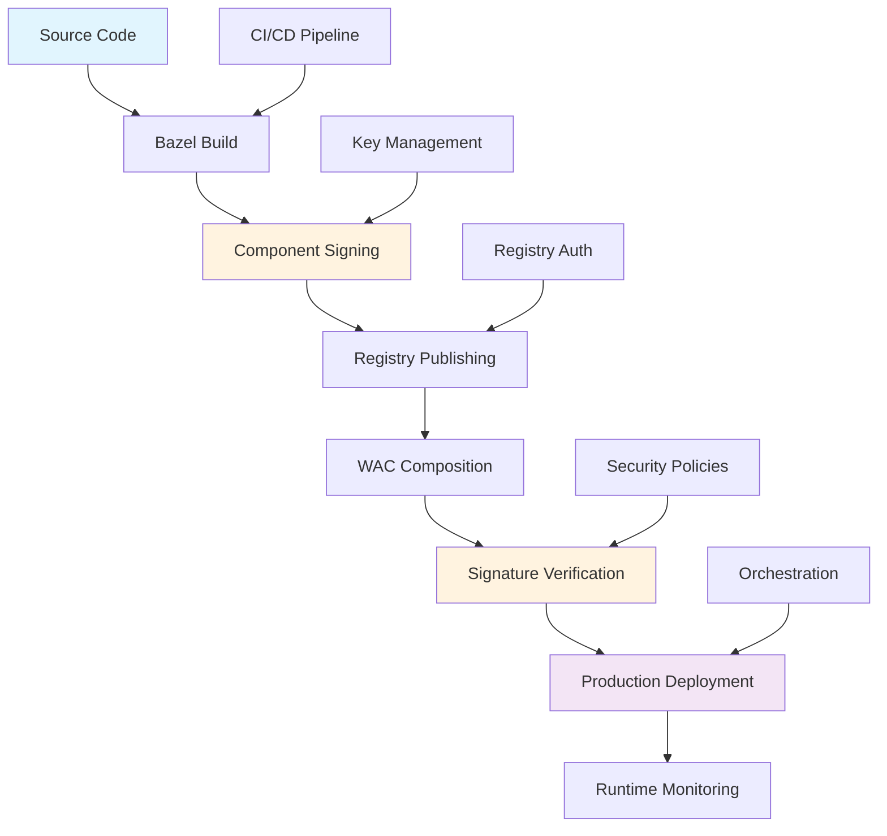

# Production Deployment Guide

## From Development to Production

**Moving from "it works on my machine" to "it works reliably for thousands of users"** requires careful planning and robust processes. This guide shows you how to deploy WebAssembly components with enterprise-grade reliability and security.

**What makes production deployment different:**
- **Scale and reliability** - Your components need to handle real user load without failing
- **Security requirements** - Production systems need cryptographic verification and access controls
- **Compliance needs** - Many organizations require audit trails and signed code
- **Team coordination** - Multiple teams need to deploy and update components safely
- **Zero-downtime updates** - Changes must happen without interrupting users

**The production challenge:** In development, you can rebuild and restart quickly when something breaks. In production, failures affect real users and cost money. This guide shows you how to build deployment processes that are both secure and reliable.

## The Complete Production Pipeline

**Think of production deployment as an assembly line** where each stage adds reliability and security. No shortcuts - each step protects your users and your business.

Learn how to deploy WebAssembly components securely in production environments using the complete pipeline: building, signing, registry publishing, composition, and runtime deployment.

## Core Production Requirements

Production deployment involves:
- **Component Building** - Optimized builds with Bazel
- **Component Signing** - Cryptographic integrity protection
- **Registry Publishing** - Secure distribution via OCI registries
- **WAC Composition** - Multi-component system assembly
- **Runtime Deployment** - Production environment orchestration

## Complete Production Pipeline



**Production-Ready:** This pipeline ensures security, reliability, and scalability for enterprise WebAssembly deployments.

## Phase 1: Secure Component Building

**Production builds are different from development builds.** They prioritize performance, security, and reliability over quick iteration. Think of it like the difference between a prototype car and one that rolls off the production line - same basic function, but built to much higher standards.

### Optimized Production Builds

```python title="BUILD.bazel"
load("@rules_wasm_component//rust:defs.bzl", "rust_wasm_component_bindgen")
load("@rules_wasm_component//wasm:defs.bzl", "wasm_sign", "wasm_validate")

# Production-optimized component
rust_wasm_component_bindgen(
    name = "auth_service_component",
    srcs = ["src/auth.rs"],
    profiles = ["release"],  # Optimized build
    wit = ":auth_interfaces",
    optimization = "size",   # Minimize binary size
    debug = False,          # No debug symbols
)

# Validate before signing
wasm_validate(
    name = "validate_auth_service",
    component = ":auth_service_component",
    # Comprehensive validation
    check_imports = True,
    check_exports = True,
    check_signatures = False,  # Will sign after validation
)
```

### Multi-Environment Configuration

```python title="BUILD.bazel"
# Development build
rust_wasm_component_bindgen(
    name = "auth_service_dev",
    srcs = ["src/auth.rs"],
    profiles = ["dev"],
    wit = ":auth_interfaces",
    debug = True,
)

# Staging build
rust_wasm_component_bindgen(
    name = "auth_service_staging",
    srcs = ["src/auth.rs"],
    profiles = ["release"],
    wit = ":auth_interfaces",
    optimization = "balanced",
)

# Production build
rust_wasm_component_bindgen(
    name = "auth_service_prod",
    srcs = ["src/auth.rs"],
    profiles = ["release"],
    wit = ":auth_interfaces",
    optimization = "size",
    debug = False,
)
```

---

## Phase 2: Component Signing Strategy

**Signing is like putting a tamper-proof seal on your components.** In production, you can't trust that components haven't been modified between build and deployment. Signing provides mathematical proof that your components are authentic and unmodified.

### Production Key Management

```python title="keys/BUILD.bazel"
load("@rules_wasm_component//wasm:defs.bzl", "wasm_keygen")

# Production signing keys (generated once, stored securely)
wasm_keygen(
    name = "production_keys",
    openssh_format = True,  # GitHub compatibility
    # Keys stored in secure key management system
)

# Staging keys for testing
wasm_keygen(
    name = "staging_keys",
    openssh_format = True,
)

# Development keys (per-developer)
wasm_keygen(
    name = "dev_keys",
    openssh_format = False,  # Faster for development
)
```

### Multi-Stage Signing Pipeline

```python title="BUILD.bazel"
# Sign for staging environment
wasm_sign(
    name = "auth_service_staging_signed",
    component = ":auth_service_staging",
    keys = "//keys:staging_keys",
    detached = True,  # Separate signature file
)

# Sign for production environment
wasm_sign(
    name = "auth_service_prod_signed",
    component = ":auth_service_prod",
    keys = "//keys:production_keys",
    detached = True,
)

# Verify production signature
wasm_verify(
    name = "verify_prod_signature",
    signed_component = ":auth_service_prod_signed",
    keys = "//keys:production_keys",
)
```

### Multi-Signature Workflow

```python title="BUILD.bazel"
# Developer signature
wasm_sign(
    name = "auth_dev_signed",
    component = ":auth_service_prod",
    keys = "//keys:developer_keys",
    detached = True,
)

# Security team signature
wasm_sign(
    name = "auth_security_signed",
    component = ":auth_dev_signed",
    keys = "//keys:security_keys",
    detached = True,
)

# Release manager signature
wasm_sign(
    name = "auth_release_signed",
    component = ":auth_security_signed",
    keys = "//keys:release_keys",
    detached = True,
)
```

---

## Phase 3: OCI Registry Publishing

**Registries are like app stores for your components.** They provide secure, versioned storage and distribution. Just as you wouldn't download apps from random websites, production systems need trusted sources for components.

### Registry Configuration

```python title="registry/BUILD.bazel"
load("@rules_wasm_component//wkg:defs.bzl", "wkg_registry_config")

# Production registry configuration
wkg_registry_config(
    name = "production_registries",
    default_registry = "corp",
    enable_signature_verification = True,
    registries = [
        # Corporate registry (primary)
        "corp|registry.company.com|oci|env|CORP_REGISTRY_TOKEN",

        # GitHub Container Registry (backup)
        "github|ghcr.io|oci|env|GITHUB_TOKEN",

        # AWS ECR (specific regions)
        "aws|123456789.dkr.ecr.us-east-1.amazonaws.com|oci|oauth|client_id|client_secret",
    ],
    timeout_seconds = 30,
    cache_dir = "/var/cache/wkg",
)
```

### Component Publishing Pipeline

```python title="BUILD.bazel"
load("@rules_wasm_component//wkg:defs.bzl", "wasm_component_oci_publish")

# Push to staging registry
wasm_component_oci_publish(
    name = "push_auth_staging",
    component = ":auth_service_staging_signed",
    registry = "registry.company.com",
    namespace = "staging",
    component_name = "auth-service",
    tag = "latest",
    registry_config = ":production_registries",
)

# Push to production registry with versioning
wasm_component_oci_publish(
    name = "push_auth_production",
    component = ":auth_service_prod_signed",
    registry = "registry.company.com",
    namespace = "production",
    component_name = "auth-service",
    tag = "v1.0.0",
    additional_tags = ["latest", "stable"],
    registry_config = ":production_registries",
)
```

### Multi-Registry Distribution

```python title="BUILD.bazel"
# Push to multiple registries for redundancy
genrule(
    name = "distribute_component",
    srcs = [":auth_service_prod_signed"],
    outs = ["distribution_report.txt"],
    cmd = """
        # Push to primary registry
        bazel run //registry:push_auth_production

        # Push to backup registry
        bazel run //registry:push_auth_github

        # Push to regional registries
        bazel run //registry:push_auth_eu
        bazel run //registry:push_auth_asia

        echo "Component distributed to all registries" > $@
    """,
)
```

---

## Phase 4: WAC Composition for Production

**Composition is where individual components become a complete application.** Like assembling a car from parts, you need to connect all your components together correctly and ensure they work as a system, not just individually.

### Production System Composition

```python title="deploy/BUILD.bazel"
load("@rules_wasm_component//wac:defs.bzl", "wac_compose_with_oci")

# Production microservices composition
wac_compose_with_oci(
    name = "production_system",
    composition_file = "compositions/production.wac",

    # Local gateway components
    local_components = {
        "api_gateway": "//gateway:production_gateway",
        "load_balancer": "//lb:production_lb",
    },

    # Production services from registries
    oci_components = {
        "auth_service": "registry.company.com/production/auth-service:v1.0.0",
        "user_service": "registry.company.com/production/user-service:v2.1.0",
        "data_service": "registry.company.com/production/data-service:v1.8.0",
        "payment_service": "registry.company.com/production/payment-service:v3.0.0",
        "notification_service": "registry.company.com/production/notification-service:v1.5.0",
    },

    # Security configuration
    verify_signatures = True,
    trusted_keys = "//keys:production_verification_keys",
    require_signed_components = True,

    # Registry configuration
    registry_config = "//registry:production_registries",
)
```

### Environment-Specific Compositions

```python title="deploy/BUILD.bazel"
# Development composition with local services
wac_compose(
    name = "dev_system",
    components = {
        "//gateway:dev_gateway": "gateway:service",
        "//services:mock_auth": "auth:service",
        "//services:mock_data": "data:service",
    },
    composition_file = "compositions/development.wac",
)

# Staging composition with mix of local and remote
wac_compose_with_oci(
    name = "staging_system",
    local_components = {
        "gateway": "//gateway:staging_gateway",
    },
    oci_components = {
        "auth_service": "registry.company.com/staging/auth-service:latest",
        "data_service": "registry.company.com/staging/data-service:latest",
    },
    verify_signatures = True,
    trusted_keys = "//keys:staging_keys",
    registry_config = "//registry:staging_registries",
)
```

### External Composition File

```shell title="compositions/production.wac"
// Production microservices composition
package production:system@1.0.0;

// Local components (built and deployed with system)
let gateway = new gateway:service {
    // Gateway configuration
    max_connections: 10000,
    timeout_seconds: 30,
    rate_limit: 1000,
    ...
};

let load_balancer = new lb:service {
    // Load balancer configuration
    algorithm: "round-robin",
    health_check_interval: 10,
    ...
};

// Remote services (pulled from OCI registries)
let auth = new auth:service {
    // Auth service configuration
    token_expiry: 3600,
    max_sessions: 50000,
    ...
};

let users = new user:service {
    // User service configuration
    cache_size: 10000,
    ...
};

let data = new data:service {
    // Data service configuration
    connection_pool_size: 100,
    query_timeout: 5000,
    ...
};

let payments = new payment:service {
    // Payment service configuration
    encryption: "AES-256",
    compliance: "PCI-DSS",
    ...
};

let notifications = new notification:service {
    // Notification service configuration
    channels: ["email", "sms", "push"],
    ...
};

// Core request flow
connect load_balancer.route-request -> gateway.handle-request;
connect gateway.authenticate -> auth.verify-token;
connect gateway.authorize -> auth.check-permissions;

// User management flow
connect gateway.user-request -> users.handle-user-request;
connect users.authenticate -> auth.verify-credentials;

// Data operations flow
connect gateway.data-request -> data.handle-query;
connect data.audit-log -> auth.log-data-access;

// Payment processing flow
connect gateway.payment-request -> payments.process-payment;
connect payments.verify-user -> users.get-user-info;
connect payments.audit -> auth.log-payment-event;

// Notification flow
connect users.notify -> notifications.send-notification;
connect payments.notify -> notifications.send-notification;
connect auth.notify -> notifications.send-notification;

// Health monitoring
connect gateway.health-check -> auth.health-status;
connect gateway.health-check -> users.health-status;
connect gateway.health-check -> data.health-status;
connect gateway.health-check -> payments.health-status;
connect gateway.health-check -> notifications.health-status;

// Export main interfaces
export load_balancer as main;
export {
    gateway.health-check as health,
    gateway.metrics as metrics,
    auth.audit-logs as audit,
} as admin;
```

---

## Phase 5: Production Deployment Orchestration

**Orchestration is about running your application reliably at scale.** It's not enough for your components to work - they need to handle failures, scale under load, and update without downtime. This is where container orchestration platforms like Kubernetes come in.

### Kubernetes Deployment

```yaml title="k8s/production-deployment.yaml"
apiVersion: apps/v1
kind: Deployment
metadata:
  name: wasm-microservices
  namespace: production
spec:
  replicas: 3
  selector:
    matchLabels:
      app: wasm-microservices
  template:
    metadata:
      labels:
        app: wasm-microservices
    spec:
      containers:
      - name: wasmtime-runtime
        image: wasmtime/wasmtime:latest
        command: ["wasmtime"]
        args:
          - "run"
          - "--wasi"
          - "preview2"
          - "/app/production_system.wasm"
        volumeMounts:
        - name: wasm-components
          mountPath: /app
        - name: signing-keys
          mountPath: /keys
          readOnly: true
        env:
        - name: WASMTIME_BACKTRACE_DETAILS
          value: "1"
        - name: VERIFY_SIGNATURES
          value: "true"
        resources:
          requests:
            memory: "256Mi"
            cpu: "200m"
          limits:
            memory: "512Mi"
            cpu: "500m"
      volumes:
      - name: wasm-components
        configMap:
          name: wasm-components
      - name: signing-keys
        secret:
          secretName: component-signing-keys
---
apiVersion: v1
kind: Service
metadata:
  name: wasm-microservices-service
  namespace: production
spec:
  selector:
    app: wasm-microservices
  ports:
  - protocol: TCP
    port: 80
    targetPort: 8080
  type: LoadBalancer
```

### Docker Deployment

```dockerfile title="Dockerfile.production"
FROM wasmtime/wasmtime:latest

# Copy signed and verified components
COPY bazel-bin/deploy/production_system.wasm /app/system.wasm
COPY keys/production_public.pem /keys/public.pem

# Verify signatures at build time
RUN wasmtime validate /app/system.wasm

# Set up runtime environment
ENV WASMTIME_BACKTRACE_DETAILS=1
ENV VERIFY_SIGNATURES=true

# Health check
HEALTHCHECK --interval=30s --timeout=3s --start-period=5s --retries=3 \
  CMD curl -f http://localhost:8080/health || exit 1

# Run the composed system
EXPOSE 8080
CMD ["wasmtime", "run", "--wasi", "preview2", "--invoke", "_start", "/app/system.wasm"]
```

### Deployment Scripts

```bash title="scripts/deploy-production.sh"
#!/bin/bash
set -euo pipefail

echo "🚀 Starting production deployment..."

# Step 1: Build all components
echo "📦 Building components..."
bazel build //deploy:production_system

# Step 2: Verify signatures
echo "🔐 Verifying signatures..."
bazel build //deploy:verify_production_signatures

# Step 3: Run integration tests
echo "🧪 Running integration tests..."
bazel test //tests:production_integration_test

# Step 4: Deploy to staging first
echo "🎭 Deploying to staging..."
kubectl apply -f k8s/staging-deployment.yaml
kubectl rollout status deployment/wasm-microservices-staging

# Step 5: Run smoke tests on staging
echo "💨 Running smoke tests..."
./scripts/smoke-test-staging.sh

# Step 6: Deploy to production
echo "🏭 Deploying to production..."
kubectl apply -f k8s/production-deployment.yaml
kubectl rollout status deployment/wasm-microservices

# Step 7: Verify production deployment
echo "✅ Verifying production deployment..."
./scripts/verify-production.sh

echo "🎉 Production deployment complete!"
```

---

## Phase 6: Monitoring and Observability

### Component Health Monitoring

```rust title="src/monitoring.rs"
use monitoring_bindings::exports::monitoring::health::Guest;

struct MonitoringComponent;

impl Guest for MonitoringComponent {
    fn check_system_health() -> SystemHealth {
        SystemHealth {
            overall_status: HealthState::Healthy,
            component_statuses: vec![
                ("auth_service".to_string(), check_auth_health()),
                ("data_service".to_string(), check_data_health()),
                ("payment_service".to_string(), check_payment_health()),
            ],
            composition_info: CompositionMetadata {
                local_components: vec!["gateway".to_string(), "load_balancer".to_string()],
                oci_components: vec![
                    "registry.company.com/production/auth-service:v1.0.0".to_string(),
                    "registry.company.com/production/data-service:v1.8.0".to_string(),
                    "registry.company.com/production/payment-service:v3.0.0".to_string(),
                ],
                registries: vec!["registry.company.com".to_string()],
                signature_verified: true,
            },
        }
    }
}
```

### Prometheus Metrics

```yaml title="k8s/monitoring.yaml"
apiVersion: v1
kind: ConfigMap
metadata:
  name: prometheus-config
data:
  prometheus.yml: |
    global:
      scrape_interval: 15s
    scrape_configs:
    - job_name: 'wasm-components'
      static_configs:
      - targets: ['wasm-microservices-service:8080']
      metrics_path: /metrics
      scrape_interval: 5s
---
apiVersion: monitoring.coreos.com/v1
kind: ServiceMonitor
metadata:
  name: wasm-components
spec:
  selector:
    matchLabels:
      app: wasm-microservices
  endpoints:
  - port: http
    interval: 30s
    path: /metrics
```

### Alerting Configuration

```yaml title="alerts/component-alerts.yaml"
groups:
- name: wasm-components
  rules:
  - alert: ComponentSignatureVerificationFailed
    expr: wasm_signature_verification_failures_total > 0
    for: 0m
    labels:
      severity: critical
    annotations:
      summary: "Component signature verification failed"
      description: "One or more WASM components failed signature verification"

  - alert: ComponentHealthCheckFailed
    expr: wasm_component_health_status != 1
    for: 2m
    labels:
      severity: warning
    annotations:
      summary: "Component health check failed"
      description: "Component {{ $labels.component }} health check failed"

  - alert: HighComponentMemoryUsage
    expr: wasm_component_memory_usage_bytes > 500000000  # 500MB
    for: 5m
    labels:
      severity: warning
    annotations:
      summary: "High memory usage in WASM component"
      description: "Component {{ $labels.component }} memory usage is above 500MB"
```

---

## Phase 7: Security and Compliance

### Security Policies

```yaml title="security/pod-security-policy.yaml"
apiVersion: policy/v1beta1
kind: PodSecurityPolicy
metadata:
  name: wasm-components-psp
spec:
  privileged: false
  allowPrivilegeEscalation: false
  requiredDropCapabilities:
    - ALL
  volumes:
    - 'configMap'
    - 'emptyDir'
    - 'projected'
    - 'secret'
    - 'downwardAPI'
    - 'persistentVolumeClaim'
  runAsUser:
    rule: 'MustRunAsNonRoot'
  seLinux:
    rule: 'RunAsAny'
  fsGroup:
    rule: 'RunAsAny'
```

### Network Policies

```yaml title="security/network-policy.yaml"
apiVersion: networking.k8s.io/v1
kind: NetworkPolicy
metadata:
  name: wasm-components-netpol
  namespace: production
spec:
  podSelector:
    matchLabels:
      app: wasm-microservices
  policyTypes:
  - Ingress
  - Egress
  ingress:
  - from:
    - namespaceSelector:
        matchLabels:
          name: ingress-nginx
    ports:
    - protocol: TCP
      port: 8080
  egress:
  - to:
    - namespaceSelector:
        matchLabels:
          name: kube-system
    ports:
    - protocol: TCP
      port: 53
    - protocol: UDP
      port: 53
```

### Audit Configuration

```yaml title="security/audit-policy.yaml"
apiVersion: audit.k8s.io/v1
kind: Policy
rules:
- level: Metadata
  namespaces: ["production"]
  resources:
  - group: ""
    resources: ["pods", "services"]
  - group: "apps"
    resources: ["deployments"]
  omitStages:
  - RequestReceived
```

---

## Phase 8: Backup and Disaster Recovery

### Component Backup Strategy

```bash title="scripts/backup-components.sh"
#!/bin/bash

# Backup signed components to multiple locations
BACKUP_DATE=$(date +%Y-%m-%d)

# Local backup
mkdir -p /backup/components/$BACKUP_DATE
cp bazel-bin/deploy/production_system.wasm /backup/components/$BACKUP_DATE/
cp bazel-bin/deploy/production_system.wasm.sig /backup/components/$BACKUP_DATE/

# Cloud backup (S3)
aws s3 cp /backup/components/$BACKUP_DATE/ s3://company-wasm-backup/components/$BACKUP_DATE/ --recursive

# Registry backup (push to backup registry)
bazel run //deploy:push_to_backup_registry

echo "Component backup completed for $BACKUP_DATE"
```

### Disaster Recovery Plan

```bash title="scripts/disaster-recovery.sh"
#!/bin/bash

echo "🚨 Initiating disaster recovery..."

# Step 1: Stop current deployment
kubectl scale deployment wasm-microservices --replicas=0

# Step 2: Restore from backup
RECOVERY_DATE=${1:-$(date +%Y-%m-%d)}
aws s3 cp s3://company-wasm-backup/components/$RECOVERY_DATE/ /tmp/recovery/ --recursive

# Step 3: Verify backup integrity
wasmsign2 verify /tmp/recovery/production_system.wasm --public-key /keys/production_public.pem

# Step 4: Deploy recovered components
kubectl create configmap wasm-components-recovery --from-file=/tmp/recovery/
kubectl set env deployment/wasm-microservices CONFIG_MAP=wasm-components-recovery

# Step 5: Scale back up
kubectl scale deployment wasm-microservices --replicas=3

# Step 6: Verify recovery
kubectl rollout status deployment/wasm-microservices
./scripts/verify-production.sh

echo "✅ Disaster recovery completed"
```

---

## Best Practices Summary

### Security Best Practices

1. **Always verify signatures** in production
2. **Use separate keys** for different environments
3. **Implement multi-signature** workflows for critical components
4. **Store private keys securely** using key management systems
5. **Monitor signature verification** status continuously

### Deployment Best Practices

1. **Test compositions** in staging before production
2. **Use immutable component versions** in production
3. **Implement gradual rollout** strategies
4. **Monitor component health** continuously
5. **Have rollback procedures** ready

### Performance Best Practices

1. **Optimize component sizes** for production
2. **Use caching** for registry components
3. **Implement health checks** for all components
4. **Monitor resource usage** and set appropriate limits
5. **Use load balancing** for high availability

### Operational Best Practices

1. **Automate the entire pipeline** from build to deployment
2. **Implement comprehensive monitoring** and alerting
3. **Regular backup** of components and configurations
4. **Document incident response** procedures
5. **Practice disaster recovery** scenarios

This production deployment guide provides a complete, secure, and scalable approach to deploying WebAssembly components in enterprise environments.
