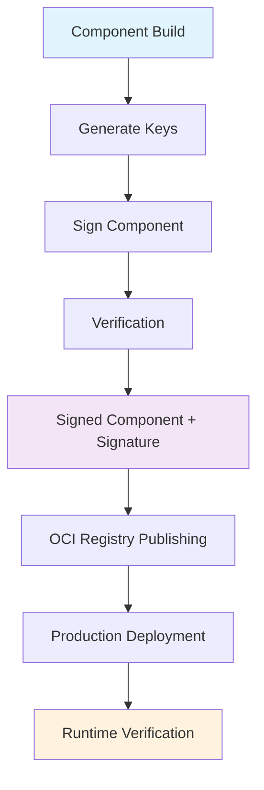

# Component Signing & Verification

Learn how to cryptographically sign and verify WebAssembly components for secure production deployment using integrated wasmsign2 support.

## Overview

Component signing provides:
- **🔐 Authenticity Verification** - Prove components come from trusted sources
- **🛡️ Integrity Protection** - Detect any tampering or corruption
- **📋 Non-repudiation** - Cryptographic proof of component origin
- **🚀 Production Ready** - Enterprise-grade security for deployment

## Pipeline Overview - Signing Workflow



**Key Insight:** Signing integrates seamlessly into your Bazel build pipeline, providing security without complexity.

---

## Quick Start

### Step 1: Generate Signing Keys

```python title="BUILD.bazel"
load("@rules_wasm_component//wasm:defs.bzl", "wasm_keygen")
load("@rules_wasm_component//wasm:ssh_keygen.bzl", "ssh_keygen")

# Generate actual OpenSSH Ed25519 keys (compatible with GitHub)
ssh_keygen(
    name = "production_keys",
    key_type = "ed25519",
    comment = "Production WebAssembly component signing key",
)

# Generate compact format keys (optimal performance)
wasm_keygen(
    name = "dev_keys",
    openssh_format = False,
)
```

### Step 2: Sign Your Component

```python title="BUILD.bazel"
load("@rules_wasm_component//wasm:defs.bzl", "wasm_sign")

# Sign with embedded signature
wasm_sign(
    name = "signed_component",
    component = ":my_component",
    keys = ":production_keys",
    detached = False,  # Signature embedded in component
)

# Sign with detached signature (separate .sig file)
wasm_sign(
    name = "signed_component_detached",
    component = ":my_component",
    keys = ":production_keys",
    detached = True,  # Creates component.wasm.sig
)
```

### Step 3: Verify Signatures

```python title="BUILD.bazel"
load("@rules_wasm_component//wasm:defs.bzl", "wasm_verify", "wasm_validate")

# Standalone verification
wasm_verify(
    name = "verify_signature",
    signed_component = ":signed_component",
    keys = ":production_keys",
)

# Validation with signature check
wasm_validate(
    name = "validate_signed_component",
    component = ":signed_component",
    verify_signature = True,
    signing_keys = ":production_keys",
)
```

### Step 4: Build and Test

```bash
# Generate keys
bazel build //:production_keys

# Sign component
bazel build //:signed_component

# Verify signature
bazel build //:verify_signature

# Complete validation
bazel build //:validate_signed_component
```

---

## Key Management

### Key Generation Methods

There are two distinct approaches to generating signing keys:

**Method 1: Actual OpenSSH Keys (Recommended)**
- Uses real `ssh-keygen` from the openssh Bazel module
- Generates authentic OpenSSH Ed25519 keys
- Compatible with GitHub SSH keys and existing infrastructure
- Required for wasmsign2's `-Z` flag (OpenSSH signing mode)
- Requires `bazel_dep(name = "openssh", version = "9.9p1.bcr.1")` in MODULE.bazel

**Method 2: wasmsign2 Compact Keys**
- Uses wasmsign2's built-in key generation
- Generates compact format keys optimized for WebAssembly signing
- Smaller key size and faster verification
- Native wasmsign2 format

### Key Generation Options

**OpenSSH Format (Recommended for CI/CD):**
```python
ssh_keygen(
    name = "github_compatible_keys",
    key_type = "ed25519",  # Actual OpenSSH Ed25519 format
    comment = "GitHub compatible signing key",
    # Compatible with GitHub SSH keys
    # Easy integration with existing infrastructure
)
```

**Compact Format (Optimal Performance):**
```python
wasm_keygen(
    name = "performance_keys",
    openssh_format = False,  # Native wasmsign2 format
    # Smaller key size
    # Faster verification
)
```

**Complete Example - Both Key Types:**
```python title="BUILD.bazel"
load("@rules_wasm_component//wasm:defs.bzl", "wasm_keygen", "wasm_sign")
load("@rules_wasm_component//wasm:ssh_keygen.bzl", "ssh_keygen")

# OpenSSH keys for production/GitHub integration
ssh_keygen(
    name = "production_openssh_keys",
    key_type = "ed25519",
    comment = "Production WebAssembly signing key",
)

# Compact keys for performance-optimized scenarios
wasm_keygen(
    name = "development_compact_keys",
    openssh_format = False,
)

# Sign with OpenSSH keys (uses -Z flag internally)
wasm_sign(
    name = "openssh_signed_component",
    component = ":my_component",
    keys = ":production_openssh_keys",
    detached = True,
)

# Sign with compact keys (standard wasmsign2)
wasm_sign(
    name = "compact_signed_component",
    component = ":my_component",
    keys = ":development_compact_keys",
    detached = False,
)
```

### Key Storage Best Practices

**Development Environment:**
```python
ssh_keygen(
    name = "dev_keys",
    key_type = "ed25519",
    comment = "Development signing key",
    # Keys generated in bazel-bin/
    # Safe for development use
)
```

**Production Environment:**
```bash
# Store private keys securely
export PRIVATE_KEY_PATH="/secure/path/private.pem"
export PUBLIC_KEY_PATH="/secure/path/public.pem"

# Use environment variables in BUILD files
wasm_sign(
    name = "production_signed",
    component = ":component",
    private_key_path = "$(PRIVATE_KEY_PATH)",
)
```

### GitHub Integration

**Using OpenSSH Keys for Signing:**
```python
# Generate OpenSSH keys and use for signing
ssh_keygen(
    name = "github_style_keys",
    key_type = "ed25519",
    comment = "your-username@github",
)

wasm_sign(
    name = "github_signed_component",
    component = ":my_component",
    keys = ":github_style_keys",
    detached = True,
)
```

---

## Signature Types

### Embedded Signatures

**Advantages:**
- Single file distribution
- Cannot be separated from component
- Automatic verification

**Use Cases:**
- Internal applications
- Simple deployment scenarios
- Development and testing

```python
wasm_sign(
    name = "embedded_signed",
    component = ":my_component",
    keys = ":signing_keys",
    detached = False,  # Signature embedded in WASM
)
```

### Detached Signatures

**Advantages:**
- Original component unchanged
- Multiple signatures possible
- Flexible verification workflows
- Better for OCI registries

**Use Cases:**
- Public component distribution
- Multi-signature workflows
- OCI registry publishing
- Enterprise environments

```python
wasm_sign(
    name = "detached_signed",
    component = ":my_component",
    keys = ":signing_keys",
    detached = True,  # Creates .wasm and .wasm.sig files
)
```

---

## Advanced Signing Patterns

### Multi-Environment Signing

**Development, Staging, Production:**
```python
# Development signing (compact keys)
wasm_sign(
    name = "dev_signed",
    component = ":component",
    keys = ":dev_keys",
    detached = False,
)

# Staging signing (OpenSSH keys)
wasm_sign(
    name = "staging_signed",
    component = ":component",
    keys = ":staging_openssh_keys",
    detached = True,
)

# Production signing (OpenSSH keys)
wasm_sign(
    name = "prod_signed",
    component = ":component",
    keys = ":production_openssh_keys",
    detached = True,
    # Additional security for production
)
```

### Multi-Signature Support

**Chain Multiple Signatures:**
```python
# First signature (developer)
wasm_sign(
    name = "developer_signed",
    component = ":component",
    keys = ":developer_keys",
    detached = True,
)

# Second signature (security team)
wasm_sign(
    name = "security_signed",
    component = ":developer_signed",  # Sign the already-signed component
    keys = ":security_keys",
    detached = True,
)

# Third signature (release manager)
wasm_sign(
    name = "release_signed",
    component = ":security_signed",
    keys = ":release_keys",
    detached = True,
)
```

### Conditional Verification

**Different Verification for Different Environments:**
```python
# Development - optional verification
wasm_validate(
    name = "dev_validate",
    component = ":dev_component",
    verify_signature = False,  # Skip in development
)

# Production - mandatory verification
wasm_validate(
    name = "prod_validate",
    component = ":prod_component",
    verify_signature = True,   # Required in production
    signing_keys = ":production_keys",
)
```

---

## Integration with OCI Registries

### Publishing Signed Components

```python
load("@rules_wasm_component//oci:defs.bzl", "wasm_component_oci_push")

# Push signed component to registry
wasm_component_oci_push(
    name = "push_signed_component",
    component = ":signed_component",
    registry = "ghcr.io",
    namespace = "my-org",
    component_name = "my-service",
    tag = "v1.0.0",
    # Signature is preserved in OCI layers
)
```

### Pulling and Verifying from OCI

```python
load("@rules_wasm_component//oci:defs.bzl", "wasm_component_from_oci")

# Pull component with signature verification
wasm_component_from_oci(
    name = "verified_remote_component",
    registry = "ghcr.io",
    namespace = "trusted-org",
    component_name = "auth-service",
    tag = "v2.1.0",
    verify_signature = True,
    trusted_keys = ":trusted_public_keys",
)
```

---

## CI/CD Integration

### GitHub Actions Workflow

```yaml title=".github/workflows/sign-and-deploy.yml"
name: Build, Sign, and Deploy

on:
  push:
    tags: ['v*']

jobs:
  build-and-sign:
    runs-on: ubuntu-latest
    steps:
      - uses: actions/checkout@v4

      - name: Setup Bazel
        uses: bazelbuild/setup-bazelisk@v2

      - name: Build component
        run: bazel build //src:my_component

      - name: Generate keys (if needed)
        run: bazel build //keys:production_keys

      - name: Sign component
        run: bazel build //src:signed_component

      - name: Verify signature
        run: bazel build //src:verify_signature

      - name: Push to registry
        run: bazel run //src:push_signed_component
        env:
          GITHUB_TOKEN: ${{ secrets.GITHUB_TOKEN }}
```

### Jenkins Pipeline

```groovy title="Jenkinsfile"
pipeline {
    agent any

    environment {
        SIGNING_KEY = credentials('production-signing-key')
    }

    stages {
        stage('Build') {
            steps {
                sh 'bazel build //src:my_component'
            }
        }

        stage('Sign') {
            steps {
                sh 'bazel build //src:signed_component'
            }
        }

        stage('Verify') {
            steps {
                sh 'bazel build //src:verify_signature'
            }
        }

        stage('Deploy') {
            when {
                tag pattern: 'v\\d+\\.\\d+\\.\\d+', comparator: 'REGEXP'
            }
            steps {
                sh 'bazel run //src:push_to_production'
            }
        }
    }
}
```

---

## Production Security Patterns

### Zero-Trust Verification

**Verify Everything, Trust Nothing:**
```python
# Production rule that always verifies
wasm_validate(
    name = "production_component",
    component = ":signed_component",
    verify_signature = True,
    signing_keys = ":trusted_keys",
    # Fail build if signature invalid
)

# Composition with signature verification
wac_compose_with_oci(
    name = "secure_microservices",
    oci_components = {
        "auth": "ghcr.io/org/auth:v1.0.0",
        "data": "ghcr.io/org/data:v1.0.0",
    },
    verify_signatures = True,  # Verify all OCI components
    trusted_keys = ":production_keys",
)
```

### Key Rotation Strategy

**Planned Key Rotation:**
```python
# Current production keys
ssh_keygen(
    name = "prod_keys_v1",
    key_type = "ed25519",
    comment = "Production keys v1",
)

# Next generation keys
ssh_keygen(
    name = "prod_keys_v2",
    key_type = "ed25519", 
    comment = "Production keys v2",
)

# Support both during rotation period
wasm_verify(
    name = "verify_with_rotation",
    signed_component = ":component",
    keys = [":prod_keys_v1", ":prod_keys_v2"],  # Accept either
)
```

### Compliance and Auditing

**Audit Trail Generation:**
```python
# Generate signing report
genrule(
    name = "signing_report",
    srcs = [":signed_component"],
    outs = ["signing_report.json"],
    cmd = """
        echo '{
            "component": "$(location :signed_component)",
            "timestamp": "$(shell date -u +%Y-%m-%dT%H:%M:%SZ)",
            "signer": "$(USER)",
            "build": "$(WORKSPACE_NAME)",
            "signature_type": "detached",
            "key_format": "openssh"
        }' > $@
    """,
)
```

---

## Troubleshooting

### Common Signing Issues

**Issue 1: Key format mismatch**
```bash
# Error: Unsupported key format
# Solution: Check if using ssh_keygen vs wasm_keygen correctly
bazel build //keys:signing_keys --verbose_failures

# For OpenSSH keys, use ssh_keygen:
ssh_keygen(
    name = "openssh_keys",
    key_type = "ed25519",
)

# For compact keys, use wasm_keygen:
wasm_keygen(
    name = "compact_keys",
    openssh_format = False,
)
```

**Issue 2: Permission denied on key files**
```bash
# Error: Cannot read private key
# Solution: Check file permissions
chmod 600 bazel-bin/keys/private.pem
```

**Issue 3: Signature verification failed**
```bash
# Debug signature verification
wasm-tools component wit signed_component.wasm
# Check for embedded signatures

# Verify manually with wasmsign2
wasmsign2 verify signed_component.wasm --public-key public.pem
```

### Performance Optimization

**Signing Performance:**
- Use compact keys for faster signing
- Sign only release builds, not development
- Cache signed components in CI/CD

**Verification Performance:**
- Embed signatures for single-file deployment
- Use hardware security modules for high-volume signing
- Batch verification in CI/CD pipelines

---

## Security Best Practices

### Key Security

1. **Private Key Protection**
   - Store private keys in secure key management systems
   - Use hardware security modules (HSMs) for production
   - Never commit private keys to version control
   - Rotate keys regularly

2. **Access Control**
   - Limit who can sign production components
   - Use separate keys for different environments
   - Implement approval workflows for production signing
   - Audit all signing operations

3. **Verification Policy**
   - Always verify signatures in production
   - Reject unsigned components in production
   - Maintain trusted key registries
   - Monitor for signature violations

### Development Workflow

1. **Local Development**
   - Use development keys for local testing
   - Skip verification in development environments
   - Generate fresh dev keys per developer

2. **CI/CD Integration**
   - Sign all release candidates
   - Verify signatures before deployment
   - Use secure credential storage
   - Fail builds on signature errors

3. **Production Deployment**
   - Mandatory signature verification
   - Use production-specific keys
   - Implement zero-trust verification
   - Monitor signature health

Component signing provides enterprise-grade security for WebAssembly components, ensuring authenticity and integrity from development through production deployment.
