# Code Explained Line by Line

This tutorial takes the basic "Hello World" component and explains **every single line** in detail. If you've ever wondered "what does this line actually do?", this guide is for you.

We'll examine three files and watch how they connect together to form a complete component:

```mermaid
flowchart LR
    A["📄 hello.wit<br/>Interface Definition"] 
    B["⚙️ BUILD.bazel<br/>Build Configuration"]
    C["🦀 src/lib.rs<br/>Rust Implementation"]
    D["📦 hello_component.wasm<br/>Final Component"]
    
    A --> B
    B --> C
    C --> D
    
    style A fill:#e1f5fe,stroke:#0288d1,stroke-width:2px
    style B fill:#fff3e0,stroke:#f57c00,stroke-width:2px  
    style C fill:#f3e5f5,stroke:#7b1fa2,stroke-width:2px
    style D fill:#e8f5e8,stroke:#388e3c,stroke-width:2px
```



1. **`hello.wit`** - The interface definition (what functions we'll export)
2. **`BUILD.bazel`** - The build configuration (how Bazel processes everything)
3. **`src/lib.rs`** - The Rust implementation (the actual function logic)

As we go through each file, we'll see how they reference each other and build up the complete component graph.

## File 1: Interface Definition (`hello.wit`)

Let's break down the WIT file line by line:

```wit title="hello.wit"
package hello:component@0.1.0;
```

**Line 1 Explanation:**
- `package` - This declares a WIT package (similar to a module or namespace)
- `hello:component` - The package name in format `namespace:name`
  - `hello` = namespace (like a company or project name)
  - `component` = specific package name
- `@0.1.0` - Semantic version number for this package
- `;` - Semicolon ends the statement (required in WIT)

**Why this matters**: This creates a unique identifier for your component's interface. Other components can import this specific version.

```wit
world hello {
```

**Line 2 Explanation:**
- `world` - Declares a "world" (think of it as a contract or API)
- `hello` - The name of this world (matches the package for simplicity)
- `{` - Opens the world definition block

**Why this matters**: A "world" defines what imports and exports a component has. It's like an interface definition in other languages.

```wit
    export hello: func(name: string) -> string;
```

**Line 3 Explanation:**
- `export` - This function will be available to other components/code
- `hello` - The function name (what others will call)
- `:` - Separates the name from the type definition
- `func` - This is a function type
- `(name: string)` - Function parameter
  - `name` = parameter name
  - `string` = parameter type (UTF-8 text)
- `->` - Arrow indicates return type
- `string` - Return type (also UTF-8 text)
- `;` - Ends the function declaration

**Why this matters**: This is your component's public API. Anyone using your component will call `hello("Alice")` and get back a string.

```wit
}
```

**Line 4 Explanation:**
- `}` - Closes the world definition block

**Complete meaning**: "I'm defining version 0.1.0 of a package called hello:component. It has one world called 'hello' that exports a function named 'hello' which takes a string parameter and returns a string."

### 📊 Component Graph After Step 1

Now we have our interface defined! Here's what exists so far:

```mermaid
flowchart LR
    A["📄 hello.wit<br/>✅ Interface Defined"] 
    A1["📋 Package<br/>hello-component v0.1.0<br/>World: hello<br/>Exports: hello func"]
    
    B["⚙️ BUILD.bazel<br/>⏳ Not yet processed"]
    C["🦀 src/lib.rs<br/>⏳ Not yet processed"] 
    D["📦 hello_component.wasm<br/>⏳ Not yet built"]
    
    A --> A1
    A1 -.-> B
    B -.-> C  
    C -.-> D
    
    style A fill:#e8f5e8,stroke:#4caf50,stroke-width:2px
    style A1 fill:#e8f5e8,stroke:#4caf50,stroke-width:2px
    style B fill:#f5f5f5,stroke:#999,stroke-dasharray: 3 3
    style C fill:#f5f5f5,stroke:#999,stroke-dasharray: 3 3
    style D fill:#f5f5f5,stroke:#999,stroke-dasharray: 3 3
```



**What we have**: A contract defining what our component will do  
**What's next**: Tell Bazel how to process this interface

---

## File 2: Build Configuration (`BUILD.bazel`)

Now let's examine the Bazel build file:

```python title="BUILD.bazel"
load("@rules_wasm_component//wit:defs.bzl", "wit_library")
```

**Line 1 Explanation:**
- `load` - Bazel function to import rules from another module
- `"@rules_wasm_component//wit:defs.bzl"` - Path to the rules file
  - `@rules_wasm_component` = External dependency (the rules we added to MODULE.bazel)
  - `//wit:defs.bzl` = File path within that dependency
- `"wit_library"` - Specific rule we want to import
- This line is like `import { wit_library } from '@rules_wasm_component/wit'` in JavaScript

**Why this matters**: We need to import the rule before we can use it. This tells Bazel where to find the `wit_library` function.

```python
load("@rules_wasm_component//rust:defs.bzl", "rust_wasm_component_bindgen")
```

**Line 2 Explanation:**
- Same pattern as line 1, but importing from the `rust` module
- `rust_wasm_component_bindgen` - Rule for building Rust WebAssembly components

**Why this matters**: This imports the rule that will compile our Rust code into a WebAssembly component.

```python
wit_library(
```

**Line 3 Explanation:**
- `wit_library` - Calls the rule we imported on line 1
- `(` - Opens the function parameters

**Why this matters**: This rule processes WIT files and makes them available for component generation.

```python
    name = "hello_interfaces",
```

**Line 4 Explanation:**
- `name = "hello_interfaces"` - Gives this target a unique name
- This name is how other rules will reference this WIT library
- The name can be anything, but should be descriptive

**Why this matters**: Bazel needs unique names for all targets. Other rules will reference this as `:hello_interfaces`.

```python
    srcs = ["hello.wit"],
```

**Line 5 Explanation:**
- `srcs = ["hello.wit"]` - Lists the source files for this library
- `["hello.wit"]` - Array with one file (could have multiple WIT files)
- Path is relative to the BUILD.bazel file location

**Why this matters**: This tells Bazel which WIT files to process for this library.

```python
    package_name = "hello:component@0.1.0",
```

**Line 6 Explanation:**
- `package_name = "hello:component@0.1.0"` - Must match the package declaration in the WIT file
- This creates the connection between the Bazel target and the WIT package

**Why this matters**: Bazel validates that this matches your WIT file's package declaration.

```python
)
```

**Line 7 Explanation:**
- `)` - Closes the `wit_library` function call

### 📊 Component Graph After wit_library

Now Bazel knows how to process our WIT file! The first connection is made:

```mermaid
flowchart LR
    A["📄 hello.wit<br/>✅ Interface Defined"]
    B1["📚 wit_library<br/>✅ hello_interfaces<br/>✅ Links to hello.wit"]
    
    B2["🔧 rust_wasm_component_bindgen<br/>⏳ Not yet configured"]
    C["🦀 src/lib.rs<br/>⏳ Not yet processed"]
    D["📦 hello_component.wasm<br/>⏳ Not yet built"]
    
    A --> B1
    B1 -.-> B2
    B2 -.-> C
    C -.-> D
    
    style A fill:#e8f5e8,stroke:#4caf50,stroke-width:2px
    style B1 fill:#e8f5e8,stroke:#4caf50,stroke-width:2px
    style B2 fill:#f5f5f5,stroke:#999,stroke-dasharray: 3 3
    style C fill:#f5f5f5,stroke:#999,stroke-dasharray: 3 3
    style D fill:#f5f5f5,stroke:#999,stroke-dasharray: 3 3
```



**What we have**: Bazel can now process our WIT file into a reusable library  
**What's next**: Configure the Rust component compilation

```python
rust_wasm_component_bindgen(
```

**Line 8 Explanation:**
- `rust_wasm_component_bindgen` - Calls the Rust component rule we imported
- This rule compiles Rust code into a WebAssembly component

**Why this matters**: This is the main rule that builds your component.

```python
    name = "hello_component",
```

**Line 9 Explanation:**
- `name = "hello_component"` - Unique name for the final component
- This will create `hello_component.wasm` in the output directory

**Why this matters**: This is the target you'll build with `bazel build //:hello_component`.

```python
    srcs = ["src/lib.rs"],
```

**Line 10 Explanation:**
- `srcs = ["src/lib.rs"]` - List of Rust source files
- Could include multiple `.rs` files if needed

**Why this matters**: This tells Bazel which Rust files to compile.

```python
    wit = ":hello_interfaces",
```

**Line 11 Explanation:**
- `wit = ":hello_interfaces"` - References the WIT library we defined above
- `:hello_interfaces` - The colon means "target in this same BUILD file"

**Why this matters**: This connects your Rust code to the WIT interface, enabling binding generation.

```python
)
```

**Line 12 Explanation:**
- `)` - Closes the `rust_wasm_component_bindgen` function call

### 📊 Component Graph After Complete BUILD.bazel

Now we have the complete build configuration! All the connections are defined:

```mermaid
flowchart LR
    A["📄 hello.wit<br/>✅ Interface Defined"]
    B1["📚 wit_library<br/>✅ hello_interfaces"]
    B2["🔧 rust_wasm_component_bindgen<br/>✅ hello_component<br/>✅ Links WIT + Rust"]
    
    C["🦀 src/lib.rs<br/>⏳ Implementation needed"]
    D["📦 hello_component.wasm<br/>⏳ Ready to build"]
    
    A --> B1
    B1 --> B2
    B2 -.-> C
    C -.-> D
    
    style A fill:#e8f5e8,stroke:#4caf50,stroke-width:2px
    style B1 fill:#e8f5e8,stroke:#4caf50,stroke-width:2px
    style B2 fill:#e8f5e8,stroke:#4caf50,stroke-width:2px
    style C fill:#fff3e0,stroke:#ff9800,stroke-width:2px
    style D fill:#f5f5f5,stroke:#999,stroke-dasharray: 3 3
```



**What we have**: Complete build pipeline configured - Bazel knows how to transform WIT + Rust → Component  
**What's next**: Implement the actual function logic in Rust

**Complete meaning**: "Create a WIT library from hello.wit, then use it to build a Rust WebAssembly component from src/lib.rs, generating the necessary bindings automatically."

---

## File 3: Rust Implementation (`src/lib.rs`)

Finally, let's examine the Rust code:

```rust title="src/lib.rs"
wit_bindgen::generate!();
```

**Line 1 Explanation:**
- `wit_bindgen::generate!()` - This is a Rust macro (indicated by the `!`)
- `wit_bindgen` - Crate imported in Cargo.toml
- `generate!()` - Macro that reads your WIT file and generates Rust code
- This macro creates:
  - A `Guest` trait with your exported functions
  - Type definitions for WIT types
  - Memory management code

**Why this matters**: This single line generates hundreds of lines of boilerplate code that connects your Rust functions to the WebAssembly component interface.

### 📊 Component Graph After wit_bindgen::generate!()

The magic happens! The macro generates the connection between WIT and Rust:

```mermaid
flowchart LR
    A["📄 hello.wit"]
    B["🔧 BUILD.bazel"]
    
    C1["✨ wit_bindgen::generate!<br/>✅ Generated bindings"]
    C2["🎯 Guest trait<br/>✅ fn hello(String) -> String"]
    C3["🏗️ Component struct<br/>⏳ Needs implementation"]
    
    D["📦 hello_component.wasm<br/>⏳ Almost ready"]
    
    A --> B
    B --> C1
    C1 --> C2
    C2 -.-> C3
    C3 -.-> D
    
    style A fill:#e8f5e8,stroke:#4caf50,stroke-width:2px
    style B fill:#e8f5e8,stroke:#4caf50,stroke-width:2px
    style C1 fill:#e8f5e8,stroke:#4caf50,stroke-width:2px
    style C2 fill:#e8f5e8,stroke:#4caf50,stroke-width:2px
    style C3 fill:#fff3e0,stroke:#ff9800,stroke-width:2px
    style D fill:#f5f5f5,stroke:#999,stroke-dasharray: 3 3
```



**What we have**: Rust knows what functions to implement (Guest trait generated from WIT)  
**What's next**: Implement the Guest trait in our Component struct

```rust
struct Component;
```

**Line 2 Explanation:**
- `struct Component;` - Defines a new Rust struct (empty struct)
- `Component` - The name (could be anything)
- `;` - Empty struct syntax (no fields)

**Why this matters**: This struct will implement the generated `Guest` trait. It's like a class that implements an interface.

```rust
impl Guest for Component {
```

**Line 3 Explanation:**
- `impl` - Rust keyword for implementing traits
- `Guest` - The trait generated by the `wit_bindgen::generate!()` macro
- `for Component` - We're implementing this trait for our `Component` struct
- `{` - Opens the implementation block

**Why this matters**: This is where you write the actual logic for your exported functions.

```rust
    fn hello(name: String) -> String {
```

**Line 4 Explanation:**
- `fn hello` - Function definition matching the WIT export
- `(name: String)` - Parameter list
  - `name` = parameter name (can be anything)
  - `String` = Rust's owned string type
- `-> String` - Return type (also Rust String)
- `{` - Opens function body

**Why this matters**: This signature must match what the generated `Guest` trait expects (which comes from your WIT file).

```rust
        format!("Hello, {}!", name)
```

**Line 5 Explanation:**
- `format!` - Rust macro for string formatting (like printf)
- `"Hello, {}!"` - Format string with placeholder `{}`
- `name` - Variable to insert into the placeholder
- Result: If `name` is "Alice", this returns "Hello, Alice!"

**Why this matters**: This is your actual business logic - what your component does when called.

```rust
    }
```

**Line 6 Explanation:**
- `}` - Closes the function body

```rust
}
```

**Line 7 Explanation:**
- `}` - Closes the impl block

```rust
export!(Component);
```

**Line 8 Explanation:**
- `export!(Component);` - Another macro from wit-bindgen
- This tells the WebAssembly runtime that `Component` implements your world
- Without this line, your component won't export any functions

**Why this matters**: This is what makes your Rust code available as a WebAssembly component. It's like `module.exports` in Node.js.

**Complete meaning**: "Generate bindings from the WIT file, implement the required functions in a struct called Component, and export that struct as the component implementation."

### 📊 Final Component Graph - Everything Connected!

🎉 **Success!** All pieces are now connected and working together:

```mermaid
flowchart LR
    A["📄 hello.wit<br/>✅ Interface Contract"]
    B["🔧 BUILD.bazel<br/>✅ Build Pipeline"]
    
    C["✨ Generated Bindings<br/>✅ Guest trait"]
    D["🏗️ Component Implementation<br/>✅ hello() function"]
    E["📤 export!(Component)<br/>✅ WASM export"]
    
    F["📦 hello_component.wasm<br/>🎉 READY TO USE!"]
    
    A --> B
    B --> C
    C --> D
    D --> E
    E --> F
    
    style A fill:#e8f5e8,stroke:#4caf50,stroke-width:2px
    style B fill:#e8f5e8,stroke:#4caf50,stroke-width:2px
    style C fill:#e8f5e8,stroke:#4caf50,stroke-width:2px
    style D fill:#e8f5e8,stroke:#4caf50,stroke-width:2px
    style E fill:#e8f5e8,stroke:#4caf50,stroke-width:2px
    style F fill:#e8f5e8,stroke:#4caf50,stroke-width:3px
```



**What we have**: A complete, working WebAssembly component! 🚀  
**What you can do**: Use it from any WebAssembly runtime, in any language, on any platform!

---

## The Complete Flow

Now you understand how these three files work together:

1. **`hello.wit`** defines the interface (what functions are available)
2. **`BUILD.bazel`** tells Bazel how to process the WIT file and compile the Rust code
3. **`src/lib.rs`** implements the actual function logic

When you run `bazel build //:hello_component`, here's what happens:

1. Bazel processes `hello.wit` with the `wit_library` rule
2. The `rust_wasm_component_bindgen` rule:
   - Generates Rust bindings from the WIT file
   - Compiles your Rust code to WebAssembly
   - Creates a WebAssembly component that exports your functions
3. You get `hello_component.wasm` - a complete, portable component

This component can now be used by any WebAssembly runtime, in any language, on any platform that supports the WebAssembly Component Model.

Pretty neat for just 8 lines of Rust code! 🎉