# Complete Go Component Tutorial

This guided walkthrough shows you how to build WebAssembly components using TinyGo and WASI Preview 2, explaining each step and how it connects to the complete development pipeline.

## What We're Building

We'll create a calculator WebAssembly component that:
- Performs mathematical operations (add, subtract, multiply, divide)
- Handles error conditions gracefully
- Uses complex WIT types (records, variants, options)
- Demonstrates TinyGo's WASI Preview 2 capabilities
- Can be called from any WebAssembly runtime

**End Goal:** A `.wasm` component that other programs can import for mathematical operations.

## Pipeline Overview

**The TinyGo journey:** `calculator.wit` → `wit_library` → `go_wasm_component` → `calculator_component.wasm`

```mermaid
flowchart LR
    A[📊 calculator.wit] --> B[🔧 Bazel Rules] --> C[🐹 Your Go Code] --> D[📦 calculator_component.wasm]
```



**Key Difference from Rust:** TinyGo has native WASI Preview 2 support, making the pipeline more direct.

---

## Step 1: Advanced Interface Design (calculator.wit)

**What:** Define a complex interface with real-world types
**Why:** Shows how WIT handles structured data and error conditions
**Pipeline Stage:** Interface specification with type safety

```wit title="examples/go_component/wit/calculator.wit"
package example:calculator@1.0.0;

interface calculator {
    variant operation-type {
        add,
        subtract,
        multiply,
        divide,
    }

    record operation {
        op: operation-type,
        a: f64,
        b: f64,
    }

    record calculation-result {
        success: bool,
        error: option<string>,
        value: option<f64>,
    }

    record component-info {
        name: string,
        version: string,
        supported-operations: list<string>,
    }

    add: func(a: f64, b: f64) -> f64;
    subtract: func(a: f64, b: f64) -> f64;
    multiply: func(a: f64, b: f64) -> f64;
    divide: func(a: f64, b: f64) -> calculation-result;

    calculate: func(operation: operation) -> calculation-result;
    get-calculator-info: func() -> component-info;
}

world calculator-world {
    export calculator;
}
```

### Advanced Type System Breakdown:

**Variants (Enums):**
```wit
variant operation-type {
    add,
    subtract,
    multiply,
    divide,
}
```
- **Like Go enums:** Represents one of several possible values
- **Type safety:** Only valid operations can be used
- **Generated code:** Becomes Go type with methods

**Records (Structs):**
```wit
record operation {
    op: operation-type,
    a: f64,
    b: f64,
}
```
- **Like Go structs:** Groups related data together
- **Composition:** Uses other WIT types (variants, primitives)
- **Generated code:** Becomes Go struct with all fields

**Options (Nullable Values):**
```wit
record calculation-result {
    success: bool,
    error: option<string>,
    value: option<f64>,
}
```
- **Like Go pointers:** Can be present or absent
- **Error handling:** Clean way to represent success/failure
- **Generated code:** Becomes `*string` and `*float64` in Go

**Lists (Arrays/Slices):**
```wit
supported-operations: list<string>,
```
- **Like Go slices:** Dynamic arrays
- **Generated code:** Becomes `[]string` in Go

### Key Insights:
- **Rich type system** beyond simple primitives
- **Cross-language compatibility** - same types work in Rust, C++, JS
- **Generated bindings** handle all marshaling/unmarshaling

---

## Step 2: Go Project Setup (go.mod)

**What:** Configure Go module dependencies
**Why:** TinyGo needs specific WebAssembly tools
**Pipeline Stage:** Dependency management

```go title="examples/go_component/go.mod"
module github.com/example/calculator

go 1.21

require github.com/bytecodealliance/wasm-tools-go v0.3.0
```

### Breaking This Down:

```go
module github.com/example/calculator
```
**What:** Go module identifier
**Why:** Required for TinyGo to understand package structure

```go
go 1.21
```
**What:** Go version requirement
**Why:** TinyGo has specific Go version compatibility requirements

```go
require github.com/bytecodealliance/wasm-tools-go v0.3.0
```
**What:** WebAssembly Component Model support for Go
**Why:** Provides the runtime support for component model features

### TinyGo vs Standard Go:
- **TinyGo:** Subset of Go designed for embedded/WebAssembly
- **WASI Preview 2:** Built-in support in recent TinyGo versions
- **Smaller binaries:** Optimized for WebAssembly output
- **Limited standard library:** Some packages not available

---

## Step 3: Build Configuration (BUILD.bazel)

**What:** Configure the complete build pipeline
**Why:** Orchestrates WIT processing, code generation, and compilation
**Pipeline Stage:** Build system orchestration

```python title="examples/go_component/BUILD.bazel"
"""Example demonstrating TinyGo WASI Preview 2 WebAssembly components"""

load("@rules_wasm_component//go:defs.bzl", "go_wasm_component", "go_wit_bindgen")
load("@rules_wasm_component//wit:defs.bzl", "wit_library", "wit_markdown")

package(default_visibility = ["//visibility:public"])

# WIT library definitions for calculator interface
wit_library(
    name = "calculator_wit",
    srcs = ["wit/calculator.wit"],
    world = "calculator-world",
)

# Generate markdown documentation for calculator interface
wit_markdown(
    name = "calculator_docs",
    wit = ":calculator_wit",
)

# Generate Go bindings from WIT for calculator
go_wit_bindgen(
    name = "calculator_bindings",
    wit = ":calculator_wit",
    world = "calculator-world",
)

# Build calculator component using TinyGo + WASI Preview 2
go_wasm_component(
    name = "calculator_component",
    srcs = [
        "calculator.go",
        "main.go",
    ],
    adapter = "//wasm/adapters:wasi_snapshot_preview1",
    go_mod = "go.mod",
    optimization = "release",
    wit = ":calculator_wit",
    world = "calculator-world",
)
```

### Breaking This Down:

```python
go_wit_bindgen(
    name = "calculator_bindings",
    wit = ":calculator_wit",
    world = "calculator-world",
)
```
**What happens:** Generate Go code from WIT interface
**Generated files:** Go structs, types, and traits matching WIT
**Pipeline step:** WIT Interface → Go Types

```python
go_wasm_component(
    name = "calculator_component",
    srcs = ["calculator.go", "main.go"],
    wit = ":calculator_wit",
    world = "calculator-world",
)
```
**What happens:** Complete TinyGo compilation pipeline
**Pipeline steps:**
1. Compile Go code with TinyGo
2. Link with WebAssembly Component Model runtime
3. Generate WASI Preview 2 compatible component
4. Wrap as Component Model component

```python
adapter = "//wasm/adapters:wasi_snapshot_preview1"
```
**What:** Compatibility adapter for WASI
**Why:** Bridges WASI Preview 1 and Preview 2 interfaces

### Build Features:
- **Automatic binding generation** from WIT
- **TinyGo optimization** for small binary size
- **WASI Preview 2 support** built-in
- **Documentation generation** from WIT comments

---

## Step 4: Implementation (calculator.go)

**What:** Implement the business logic
**Why:** This is where the actual calculator functionality lives
**Pipeline Stage:** Component implementation with generated bindings

```go title="examples/go_component/calculator.go"
package main

import (
	"fmt"
	"math"
)

// MathUtils provides additional mathematical utility functions
type MathUtils struct{}

// Power calculates a raised to the power of b
func (m *MathUtils) Power(a, b float64) float64 {
	return math.Pow(a, b)
}

// SquareRoot calculates the square root of a number
func (m *MathUtils) SquareRoot(a float64) (float64, error) {
	if a < 0 {
		return 0, fmt.Errorf("cannot calculate square root of negative number: %f", a)
	}
	return math.Sqrt(a), nil
}

// IsValidNumber checks if a float64 is a valid number (not NaN or Inf)
func (m *MathUtils) IsValidNumber(n float64) bool {
	return !math.IsNaN(n) && !math.IsInf(n, 0)
}

// ValidateOperation checks if an operation can be performed safely
func ValidateOperation(op string, a, b float64) error {
	utils := &MathUtils{}

	if !utils.IsValidNumber(a) || !utils.IsValidNumber(b) {
		return fmt.Errorf("invalid numbers provided: a=%f, b=%f", a, b)
	}

	switch op {
	case "divide":
		if b == 0 {
			return fmt.Errorf("division by zero")
		}
	case "power":
		if a == 0 && b < 0 {
			return fmt.Errorf("zero raised to negative power is undefined")
		}
	}

	return nil
}
```

### Key Go Patterns:

**Struct Methods:**
```go
type MathUtils struct{}

func (m *MathUtils) Power(a, b float64) float64 {
    return math.Pow(a, b)
}
```
**What:** Go's approach to object-oriented programming
**Why:** Groups related functionality together
**Component Model:** These become internal implementation details

**Error Handling:**
```go
func (m *MathUtils) SquareRoot(a float64) (float64, error) {
    if a < 0 {
        return 0, fmt.Errorf("cannot calculate square root of negative number: %f", a)
    }
    return math.Sqrt(a), nil
}
```
**What:** Go's explicit error handling pattern
**Component Model:** Errors are handled through WIT result types

**Validation Logic:**
```go
func ValidateOperation(op string, a, b float64) error {
    if !utils.IsValidNumber(a) || !utils.IsValidNumber(b) {
        return fmt.Errorf("invalid numbers provided: a=%f, b=%f", a, b)
    }
    // ...
}
```
**What:** Input validation and error checking
**Why:** Ensures component robustness and proper error reporting

---

## Step 5: Entry Point (main.go)

**What:** Minimal entry point for TinyGo
**Why:** TinyGo requires a main function even for components
**Pipeline Stage:** Component initialization

```go title="examples/go_component/main.go"
package main

func main() {
	// Minimal working TinyGo WASI Preview 2 WebAssembly component
	// This demonstrates the complete TinyGo + Component Model pipeline working!
}
```

### Understanding the Entry Point:

**Why a main function?**
- **TinyGo requirement:** Needs entry point for compilation
- **Component model:** Runtime will call exported functions, not main
- **Minimal implementation:** Just needs to exist

**What happens at runtime:**
1. Component is instantiated by host
2. Host calls exported functions directly
3. main() may never be called during normal operation
4. Component Model handles the function dispatch

---

## Step 6: The TinyGo Build Process - What Happens

**Command:** `bazel build //examples/go_component:calculator_component`

### Stage 1: WIT Processing
```bash
# Bazel processes WIT files
wit-bindgen go --out-dir $GENERATED_DIR examples/go_component/wit/calculator.wit
```
**Generated files:**
- Go struct definitions for all WIT records
- Go constants for variants
- Interface types and method signatures
- Component Model export/import handling

### Stage 2: Go Binding Generation
**Generated Go code includes:**
```go
// Generated from WIT
type OperationType uint32
const (
    OperationTypeAdd OperationType = iota
    OperationTypeSubtract
    OperationTypeMultiply
    OperationTypeDivide
)

type Operation struct {
    Op OperationType
    A  float64
    B  float64
}

type CalculationResult struct {
    Success bool
    Error   *string
    Value   *float64
}
```

### Stage 3: TinyGo Compilation
```bash
# Bazel runs TinyGo with WASI Preview 2 target
tinygo build -target=wasip2 -o calculator.wasm calculator.go main.go
```
**What happens:**
- Compiles Go code to WebAssembly
- Links with WASI Preview 2 runtime
- Includes Component Model support
- Optimizes for size and performance

### Stage 4: Component Wrapping
```bash
# Bazel creates final component
wasm-tools component new calculator.wasm -o calculator_component.wasm
```
**What happens:**
- Wraps core module as Component Model component
- Adds WIT interface metadata
- Creates typed exports/imports
- Validates component structure

### Build Output:
```
bazel-bin/examples/go_component/
└── calculator_component.wasm  # Your final Go component!
```

---

## Step 7: Testing Your Go Component

**Validate the component:**

```bash
# Check component structure
bazel run //tools:wasm_validate -- bazel-bin/examples/go_component/calculator_component.wasm

# Inspect component interfaces
wasm-tools component wit bazel-bin/examples/go_component/calculator_component.wasm

# Test with wasmtime
wasmtime run --wasi preview2 bazel-bin/examples/go_component/calculator_component.wasm
```

**Expected output:**
```
Component: calculator_component.wasm
├── Exports: example:calculator/calculator@1.0.0
├── Functions: add, subtract, multiply, divide, calculate, get-calculator-info
├── Types: operation-type, operation, calculation-result, component-info
├── Size: ~200KB (TinyGo optimized)
└── WASI: Preview 2 native support
```

### Understanding Component Metadata:

**Interface exports:**
```wit
interface calculator {
    add: func(a: f64, b: f64) -> f64;
    divide: func(a: f64, b: f64) -> calculation-result;
    // ... other functions
}
```

**Type information:**
- All WIT types are preserved in the component
- Runtime type checking ensures safety
- Cross-language interoperability guaranteed

---

## Step 8: How This Connects to Larger Systems

### Using Your Go Component:

**From another Go component:**
```go
// In another component using wasmtime-go
calculator := NewCalculator(instance)
result := calculator.Add(5.0, 3.0)
fmt.Printf("5 + 3 = %f\n", result)
```

**From a Rust host:**
```rust
// In a Rust application using wasmtime
let result: f64 = instance.call_add(&mut store, 5.0, 3.0)?;
println!("5 + 3 = {}", result);
```

**From JavaScript:**
```javascript
// In Node.js using @bytecodealliance/jco
import { calculator } from './calculator_component.js';
const result = calculator.add(5.0, 3.0);
console.log(`5 + 3 = ${result}`);
```

### Composition with WAC:
```shell
// Combine Go calculator with other components
package my:math-service@1.0.0;

import example:calculator/calculator@1.0.0 from registry.example.com/go-calculator:v1.0.0;
import ui:web-server@1.0.0 from registry.example.com/web-ui:v1.0.0;

// Create a complete math service application
```

---

## Step 9: TinyGo-Specific Considerations

### Advantages of TinyGo for WebAssembly:

**Native WASI Preview 2 Support:**
- Built-in support for latest WASI standards
- No adapter layers needed
- Direct system interface access

**Small Binary Size:**
- Optimized for embedded/WebAssembly targets
- Dead code elimination
- Minimal runtime overhead

**Go Language Familiarity:**
- Standard Go syntax and patterns
- Familiar error handling
- Strong type system

### Limitations to Consider:

**Standard Library Subset:**
```go
// Available: math, fmt, strings (basic operations)
import "math"     // ✅ Available
import "fmt"      // ✅ Available (limited)
import "net/http" // ❌ Not available in TinyGo
import "os"       // ❌ Limited WASI-only operations
```

**Reflection Limitations:**
```go
// Limited reflection support
reflect.TypeOf(x) // ❌ May not work as expected
```

**Concurrency:**
```go
// Goroutines have limited support
go func() { ... }() // ⚠️ Limited scheduler
```

### Best Practices for TinyGo Components:

1. **Keep dependencies minimal** - prefer standard library
2. **Avoid reflection** - use explicit type handling
3. **Handle errors explicitly** - no panic recovery
4. **Test thoroughly** - TinyGo behavior may differ from standard Go

---

## Step 10: Common Issues and Debugging

### Issue 1: "TinyGo build failed"
**Symptom:** Build error during compilation
**Common causes:**
- Using unsupported standard library packages
- Reflection usage
- Goroutine-heavy code

**Debug approach:**
```bash
# Test with simplified code
tinygo build -target=wasip2 -o test.wasm simple_main.go
```

### Issue 2: "Component validation failed"
**Symptom:** wasm-tools validation error
**Cause:** WIT interface mismatch with Go implementation
**Fix:** Ensure generated bindings are used correctly

### Issue 3: "WASI interface not found"
**Symptom:** Runtime error when calling component
**Cause:** WASI Preview 1 vs Preview 2 mismatch
**Fix:** Use compatible runtimes (wasmtime 14+)

### Issue 4: "Import resolution failed"
**Symptom:** Module not found during build
**Debug:**
```bash
# Check go.mod is correctly configured
go mod tidy
go mod verify
```

---

## Step 11: Performance Optimization

### Binary Size Optimization:
```bash
# TinyGo optimization flags
tinygo build -target=wasip2 -opt=2 -no-debug -o optimized.wasm
```

### Memory Usage:
```go
// Efficient memory patterns for WebAssembly
func processLargeData(data []float64) []float64 {
    // Process in chunks to avoid large allocations
    const chunkSize = 1000
    result := make([]float64, 0, len(data))

    for i := 0; i < len(data); i += chunkSize {
        end := i + chunkSize
        if end > len(data) {
            end = len(data)
        }
        chunk := processChunk(data[i:end])
        result = append(result, chunk...)
    }

    return result
}
```

### Startup Performance:
- TinyGo components have fast startup times
- No JIT compilation needed
- Minimal runtime initialization
- Consider Wizer pre-initialization for even faster startup

---

## Step 12: Advanced Features

### Error Handling with WIT Results:
```wit
divide: func(a: f64, b: f64) -> result<f64, string>;
```

```go
// Implementation using generated result types
func Divide(a, b float64) CalculationResult {
    if b == 0 {
        return CalculationResult{
            Success: false,
            Error:   stringPtr("division by zero"),
            Value:   nil,
        }
    }

    result := a / b
    return CalculationResult{
        Success: true,
        Error:   nil,
        Value:   &result,
    }
}

func stringPtr(s string) *string {
    return &s
}
```

### Complex Data Structures:
```wit
record matrix {
    rows: u32,
    cols: u32,
    data: list<f64>,
}

multiply-matrices: func(a: matrix, b: matrix) -> result<matrix, string>;
```

```go
type Matrix struct {
    Rows uint32
    Cols uint32
    Data []float64
}

func MultiplyMatrices(a, b Matrix) (Matrix, error) {
    if a.Cols != b.Rows {
        return Matrix{}, fmt.Errorf("incompatible matrix dimensions")
    }

    result := Matrix{
        Rows: a.Rows,
        Cols: b.Cols,
        Data: make([]float64, a.Rows * b.Cols),
    }

    // Matrix multiplication logic...

    return result, nil
}
```

---

## Key Takeaways

**For TinyGo WebAssembly Development:**
- TinyGo provides the most direct path to WebAssembly components in Go
- WASI Preview 2 support is built-in and mature
- Binary sizes are optimized for WebAssembly deployment
- Standard Go patterns work within TinyGo's constraints

**For Component Model Development:**
- WIT interfaces provide strong typing across language boundaries
- Generated bindings handle all WebAssembly specifics
- Components are truly polyglot - can be used from any language
- Error handling follows Go patterns but maps to WIT result types

**For the Complete Workflow:**
1. Design rich interfaces with WIT (records, variants, results)
2. Configure Bazel build with Go-specific rules
3. Implement using familiar Go patterns and error handling
4. Build with TinyGo's optimized WebAssembly compilation
5. Test and deploy as portable WebAssembly components

This tutorial demonstrates how TinyGo bridges familiar Go development patterns with cutting-edge WebAssembly Component Model technology, providing a path to building fast, portable, and interoperable components.
