# Complete Go Component Tutorial

This guided walkthrough shows you how to build WebAssembly components using TinyGo and WASI Preview 2, explaining each step and how it connects to the complete development pipeline.

## What We're Building

We'll create a calculator WebAssembly component that:

- Demonstrates TinyGo compilation to WebAssembly
- Uses WASI Preview 2 for system interface access
- Shows multi-file Go component architecture
- Provides mathematical utility functions
- Runs as a WASI CLI component

**End Goal:** A `.wasm` component that runs with WASI-compatible runtimes like wasmtime.

**Important Note:** This tutorial demonstrates WASI CLI components (using `world = "wasi:cli/command"`). For custom WIT interface implementations, see the Rust tutorial which shows that pattern.

## Pipeline Overview

**The TinyGo journey:** `Go source files` → `go_wasm_component` → `calculator_component.wasm`

```mermaid
flowchart LR
    A[🐹 Your Go Code] --> B[🔧 TinyGo Compiler] --> C[📦 calculator_component.wasm]
```



**Key Difference from Rust:** This example shows WASI CLI components, which don't require custom WIT interfaces. TinyGo compiles directly to WebAssembly with native WASI Preview 2 support.

---

## Step 1: Go Project Setup (go.mod)

**What:** Configure Go module dependencies
**Why:** TinyGo needs specific WebAssembly tools
**Pipeline Stage:** Dependency management

```go title="examples/go_component/go.mod"
module github.com/example/calculator

go 1.21

require github.com/bytecodealliance/wasm-tools-go v0.3.0
```

### Breaking This Down:

```go
module github.com/example/calculator
```

**What:** Go module identifier
**Why:** Required for TinyGo to understand package structure

```go
go 1.21
```

**What:** Go version requirement
**Why:** TinyGo has specific Go version compatibility requirements

```go
require github.com/bytecodealliance/wasm-tools-go v0.3.0
```

**What:** WebAssembly Component Model support for Go
**Why:** Provides the runtime support for component model features

### TinyGo vs Standard Go:

- **TinyGo:** Subset of Go designed for embedded/WebAssembly
- **WASI Preview 2:** Built-in support in recent TinyGo versions
- **Smaller binaries:** Optimized for WebAssembly output
- **Limited standard library:** Some packages not available

---

## Step 2: Build Configuration (BUILD.bazel)

**What:** Configure the complete build pipeline
**Why:** Orchestrates TinyGo compilation to WebAssembly
**Pipeline Stage:** Build system orchestration

```python title="examples/go_component/BUILD.bazel"
"""Example demonstrating TinyGo WASI Preview 2 WebAssembly components"""

load("@rules_wasm_component//go:defs.bzl", "go_wasm_component")

package(default_visibility = ["//visibility:public"])

# Build calculator component using TinyGo + WASI Preview 2
# This is a simple WASI CLI component, not implementing WIT interfaces
go_wasm_component(
    name = "calculator_component",
    srcs = [
        "calculator.go",
        "main.go",
        "utils.go",
    ],
    adapter = "//wasm/adapters:wasi_snapshot_preview1",
    go_mod = "go.mod",
    optimization = "release",
    world = "wasi:cli/command",
)

# Debug version for development
go_wasm_component(
    name = "calculator_component_debug",
    srcs = [
        "calculator.go",
        "main.go",
        "utils.go",
    ],
    adapter = "//wasm/adapters:wasi_snapshot_preview1",
    go_mod = "go.mod",
    optimization = "debug",
    world = "wasi:cli/command",
)
```

### Breaking This Down:

```python
go_wasm_component(
    name = "calculator_component",
    srcs = ["calculator.go", "main.go", "utils.go"],
    world = "wasi:cli/command",
    go_mod = "go.mod",
    optimization = "release",
)
```

**What happens:** Compiles Go code to WebAssembly using TinyGo
**Generated files:** Final .wasm component file
**Pipeline step:** Go Source Files → TinyGo → WebAssembly Component

**Key features of go_wasm_component:**

1. **TinyGo compilation** - Optimized for WebAssembly output
2. **WASI Preview 2 support** - Modern system interface
3. **Multi-file support** - Handles multiple Go source files
4. **Component model wrapping** - Creates proper .wasm components

```python
world = "wasi:cli/command"
```

**What:** Uses the standard WASI CLI world for command-line style programs
**Why:** This allows the component to run like a regular CLI program with WASI system access

```python
adapter = "//wasm/adapters:wasi_snapshot_preview1"
```

**What:** Compatibility adapter for WASI
**Why:** Bridges WASI Preview 1 and Preview 2 interfaces

### Build Features:

- **TinyGo optimization** for small binary size
- **WASI Preview 2 support** built-in
- **Multi-file Go compilation** with proper module support
- **Release and debug build modes**

---

## Step 3: Implementation (calculator.go)

**What:** Implement the business logic
**Why:** This is where the actual calculator functionality lives
**Pipeline Stage:** Component implementation in standard Go

```go title="examples/go_component/calculator.go"
package main

import (
	"fmt"
	"math"
)

// MathUtils provides additional mathematical utility functions
type MathUtils struct{}

// Power calculates a raised to the power of b
func (m *MathUtils) Power(a, b float64) float64 {
	return math.Pow(a, b)
}

// SquareRoot calculates the square root of a number
func (m *MathUtils) SquareRoot(a float64) (float64, error) {
	if a < 0 {
		return 0, fmt.Errorf("cannot calculate square root of negative number: %f", a)
	}
	return math.Sqrt(a), nil
}

// IsValidNumber checks if a float64 is a valid number (not NaN or Inf)
func (m *MathUtils) IsValidNumber(n float64) bool {
	return !math.IsNaN(n) && !math.IsInf(n, 0)
}

// ValidateOperation checks if an operation can be performed safely
func ValidateOperation(op string, a, b float64) error {
	utils := &MathUtils{}

	if !utils.IsValidNumber(a) || !utils.IsValidNumber(b) {
		return fmt.Errorf("invalid numbers provided: a=%f, b=%f", a, b)
	}

	switch op {
	case "divide":
		if b == 0 {
			return fmt.Errorf("division by zero")
		}
	case "power":
		if a == 0 && b < 0 {
			return fmt.Errorf("zero raised to negative power is undefined")
		}
	}

	return nil
}
```

### Key Go Patterns:

**Struct Methods:**

```go
type MathUtils struct{}

func (m *MathUtils) Power(a, b float64) float64 {
    return math.Pow(a, b)
}
```

**What:** Go's approach to object-oriented programming
**Why:** Groups related functionality together
**Component Model:** These become internal implementation details

**Error Handling:**

```go
func (m *MathUtils) SquareRoot(a float64) (float64, error) {
    if a < 0 {
        return 0, fmt.Errorf("cannot calculate square root of negative number: %f", a)
    }
    return math.Sqrt(a), nil
}
```

**What:** Go's explicit error handling pattern
**Component Model:** Errors are handled through WIT result types

**Validation Logic:**

```go
func ValidateOperation(op string, a, b float64) error {
    if !utils.IsValidNumber(a) || !utils.IsValidNumber(b) {
        return fmt.Errorf("invalid numbers provided: a=%f, b=%f", a, b)
    }
    // ...
}
```

**What:** Input validation and error checking
**Why:** Ensures component robustness and proper error reporting

---

## Step 4: Entry Point (main.go)

**What:** CLI entry point for WASI component
**Why:** WASI CLI components run like regular command-line programs
**Pipeline Stage:** Component execution entry point

```go title="examples/go_component/main.go"
package main

import "fmt"

func main() {
	// Test calling functions from other Go files in same package
	result := TestFunction("Multi-file Go component test")
	fmt.Println(result)

	// Test mathematical operations
	sum := Add(5, 3)
	product := Multiply(4, 6)
	fmt.Printf("Add(5, 3) = %d\n", sum)
	fmt.Printf("Multiply(4, 6) = %d\n", product)

	// This demonstrates the complete TinyGo + Component Model pipeline working with multiple Go files!
}
```

### Understanding the Entry Point:

**Why a main function?**

- **WASI CLI pattern:** This runs like a regular command-line program
- **Component entry point:** main() is called when the component starts
- **Multi-file demo:** Shows how to use functions from other Go files

**What happens at runtime:**

1. Component is instantiated by WASI runtime (like wasmtime)
2. main() function is called as the program entry point
3. Component can use standard I/O (fmt.Println, fmt.Printf)
4. Functions from other files (utils.go, calculator.go) are available

---

## Step 5: The TinyGo Build Process - What Happens

**Command:** `bazel build //examples/go_component:calculator_component`

### Stage 1: TinyGo Compilation

```bash
# Bazel runs TinyGo with WASI Preview 2 target
tinygo build -target=wasip2 -o calculator.wasm calculator.go main.go utils.go
```

**What happens:**

- Compiles all Go source files to WebAssembly
- Links with WASI Preview 2 runtime
- Includes Component Model support
- Optimizes for size and performance

### Stage 2: Component Wrapping

```bash
# Bazel creates final component
wasm-tools component new calculator.wasm -o calculator_component.wasm
```

**What happens:**

- Wraps core module as Component Model component
- Adds WASI CLI world metadata
- Creates proper WASI exports/imports
- Validates component structure

### Build Output:

```
bazel-bin/examples/go_component/
└── calculator_component.wasm  # Your final Go component!
```

---

## Step 6: Testing Your Go Component

**Validate the component:**

```bash
# Check component structure
bazel run //tools:wasm_validate -- bazel-bin/examples/go_component/calculator_component.wasm

# Inspect component interfaces
wasm-tools component wit bazel-bin/examples/go_component/calculator_component.wasm

# Test with wasmtime
wasmtime run --wasi preview2 bazel-bin/examples/go_component/calculator_component.wasm
```

**Expected output:**

```
Component: calculator_component.wasm
├── Exports: wasi:cli/command world
├── Functions: main (CLI entry point)
├── Types: Standard WASI types for I/O
├── Size: ~200KB (TinyGo optimized)
└── WASI: Preview 2 native support
```

**Running the component:**

```bash
# Run with wasmtime
wasmtime run --wasi preview2 bazel-bin/examples/go_component/calculator_component.wasm
```

**Expected runtime output:**

```
Multi-file Go component test
Add(5, 3) = 8
Multiply(4, 6) = 24
```

**Understanding Component Structure:**

- This is a WASI CLI component that runs like a regular program
- It has access to standard I/O (println, printf work)
- Functions from multiple Go files are available
- Component follows WASI Preview 2 interfaces

---

## Step 7: How This Connects to Larger Systems

### Using Your Go Component:

**As a WASI CLI application:**

```bash
# Run directly with wasmtime
wasmtime run --wasi preview2 calculator_component.wasm

# Or use as part of a larger system
docker run --rm -v $(pwd):/app wasmtime:latest \
  wasmtime run --wasi preview2 /app/calculator_component.wasm
```

**From host applications:**

```rust
// In a Rust application using wasmtime
use wasmtime::*;
use wasmtime_wasi::{WasiCtxBuilder, WasiView};

let mut store = Store::new(&engine, WasiCtx::default());
let instance = Instance::new(&mut store, &module, &[])?;
// Call the main function to run the Go component
instance.get_func(&mut store, "_start")?.call(&mut store, &[], &mut [])?;
```

**Container deployment:**

```yaml
# Kubernetes deployment for WASI components
apiVersion: apps/v1
kind: Deployment
metadata:
  name: go-calculator
spec:
  template:
    spec:
      containers:
        - name: wasmtime
          image: wasmtime/wasmtime:latest
          command: ['wasmtime', 'run', '--wasi', 'preview2', '/app/calculator_component.wasm']
```

### Composition with WAC:

```shell
// Combine Go calculator with other components
package my:math-service@1.0.0;

import example:calculator/calculator@1.0.0 from registry.example.com/go-calculator:v1.0.0;
import ui:web-server@1.0.0 from registry.example.com/web-ui:v1.0.0;

// Create a complete math service application
```

---

## Step 9: TinyGo-Specific Considerations

### Advantages of TinyGo for WebAssembly:

**Native WASI Preview 2 Support:**

- Built-in support for latest WASI standards
- No adapter layers needed
- Direct system interface access

**Small Binary Size:**

- Optimized for embedded/WebAssembly targets
- Dead code elimination
- Minimal runtime overhead

**Go Language Familiarity:**

- Standard Go syntax and patterns
- Familiar error handling
- Strong type system

### Limitations to Consider:

**Standard Library Subset:**

```go
// Available: math, fmt, strings (basic operations)
import "math"     // ✅ Available
import "fmt"      // ✅ Available (limited)
import "net/http" // ❌ Not available in TinyGo
import "os"       // ❌ Limited WASI-only operations
```

**Reflection Limitations:**

```go
// Limited reflection support
reflect.TypeOf(x) // ❌ May not work as expected
```

**Concurrency:**

```go
// Goroutines have limited support
go func() { ... }() // ⚠️ Limited scheduler
```

### Best Practices for TinyGo Components:

1. **Keep dependencies minimal** - prefer standard library
2. **Avoid reflection** - use explicit type handling
3. **Handle errors explicitly** - no panic recovery
4. **Test thoroughly** - TinyGo behavior may differ from standard Go

---

## Step 10: Common Issues and Debugging

### Issue 1: "TinyGo build failed"

**Symptom:** Build error during compilation
**Common causes:**

- Using unsupported standard library packages
- Reflection usage
- Goroutine-heavy code

**Debug approach:**

```bash
# Test with simplified code
tinygo build -target=wasip2 -o test.wasm simple_main.go
```

### Issue 2: "Component validation failed"

**Symptom:** wasm-tools validation error
**Cause:** WIT interface mismatch with Go implementation
**Fix:** Ensure generated bindings are used correctly

### Issue 3: "WASI interface not found"

**Symptom:** Runtime error when calling component
**Cause:** WASI Preview 1 vs Preview 2 mismatch
**Fix:** Use compatible runtimes (wasmtime 14+)

### Issue 4: "Import resolution failed"

**Symptom:** Module not found during build
**Debug:**

```bash
# Check go.mod is correctly configured
go mod tidy
go mod verify
```

---

## Step 11: Performance Optimization

### Binary Size Optimization:

```bash
# TinyGo optimization flags
tinygo build -target=wasip2 -opt=2 -no-debug -o optimized.wasm
```

### Memory Usage:

```go
// Efficient memory patterns for WebAssembly
func processLargeData(data []float64) []float64 {
    // Process in chunks to avoid large allocations
    const chunkSize = 1000
    result := make([]float64, 0, len(data))

    for i := 0; i < len(data); i += chunkSize {
        end := i + chunkSize
        if end > len(data) {
            end = len(data)
        }
        chunk := processChunk(data[i:end])
        result = append(result, chunk...)
    }

    return result
}
```

### Startup Performance:

- TinyGo components have fast startup times
- No JIT compilation needed
- Minimal runtime initialization
- Consider Wizer pre-initialization for even faster startup

---

## Step 12: Advanced Features

### Error Handling with WIT Results:

```wit
divide: func(a: f64, b: f64) -> result<f64, string>;
```

```go
// Implementation using generated result types
func Divide(a, b float64) CalculationResult {
    if b == 0 {
        return CalculationResult{
            Success: false,
            Error:   stringPtr("division by zero"),
            Value:   nil,
        }
    }

    result := a / b
    return CalculationResult{
        Success: true,
        Error:   nil,
        Value:   &result,
    }
}

func stringPtr(s string) *string {
    return &s
}
```

### Complex Data Structures:

```wit
record matrix {
    rows: u32,
    cols: u32,
    data: list<f64>,
}

multiply-matrices: func(a: matrix, b: matrix) -> result<matrix, string>;
```

```go
type Matrix struct {
    Rows uint32
    Cols uint32
    Data []float64
}

func MultiplyMatrices(a, b Matrix) (Matrix, error) {
    if a.Cols != b.Rows {
        return Matrix{}, fmt.Errorf("incompatible matrix dimensions")
    }

    result := Matrix{
        Rows: a.Rows,
        Cols: b.Cols,
        Data: make([]float64, a.Rows * b.Cols),
    }

    // Matrix multiplication logic...

    return result, nil
}
```

---

## Key Takeaways

**For TinyGo WebAssembly Development:**

- TinyGo provides the most direct path to WebAssembly components in Go
- WASI Preview 2 support is built-in and mature
- Binary sizes are optimized for WebAssembly deployment
- Standard Go patterns work within TinyGo's constraints

**For Component Model Development:**

- WIT interfaces provide strong typing across language boundaries
- Generated bindings handle all WebAssembly specifics
- Components are truly polyglot - can be used from any language
- Error handling follows Go patterns but maps to WIT result types

**For the Complete Workflow:**

1. Design rich interfaces with WIT (records, variants, results)
2. Configure Bazel build with Go-specific rules
3. Implement using familiar Go patterns and error handling
4. Build with TinyGo's optimized WebAssembly compilation
5. Test and deploy as portable WebAssembly components

This tutorial demonstrates how TinyGo bridges familiar Go development patterns with cutting-edge WebAssembly Component Model technology, providing a path to building fast, portable, and interoperable components.
