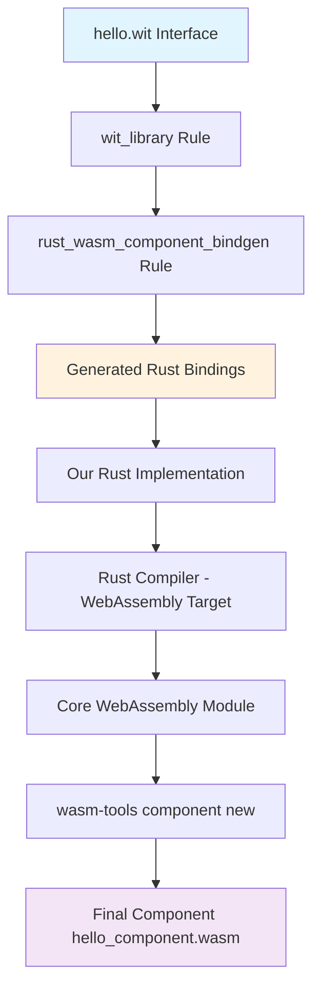

# Complete Rust Component Tutorial

This guided walkthrough takes you from zero to a working WebAssembly component, explaining each step in detail and how it connects to the overall development pipeline.

## What We're Building

We'll create a simple "Hello World" WebAssembly component that:
- Takes a name as input
- Returns a greeting message
- Can be called from any WebAssembly runtime
- Demonstrates the complete development workflow

**End Goal:** A `.wasm` component file that other programs can import and use.

## Pipeline Overview - Where We're Going

Before diving in, let's see the complete journey:



Now let's walk through each step:

---

## Step 1: Interface Design (hello.wit)

**What:** Define the public interface your component will expose
**Why:** This is the "contract" - what functions your component provides and what types they use
**Pipeline Stage:** Starting point - everything else builds from this

```wit title="examples/basic/wit/hello.wit"
/// Hello world interface
package hello:interfaces@0.1.0;

interface greeting {
    /// Say hello to someone
    hello: func(name: string) -> string;
}

world hello {
    export greeting;
}
```

### Breaking This Down:

```wit
package hello:interfaces@0.1.0;
```
- **Package name:** `hello:interfaces` (namespace:package format)
- **Version:** `@0.1.0` (semantic versioning for interface compatibility)
- **Why this matters:** Other components can import this specific version

```wit
interface greeting {
    hello: func(name: string) -> string;
}
```
- **Interface:** Groups related functions together
- **Function signature:** `hello` takes a `string`, returns a `string`
- **Type safety:** WebAssembly Component Model ensures type checking

```wit
world hello-world {
    export greeting;
}
```
- **World:** Defines what this component exports/imports
- **Export:** Our component provides the `greeting` interface to others
- **Import would be:** External interfaces our component depends on

### Key Concepts:
- **Interfaces** are like TypeScript interfaces or Java interfaces
- **Worlds** define the complete "shape" of a component
- **Types** are checked at both compile-time and runtime

---

## Step 2: Build Configuration (BUILD.bazel)

**What:** Tell Bazel how to build our component
**Why:** Orchestrates the entire pipeline automatically
**Pipeline Stage:** Build system coordination

For the complete BUILD.bazel example, see the [basic example](/examples/basic/) which shows the standard pattern used across all Rust components.

### The BUILD.bazel File Orchestrates Three Key Steps:

1. **[`wit_library()`](/reference/rules/#wit_library)** - Processes and validates your WIT interface files
2. **[`rust_wasm_component_bindgen()`](/reference/rules/#rust_wasm_component_bindgen)** - Generates Rust bindings and compiles to WebAssembly 
3. **[`rust_wasm_component_test()`](/reference/rules/#rust_wasm_component_test)** - Creates tests to verify your component works

**What happens behind the scenes:**
- **Stage 1:** WIT Interface Definition → Validated Interface (Internal Bazel representation)
- **Stage 2:** Multiple stages in one rule:
  1. Generate Rust traits/types from WIT
  2. Compile your Rust code with these bindings  
  3. Create WebAssembly core module
  4. Wrap as Component Model component
- **Stage 3:** Test framework integration

**Generated files:**
- Rust bindings (cached by Bazel)
- `hello_component.wasm` (your final component)

### Why Bazel?
- **Hermetic builds:** Same result every time, anywhere
- **Incremental:** Only rebuilds what changed
- **Dependency management:** Automatically downloads tools
- **Cross-platform:** Works on Windows, macOS, Linux

---

## Step 3: Implementation (src/lib.rs)

**What:** Write the actual business logic
**Why:** This is where your component's behavior is defined
**Pipeline Stage:** Component Implementation

```rust title="examples/basic/src/lib.rs"
// Basic hello world WASM component using generated bindings

// Import the generated WIT bindings
use hello_component_bindings::exports::hello::interfaces::greeting::Guest;

// Component implementation
struct Component;

impl Guest for Component {
    fn hello(name: String) -> String {
        format!("Hello, {name}!")
    }
}

// Export the component implementation
hello_component_bindings::export!(Component with_types_in hello_component_bindings);
```

### Breaking This Down:

```rust
use hello_component_bindings::exports::hello::interfaces::greeting::Guest;
```
**What happens:** Import the generated bindings
**Where this comes from:** The `rust_wasm_component_bindgen` rule generated this
**Key insight:** You never write these bindings manually - they're generated from WIT

```rust
struct Component;
```
**What:** Your component implementation
**Pattern:** Empty struct that implements the generated trait

```rust
impl Guest for Component {
    fn hello(name: String) -> String {
        format!("Hello, {name}!")
    }
}
```
**What happens:** Implement the interface defined in WIT
**Type safety:** Function signature must exactly match `hello.wit`
**Business logic:** Your actual component behavior

```rust
hello_component_bindings::export!(Component with_types_in hello_component_bindings);
```
**What happens:** Export this implementation as the component's public interface
**Generated macro:** Creates all the WebAssembly component model plumbing

### Key Insights:
- **Generated bindings** handle all the WebAssembly details
- **Your code** focuses on business logic only
- **Type safety** is enforced from WIT through to implementation
- **Component model plumbing** is automatic

---

## Step 4: The Build Process - What Happens When You Run Bazel

**Command:** `bazel build //:hello_component`

**What Bazel does behind the scenes:**

### Stage 1: WIT Processing
```bash
# Bazel runs wit-bindgen internally
wit-bindgen rust --out-dir $GENERATED_DIR examples/basic/wit/hello.wit
```
**Generated files:**
- `bindings.rs` - Rust traits matching your WIT interface
- Type definitions for all WIT types
- Export macros for component model integration

### Stage 2: Rust Compilation
```bash
# Bazel runs rustc with WebAssembly target
rustc --target wasm32-wasi --crate-type cdylib src/lib.rs
```
**What happens:**
- Compiles your Rust code + generated bindings
- Produces a WebAssembly core module
- Includes WASI (WebAssembly System Interface) support

### Stage 3: Component Wrapping
```bash
# Bazel runs wasm-tools to create component
wasm-tools component new $CORE_MODULE -o hello_component.wasm
```
**What happens:**
- Takes the core WebAssembly module
- Wraps it with Component Model metadata
- Adds interface type information
- Creates final `.wasm` component

### Build Output:
```
bazel-bin/
└── hello_component.wasm  # Your final component!
```

---

## Step 5: Testing Your Component

**Verify it works:**

```bash
# Validate the component structure
bazel run //tools:wasm_validate -- bazel-bin/hello_component.wasm

# Test with wasmtime runtime
wasmtime run --wasi preview2 bazel-bin/hello_component.wasm
```

**What you should see:**
- Component validation passes
- Component can be instantiated by a runtime

### Understanding the Output:

**Component metadata:**
```
Component: hello_component.wasm
├── Exports: hello:interfaces/greeting@0.1.0
├── Functions: hello(name: string) -> string
├── Size: ~50KB (including runtime)
└── WASI: Preview 2 compatible
```

---

## Step 6: How This Connects to Larger Systems

### Using Your Component:

**From another component:**
```wit
// In another component's WIT file
import hello:interfaces/greeting@0.1.0;

world my-app {
    import hello:interfaces/greeting@0.1.0;
    // Your app can now call the hello function
}
```

**From a host application:**
```rust
// In a Rust host application using wasmtime
let greeting = instance.call_hello("World")?;
println!("{}", greeting); // "Hello, World!"
```

### Composition with WAC:
```shell
// Combine multiple components
package my:app@1.0.0;

import hello:interfaces/greeting@0.1.0 from registry.example.com/hello:v1.0.0;
import http:server@1.0.0 from registry.example.com/http-server:v1.0.0;

// Wire them together for a complete application
```

---

## Common Issues and Debugging

### Issue 1: Build Fails with "WIT validation error"
**Symptom:** Error when running `bazel build`
**Cause:** Syntax error in `hello.wit`
**Fix:** Check WIT syntax - common issues:
- Missing semicolons
- Incorrect type names
- Package name format

### Issue 2: "Function signature mismatch"
**Symptom:** Rust compilation error
**Cause:** Your Rust function doesn't match the WIT interface
**Fix:** Ensure exact type matching:
```rust
// WIT: hello: func(name: string) -> string;
// Rust must be:
fn hello(name: String) -> String { ... }
```

### Issue 3: Component won't run
**Symptom:** `wasmtime` fails to load component
**Cause:** Component model format issue
**Debug:**
```bash
# Check component structure
wasm-tools validate bazel-bin/hello_component.wasm
wasm-tools component wit bazel-bin/hello_component.wasm
```

### Issue 4: "Module not found" errors
**Symptom:** Bazel can't find rules or dependencies
**Cause:** Missing dependencies in `MODULE.bazel`
**Fix:** Ensure you have:
```python
bazel_dep(name = "rules_wasm_component", version = "1.0.0")
bazel_dep(name = "rules_rust", version = "0.48.0")
```

---

## Next Steps: Building on This Foundation

### 1. Add More Complex Types
```wit
record person {
    name: string,
    age: u32,
}

interface advanced-greeting {
    greet-person: func(person: person) -> string;
}
```

### 2. Error Handling
```wit
interface safe-math {
    divide: func(a: f64, b: f64) -> result<f64, string>;
}
```

### 3. Multi-Component Systems
- Build multiple components
- Use WAC composition
- Deploy to registries

### 4. Performance Optimization
- Add Wizer pre-initialization
- Optimize for binary size
- Profile memory usage

---

## Key Takeaways

**For Component Model beginners:**
- WIT defines interfaces, Rust implements them
- Generated bindings handle all WebAssembly details
- Components are like libraries that work across languages

**For Bazel beginners:**
- Rules automate the entire pipeline
- Hermetic builds ensure reproducibility
- Incremental builds speed up development

**For the complete workflow:**
1. Design interfaces first (WIT)
2. Configure build (BUILD.bazel)
3. Implement logic (Rust)
4. Build and test (Bazel + wasmtime)
5. Compose and deploy (WAC + OCI)

This tutorial has taken you through the complete journey from interface design to working component. You now understand how each piece connects to create a production-ready WebAssembly component system.
