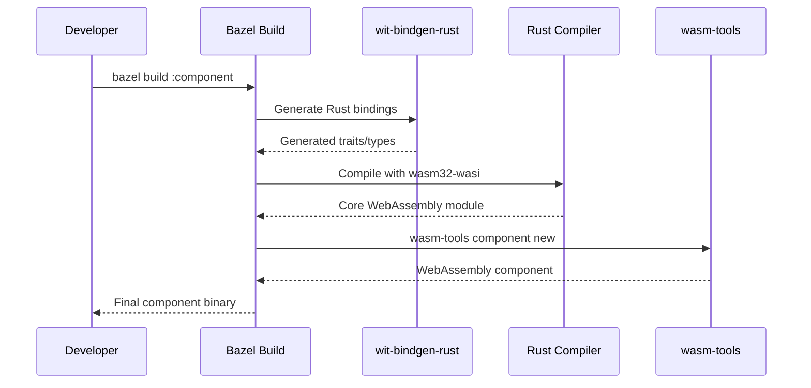
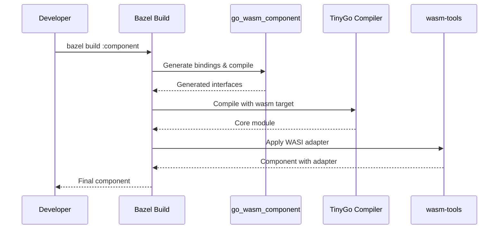
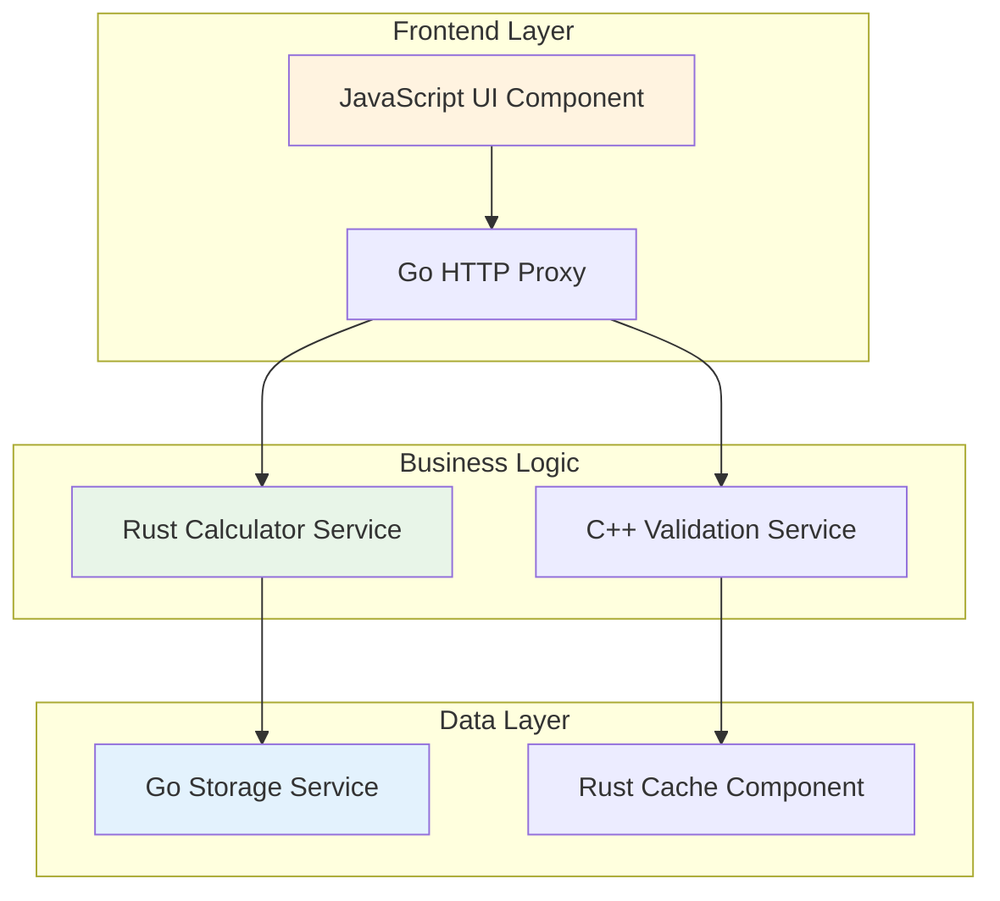

# Complete Development Workflow

A comprehensive guide to building WebAssembly components, from initial interface design through deployment and composition.

## Phase 1: Interface Design

### Define Component Interfaces

Start by designing your component's public interface using the WebAssembly Interface Types (WIT) format, as shown in `examples/basic/wit/hello.wit`:

Key considerations for interface design:

- **Resource Management**: Define owned vs borrowed resources
- **Error Handling**: Use `result<T, E>` types for fallible operations
- **Data Types**: Leverage rich WIT types (records, variants, lists)
- **Versioning**: Plan for interface evolution with semantic versioning

### Validate Interface Design

```bash
# Validate WIT syntax and semantics
bazel build //examples/basic:hello_wit
```

The `wit_library` rule validates interfaces during build, catching:

- Syntax errors in WIT files
- Type resolution issues
- World definition problems
- Import/export inconsistencies

## Phase 2: Implementation

### Generate Language Bindings

The build system automatically generates language-specific bindings from WIT interfaces:

**Rust Binding Generation:** Configured in `examples/basic/BUILD.bazel`

**Go Binding Generation:** Configured in `examples/go_component/BUILD.bazel`

### Implement Component Logic

Each language follows its own implementation patterns:

**Rust Implementation:** See `examples/basic/src/lib.rs`

**Go Implementation:** See `examples/go_component/main.go`

### Language-Specific Build Process

#### Rust Compilation Flow



#### Go/TinyGo Compilation Flow



## Phase 3: Testing and Validation

### Component Testing

Test components using the validation and runtime tools:

```bash
# Validate component structure
bazel run //tools:wasm_validate -- component.wasm

# Test with wasmtime runtime
wasmtime run --wasi preview2 component.wasm

# Run component tests
bazel test //examples/basic:component_test
```

### Integration Testing

Integration tests are configured in `test/integration/BUILD.bazel`:

The test infrastructure provides:

- **Component Validation**: Structural and semantic correctness
- **Runtime Testing**: Execution with wasmtime
- **Interface Compliance**: WIT interface conformance
- **Performance Benchmarks**: Startup time and memory usage

## Phase 4: Optimization

### Wizer Pre-initialization

Optimize component startup with Wizer pre-initialization:

```bash
# Build with Wizer optimization
bazel build //examples/wizer_example:optimized_component
```

**Performance Impact:**

- Startup time: 1.35-6x improvement
- Memory efficiency: Pre-allocated runtime structures
- Reduced initialization overhead

### Build Optimizations

```python
rust_wasm_component_bindgen(
    name = "optimized_component",
    srcs = ["lib.rs"],
    wit = ":interfaces",
    profiles = ["release"],  # Release optimizations
)
```

## Phase 5: Composition

### Local Component Composition

Combine multiple components using WAC (WebAssembly Composition), as demonstrated in `examples/multi_profile/production.wac`:

### Multi-Language System Architecture



### Component Dependency Management

```bash
# Compose components with dependency resolution
bazel run //examples/multi_component_system:compose_system

# Deploy composed system
bazel run //examples/multi_component_system:deploy_k8s
```

## Phase 6: Registry and Deployment

### OCI Registry Publishing

Publish components to container registries for distribution:

```python
oci_push(
    name = "publish_calculator",
    image = ":calculator_component_image",
    repository = "registry.example.com/wasm-components/calculator",
    tag = "v1.0.0",
)
```

### Registry-Based Composition

Reference published components in compositions:

```shell
// microservices.wac
package local:microservices;

import calculator:math@1.0.0 from registry.example.com/calculator:v1.0.0;
import http:server@1.0.0 from registry.example.com/http-server:v1.0.0;

instantiate calculator:math@1.0.0 as calc;
instantiate http:server@1.0.0 as server;

export server.handle = server.handle;
```

### Deployment Strategies

#### Kubernetes Deployment

```yaml
apiVersion: apps/v1
kind: Deployment
metadata:
  name: wasm-microservice
spec:
  template:
    spec:
      containers:
        - name: wasmtime-runner
          image: wasmtime/wasmtime:latest
          command: ['wasmtime', 'run', '--wasi', 'preview2', '/app/component.wasm']
          volumeMounts:
            - name: component-volume
              mountPath: /app
```

#### Serverless Functions

```bash
# Deploy to WebAssembly-enabled serverless platform
wasm-functions deploy --component calculator.wasm --trigger http
```

## Development Best Practices

### Interface Design Principles

- **Stability**: Design interfaces for long-term stability
- **Composability**: Enable component reuse across systems
- **Performance**: Consider serialization costs for complex types
- **Security**: Minimize capabilities and surface area

### Build System Integration

- **Hermetic Builds**: All dependencies managed by Bazel
- **Incremental Building**: Only rebuild changed components
- **Cross-Platform**: Support Windows, macOS, Linux development
- **CI/CD Integration**: Automated testing and deployment

### Performance Considerations

- **Memory Layout**: Optimize data structures for WebAssembly
- **Binary Size**: Use appropriate optimization levels
- **Startup Time**: Leverage Wizer for initialization-heavy components
- **Runtime Efficiency**: Profile and optimize hot paths

### Security Guidelines

- **Capability Model**: Grant minimal required permissions
- **Input Validation**: Validate all external inputs
- **Resource Limits**: Set appropriate memory and execution limits
- **Component Isolation**: Maintain clear security boundaries

This workflow enables teams to build production-ready WebAssembly component systems with confidence, from initial design through deployment and maintenance.
