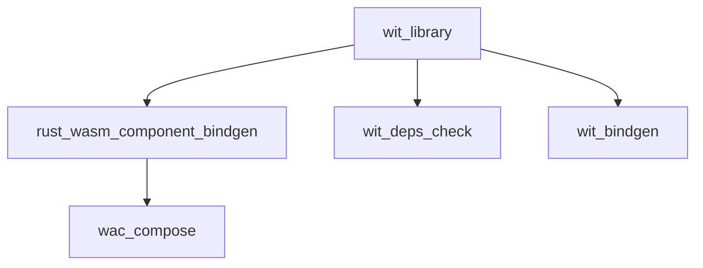

# AI Agent Guide for rules_wasm_component

This guide provides structured information for AI coding assistants to understand and use the WebAssembly Component Model rules effectively. It follows Model Context Protocol (MCP) best practices for decomposition, iteration, and validation.

> **⚠️ Critical for AI Agents**: This documentation is based on hard-learned lessons from implementing these rules. The pitfalls documented here represent actual issues we encountered and solved. Following these patterns prevents repeating the same mistakes.

## MCP-Aligned Approach for AI Agents

### Core Principles

1. **Decomposition**: Break complex tasks into smaller, verifiable steps
2. **Iteration**: Use feedback loops for validation and course correction
3. **Validation**: Verify each step before proceeding
4. **Context Management**: Properly interpret tool results and maintain state

### Task Decomposition Strategy

When working with WebAssembly components:

1. Understand the WIT interface requirements
2. Identify dependencies and their relationships
3. Build components incrementally
4. Test and validate each component
5. Compose components with proper validation
6. Verify final system integration

## Quick Reference

### Core Rules

- `wit_library()` - Define WIT interface libraries
- `rust_wasm_component_bindgen()` - Build Rust WASM components
- `wac_compose()` - Compose multiple WASM components

### Providers

- `WitInfo` - WIT interface metadata
- `WasmComponentInfo` - WASM component metadata

### Dependencies Setup

```starlark
# MODULE.bazel
bazel_dep(name = "rules_wasm_component", version = "0.1.0")
```

## Rule Usage Patterns

### Pattern 1: Simple WIT Library

```starlark
load("@rules_wasm_component//wit:defs.bzl", "wit_library")

wit_library(
    name = "my_interfaces",
    package_name = "my:pkg@1.0.0",
    srcs = ["interfaces.wit"],
)
```

### Pattern 2: WIT Library with Dependencies

```starlark
wit_library(
    name = "consumer_interfaces",
    package_name = "consumer:app@1.0.0",
    srcs = ["consumer.wit"],
    deps = ["//external:interfaces"],
)
```

### Pattern 3: Rust WASM Component

```starlark
load("@rules_wasm_component//rust:defs.bzl", "rust_wasm_component_bindgen")

rust_wasm_component_bindgen(
    name = "my_component",
    srcs = ["src/lib.rs"],
    wit = ":my_interfaces",
    profiles = ["release"],
)
```

Rust implementation pattern:

```rust
// src/lib.rs
use my_component_bindings::exports::my::pkg::interface_name::Guest;

struct Component;
impl Guest for Component {
    // Implement interface methods
}

my_component_bindings::export!(Component with_types_in my_component_bindings);
```

## Rule Attributes Reference

### wit_library

| Attribute      | Type          | Required | Description                               |
| -------------- | ------------- | -------- | ----------------------------------------- |
| `name`         | `string`      | ✓        | Target name                               |
| `srcs`         | `label_list`  | ✓        | WIT source files (\*.wit)                 |
| `package_name` | `string`      | ✗        | WIT package name (e.g., "pkg:name@1.0.0") |
| `deps`         | `label_list`  | ✗        | WIT library dependencies                  |
| `world`        | `string`      | ✗        | World name to export                      |
| `interfaces`   | `string_list` | ✗        | Interface names defined                   |

### rust_wasm_component_bindgen

| Attribute  | Type          | Required | Description                                   |
| ---------- | ------------- | -------- | --------------------------------------------- |
| `name`     | `string`      | ✓        | Target name                                   |
| `srcs`     | `label_list`  | ✓        | Rust source files                             |
| `wit`      | `label`       | ✓        | WIT library target                            |
| `profiles` | `string_list` | ✗        | Build profiles ["debug", "release", "custom"] |

## Provider Information

### WitInfo

```starlark
# Fields available in WitInfo provider:
info.wit_files        # depset: WIT source files
info.wit_deps         # depset: Transitive WIT dependencies
info.package_name     # string: WIT package name
info.world_name       # string: World name (optional)
info.interface_names  # list: Interface names
```

### Usage in custom rules:

```starlark
def _my_rule_impl(ctx):
    wit_info = ctx.attr.wit[WitInfo]
    package_name = wit_info.package_name
    wit_files = wit_info.wit_files.to_list()
    # ...
```

## Common Patterns

### Check Missing Dependencies

```bash
# If you get "package not found" errors:
bazel build //your/package:check_deps
cat bazel-bin/.../check_deps_report.txt
```

### Multi-Component Composition

```starlark
load("@rules_wasm_component//wac:defs.bzl", "wac_compose")

wac_compose(
    name = "composed_system",
    components = {
        ":component_a": "comp_a",
        ":component_b": "comp_b",
    },
    composition = '''
        let a = new comp_a {};
        let b = new comp_b {};
        export a;
    ''',
)
```

## Error Resolution

### Error: "package 'pkg:name@1.0.0' not found"

**Solution:** Add missing dependency to `deps` attribute

```starlark
wit_library(
    deps = ["//path/to:missing_package"],
)
```

### Error: "No .wit files found"

**Solution:** Check `srcs` attribute points to .wit files

```starlark
wit_library(
    srcs = ["interfaces.wit"],  # Must be .wit files
)
```

### Error: "missing `with` mapping for the key `package:name@1.0.0`"

**Status:** Fixed in latest version
**Solution:** External dependencies now work automatically with `--generate-all` flag

## File Organization

```
my_component/
├── BUILD.bazel           # Bazel build definitions
├── src/
│   └── lib.rs           # Rust implementation
├── wit/
│   └── interfaces.wit   # WIT interface definitions
└── tests/
    └── integration_test.rs
```

## Dependencies Between Rules



## Build Outputs

### wit_library outputs:

- `{name}_wit/` - Directory with WIT files and deps structure

### rust_wasm_component_bindgen outputs:

- `{name}_{profile}.wasm` - WASM component file
- `{name}_wit_bindgen_gen.rs` - Generated Rust bindings

## Bazel Rule Usage Guidelines for AI Agents

### wit_library Rule Patterns

#### Dependency Management

```starlark
wit_library(
    name = "my_interfaces",
    package_name = "org:project@1.0.0",  # Required for external deps
    srcs = ["interface.wit"],
    deps = [":other_wit_library"],  # Bazel target dependencies
)
```

#### Common Pitfalls with wit_library

- ❌ Forgetting `package_name` when other libraries depend on this
- ❌ Using file paths instead of Bazel targets in `deps`
- ✅ Always use Bazel target labels (`:target` or `//path:target`)

### rust_wasm_component_bindgen Rule Patterns

#### Basic Usage

```starlark
rust_wasm_component_bindgen(
    name = "my_component",
    srcs = ["src/lib.rs"],
    wit = ":my_interfaces",  # Reference to wit_library target
    profiles = ["debug", "release"],  # Build variants
)
```

#### Module Naming Convention

- Generated bindings follow pattern: `{target_name}_bindings`
- Import paths follow WIT package structure
- Example: For target `my_component`, use `my_component_bindings` in Rust

### wac_compose Rule Patterns

#### Component Mapping

```starlark
wac_compose(
    name = "composed_system",
    components = {
        ":component_target": "wit:package",  # Map Bazel target to WIT package
    },
    composition = """..."""  # WAC composition syntax
)
```

#### WASI Component Composition

```starlark
wac_compose(
    name = "wasi_system",
    components = {
        ":wasi_component": "my:component",
    },
    composition = """
        package my:system@1.0.0;

        # Use ... syntax for WASI components
        let comp = new my:component { ... };
        export comp;
    """,
)
```

#### Composition Patterns

- **For WASI components**: Always use `{ ... }` in instantiation
- **For regular components**: List all required imports explicitly
- **Package declaration**: Required in composition string

### wac_bundle Rule (Alternative to Composition)

```starlark
wac_bundle(
    name = "component_bundle",
    components = [
        ":component_a",
        ":component_b",
    ],
)
```

### wit_deps_check Rule for Validation

```starlark
wit_deps_check(
    name = "check_deps",
    wit_file = "consumer.wit",
)
```

## How Our Rules Handle Tool Invocations

### wit_bindgen Integration

- **Automatic `--generate-all`**: Added when external deps detected
- **No manual flags needed**: Rule handles all wit-bindgen configuration
- **Directory structure**: Rule creates proper deps layout automatically

### WAC Integration

- **Component resolution**: Rule maps Bazel targets to WAC names
- **Hermetic execution**: No workspace spillage, all in Bazel cache
- **Automatic deps directory**: Created via Go tool, not shell commands

### Key Implementation Details

- **wit_library creates**: `{name}_wit/` directory with proper structure
- **rust_wasm_component_bindgen creates**: `{name}_{profile}.wasm` files
- **wac_compose creates**: Final composed `.wasm` file
- **All artifacts**: Stored in `bazel-bin/`, part of Bazel cache

## Validation and Error Resolution

### Iterative Validation Approach

1. **Build incrementally**: Test each component before composition
2. **Validate dependencies**: Use `wit_deps_check` rule for missing packages
3. **Verify outputs**: Check generated files exist in `bazel-bin/`
4. **Test compositions**: Ensure WAC compositions are valid

### Common Error Patterns and Solutions

#### "package 'name:pkg@1.0.0' not found" in wit_library

**Root Cause**: Missing dependency in `deps` attribute
**Solution**: Add the required wit_library to `deps`

```starlark
wit_library(
    deps = [":missing_library"],  # Add missing Bazel target
)
```

#### "No .wit files found" in wit_library

**Root Cause**: Incorrect `srcs` attribute
**Solution**: Ensure `srcs` points to actual `.wit` files

```starlark
wit_library(
    srcs = ["interfaces.wit"],  # Must be .wit files
)
```

#### "missing instantiation argument wasi:\*" in wac_compose

**Root Cause**: WASI components need import pass-through
**Solution**: Use `{ ... }` syntax in composition attribute

```starlark
wac_compose(
    composition = """
        let comp = new my:component { ... };  # Allow WASI imports
    """,
)
```

#### Build errors with external dependencies

**Root Cause**: Missing `package_name` in wit_library
**Solution**: Always specify `package_name` for libraries used by others

```starlark
wit_library(
    package_name = "org:lib@1.0.0",  # Required for external use
)
```

#### "Module not found" in Rust code

**Root Cause**: Incorrect module name in imports
**Solution**: Use `{target_name}_bindings` pattern

```rust
// For target "my_component":
use my_component_bindings::exports::...;
```

## Lessons Learned: Critical Pitfalls to Avoid

### Historical Issues We Solved (Don't Repeat These)

#### 1. Non-Hermetic Shell Commands

**What we did wrong**: Used shell commands in Bazel rules

```starlark
# ❌ NEVER DO THIS:
ctx.actions.run_shell(
    command = "mkdir -p {} && ln -s ...".format(deps_dir),
)
```

**What we learned**: Use native Bazel actions with proper I/O declaration

```starlark
# ✅ CORRECT APPROACH:
ctx.actions.run(
    executable = ctx.executable._tool,
    inputs = inputs,
    outputs = [deps_dir],
)
```

#### 2. WAC Registry Resolution Confusion

**What we did wrong**: Assumed WAC would resolve local components
**What we learned**: WAC tries registry lookup for versioned package names
**Solution implemented**: Map components to unversioned package names in our rule

#### 3. WASI Import Satisfaction Misunderstanding

**What we did wrong**: Tried to satisfy all imports during composition
**What we learned**: WASI imports should pass through to host runtime
**Solution implemented**: Use `{ ... }` syntax for WASI components

#### 4. Symlink Path Issues

**What we did wrong**: Created absolute path symlinks in Bazel sandbox
**What we learned**: Absolute paths become dangling in sandbox
**Solution implemented**: Use relative paths computed with `filepath.Rel()`

### MCP-Aligned Best Practices for AI Agents

1. **Always specify `package_name`** in wit_library for external dependencies
2. **Use explicit `deps`** with Bazel target labels, not file paths
3. **Check build errors** with `wit_deps_check` rule before proceeding
4. **Follow naming conventions**: `{component}_interfaces` for WIT libraries
5. **Test components** with multiple profiles when needed
6. **Validate each step** before moving to composition
7. **Use MCP decomposition** for complex multi-component systems
8. **Trust the rules' automatic tooling** - they handle wit-bindgen and WAC complexity
9. **Check provider data** before making assumptions about dependencies
10. **Iterate with validation** rather than building everything at once
11. **Never use shell commands** in custom rules - use native Bazel actions
12. **For WASI components** - always use `{ ... }` in compositions
13. **Understand tool behavior** - don't assume direct tool invocation patterns apply

## Integration Examples

### With External Crates

```starlark
load("@crates//:defs.bzl", "crate")

rust_wasm_component_bindgen(
    name = "my_component",
    srcs = ["src/lib.rs"],
    wit = ":interfaces",
    deps = [
        crate("serde"),
        # Note: wit-bindgen is automatically provided by the rule
    ],
)
```

### Multi-Language Components

```starlark
# Future: Other language bindings
# go_wasm_component(...)
# python_wasm_component(...)
```

## Implementation Architecture Understanding

### How Our Rules Work Internally

1. **wit_library**: Creates structured directory with deps, runs validation
2. **rust_wasm_component_bindgen**: Invokes wit-bindgen with auto-detected flags
3. **wac_compose**: Creates deps directory, maps components, runs WAC
4. **All rules**: Maintain hermetic execution within Bazel cache

### Key Internal Tools

- **wit-bindgen**: Invoked automatically with proper `--generate-all` flag
- **WAC**: Invoked with component mappings and deps directories
- **Go deps tool**: Creates hermetic deps directories with relative symlinks
- **wit-deps-check**: Validates WIT dependency completeness

### Provider System

```starlark
# WitInfo provider carries:
- wit_files: depset of .wit source files
- wit_deps: depset of transitive dependencies
- package_name: WIT package identifier
- world_name: Optional world name
- interface_names: List of defined interfaces

# WasmComponentInfo provider carries:
- wasm_file: Generated .wasm component
- wit_info: Associated WIT information
```
