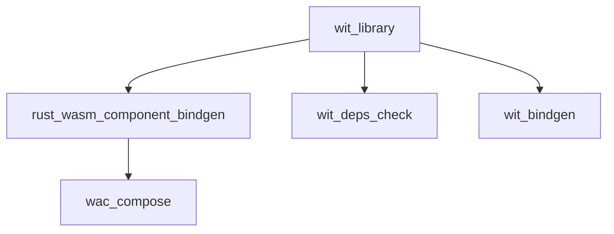

# AI Agent Guide for rules_wasm_component

This guide provides structured information for AI coding assistants to understand and use the WebAssembly Component Model rules effectively.

## Quick Reference

### Core Rules
- `wit_library()` - Define WIT interface libraries
- `rust_wasm_component_bindgen()` - Build Rust WASM components
- `wac_compose()` - Compose multiple WASM components

### Providers
- `WitInfo` - WIT interface metadata
- `WasmComponentInfo` - WASM component metadata

### Dependencies Setup
```starlark
# MODULE.bazel
bazel_dep(name = "rules_wasm_component", version = "0.1.0")
```

## Rule Usage Patterns

### Pattern 1: Simple WIT Library
```starlark
load("@rules_wasm_component//wit:defs.bzl", "wit_library")

wit_library(
    name = "my_interfaces",
    package_name = "my:pkg@1.0.0",
    srcs = ["interfaces.wit"],
)
```

### Pattern 2: WIT Library with Dependencies
```starlark
wit_library(
    name = "consumer_interfaces", 
    package_name = "consumer:app@1.0.0",
    srcs = ["consumer.wit"],
    deps = ["//external:interfaces"],
)
```

### Pattern 3: Rust WASM Component
```starlark
load("@rules_wasm_component//rust:defs.bzl", "rust_wasm_component_bindgen")

rust_wasm_component_bindgen(
    name = "my_component",
    srcs = ["src/lib.rs"],
    wit = ":my_interfaces",
    profiles = ["release"],
)
```

Rust implementation pattern:
```rust
// src/lib.rs
use my_component_bindings::exports::my::pkg::interface_name::Guest;

struct Component;
impl Guest for Component {
    // Implement interface methods
}

my_component_bindings::export!(Component with_types_in my_component_bindings);
```

## Rule Attributes Reference

### wit_library
| Attribute | Type | Required | Description |
|-----------|------|----------|-------------|
| `name` | `string` | ✓ | Target name |
| `srcs` | `label_list` | ✓ | WIT source files (*.wit) |
| `package_name` | `string` | ✗ | WIT package name (e.g., "pkg:name@1.0.0") |
| `deps` | `label_list` | ✗ | WIT library dependencies |
| `world` | `string` | ✗ | World name to export |
| `interfaces` | `string_list` | ✗ | Interface names defined |

### rust_wasm_component_bindgen  
| Attribute | Type | Required | Description |
|-----------|------|----------|-------------|
| `name` | `string` | ✓ | Target name |
| `srcs` | `label_list` | ✓ | Rust source files |
| `wit` | `label` | ✓ | WIT library target |
| `profiles` | `string_list` | ✗ | Build profiles ["debug", "release", "custom"] |

## Provider Information

### WitInfo
```starlark
# Fields available in WitInfo provider:
info.wit_files        # depset: WIT source files
info.wit_deps         # depset: Transitive WIT dependencies  
info.package_name     # string: WIT package name
info.world_name       # string: World name (optional)
info.interface_names  # list: Interface names
```

### Usage in custom rules:
```starlark
def _my_rule_impl(ctx):
    wit_info = ctx.attr.wit[WitInfo]
    package_name = wit_info.package_name
    wit_files = wit_info.wit_files.to_list()
    # ...
```

## Common Patterns

### Check Missing Dependencies
```bash
# If you get "package not found" errors:
bazel build //your/package:check_deps
cat bazel-bin/.../check_deps_report.txt
```

### Multi-Component Composition
```starlark
load("@rules_wasm_component//wac:defs.bzl", "wac_compose")

wac_compose(
    name = "composed_system",
    components = {
        ":component_a": "comp_a",
        ":component_b": "comp_b", 
    },
    composition = '''
        let a = new comp_a {};
        let b = new comp_b {};
        export a;
    ''',
)
```

## Error Resolution

### Error: "package 'pkg:name@1.0.0' not found"
**Solution:** Add missing dependency to `deps` attribute
```starlark
wit_library(
    deps = ["//path/to:missing_package"],
)
```

### Error: "No .wit files found"
**Solution:** Check `srcs` attribute points to .wit files
```starlark
wit_library(
    srcs = ["interfaces.wit"],  # Must be .wit files
)
```

### Error: "missing `with` mapping for the key `package:name@1.0.0`"
**Status:** Fixed in latest version
**Solution:** External dependencies now work automatically with `--generate-all` flag

## File Organization

```
my_component/
├── BUILD.bazel           # Bazel build definitions
├── src/
│   └── lib.rs           # Rust implementation  
├── wit/
│   └── interfaces.wit   # WIT interface definitions
└── tests/
    └── integration_test.rs
```

## Dependencies Between Rules



## Build Outputs

### wit_library outputs:
- `{name}_wit/` - Directory with WIT files and deps structure

### rust_wasm_component_bindgen outputs:  
- `{name}_{profile}.wasm` - WASM component file
- `{name}_wit_bindgen_gen.rs` - Generated Rust bindings

## Best Practices for AI Agents

1. **Always specify `package_name`** in wit_library for external dependencies
2. **Use explicit `deps`** rather than implicit dependencies
3. **Check build errors** with `wit_deps_check` rule
4. **Follow naming conventions**: `{component}_interfaces` for WIT libraries
5. **Test components** with multiple profiles when needed

## Integration Examples

### With External Crates
```starlark
load("@crates//:defs.bzl", "crate")

rust_wasm_component_bindgen(
    name = "my_component",
    srcs = ["src/lib.rs"],
    wit = ":interfaces",
    deps = [
        crate("serde"),
        # Note: wit-bindgen is automatically provided by the rule
    ],
)
```

### Multi-Language Components
```starlark
# Future: Other language bindings
# go_wasm_component(...)
# python_wasm_component(...) 
```