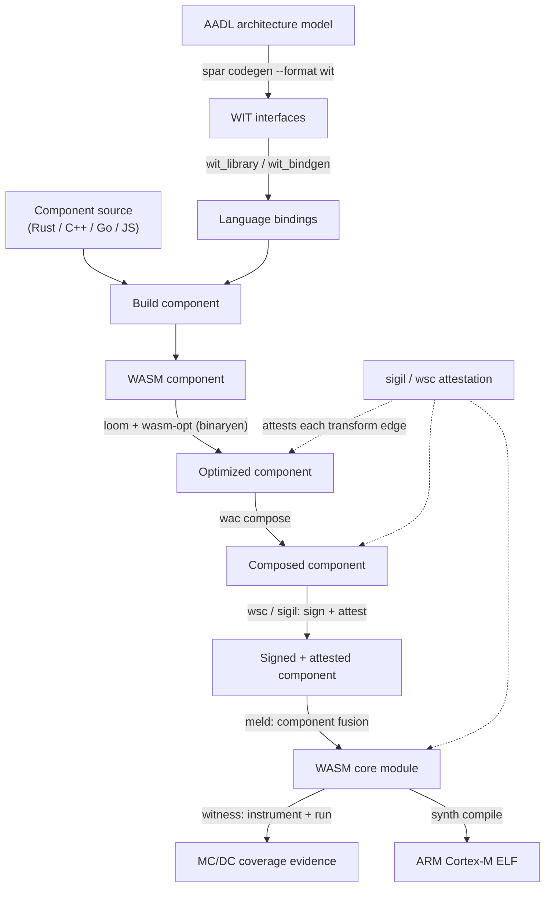

# Certifiable WebAssembly Pipeline

This document describes the end-to-end build-and-verification pipeline that
`rules_wasm_component` targets, integrating the PulseEngine toolchain
(`spar`, `loom`, `meld`, `sigil`/`wsc`, `witness`, `synth`). It is the
reference flow for producing **certifiable** WebAssembly artifacts — the tool
ordering has a DO-178C / ISO 26262 lineage.

## Flow

## Stages

| Stage | Tool | Consumes | Produces |
|-------|------|----------|----------|
| Interface generation | **spar** | AADL v2.3 architecture model | `wit/*.wit` (one per `process`) |
| Binding generation | `wit_library` / `wit_bindgen` | WIT interfaces | Language bindings |
| Build | existing language rules | source + bindings | WASM component |
| Optimization | **loom** + **wasm-opt** (binaryen) | WASM component | Optimized component |
| Composition | `wac` | components | Composed component |
| Sign & attest | **sigil** (`wsc` CLI) | composed component | Signed + attested component |
| Fusion | **meld** | composed component | WASM **core module** (`MeldFusedInfo`) |
| Coverage | **witness** | core module | MC/DC branch-coverage evidence |
| Target compile | **synth** | core module | ARM Cortex-M ELF |

## Key architectural points

- **`meld` is the component → core-module bridge.** `witness` and `synth`
  both operate on *core modules*, not components — `meld`'s component fusion
  is what makes them applicable. Both consume the same `MeldFusedInfo`
  provider (`synth_compile.bzl` already does); the `witness` rule should too.
- **`spar` extends the pipeline's origin point** from hand-authored WIT to
  WIT derived from a formal AADL architecture model.
- **`sigil`/`wsc` attestation wraps each transform edge** so the entire chain
  is independently verifiable — this is what the existing `wasm_attest` /
  `wasm_verify_chain` / `wasm_show_chain` rules provide.

## Tool integration status

| Tool | Repo | Latest | Status |
|------|------|--------|--------|
| loom | `pulseengine/loom` | 0.3.0 | ✅ Integrated (`wasm_optimize`) |
| meld | `pulseengine/meld` | 0.1.0 | ✅ Integrated (`meld_fuse`, native toolchain) |
| sigil (`wsc`) | `pulseengine/sigil` | 0.7.0 | ✅ Integrated (`wasm_attest` etc.) |
| spar | `pulseengine/spar` | 0.9.3 | 🔜 Planned — `aadl_wit_library` rule |
| witness | `pulseengine/witness` | 0.22.0 | 🔜 Planned — `wasm_module_coverage` rule |
| synth | `pulseengine/synth` | — | ⏸️ Deferred — awaiting an upstream release |

See rivet design-decision artifacts in `artifacts/decisions.yaml` for the
recorded rationale behind this pipeline and the integration plan.
