# OCI Image Signing for WebAssembly Components

This example demonstrates **dual-layer security** for WebAssembly components published to OCI registries:

1. **Component-level signing** with `wasmsign2` - Signs the WASM component binary
2. **OCI image signing** with `cosign` - Signs the OCI manifest and layers

## Security Architecture

```mermaid
graph TD
    A[WASM Component] --> B[Component Signing with wasmsign2]
    B --> C[Signed WASM Component]
    C --> D[OCI Image Creation with wkg]
    D --> E[OCI Manifest Signing with cosign]
    E --> F[🔒 Dual-Layer Signed Image]

    style F fill:#e8f5e8,stroke:#4caf50,stroke-width:3px
```



## Prerequisites

### 1. Local OCI Registry

```bash
# Start a local registry for testing
docker run -d -p 5000:5000 --name registry registry:2
```

### 2. cosign Key Pair (for full example)

```bash
# Generate cosign key pair
cosign generate-key-pair --output-key-prefix oci-signing-demo

# This creates:
# - oci-signing-demo.key (private key)
# - oci-signing-demo.pub (public key)
```

## Examples

### 1. Component Signing Only

```bash
# Build component with WASM-level signing only
bazel build //examples/oci_signing:component_signed_greeting_image
```

### 2. Dual-Layer Signing (Full Security)

```bash
# Build component with both WASM and OCI signing
bazel build //examples/oci_signing:secure_greeting_image
```

### 3. Publish to Registry

```bash
# Publish the secure component
bazel run //examples/oci_signing:publish_secure_greeting
```

### 4. Verify Signatures

```bash
# Verify both signature layers
bazel test //examples/oci_signing:verify_secure_greeting
```

## Security Levels Comparison

| Security Level | Component Signed | OCI Manifest Signed | Protection |
|---------------|------------------|-------------------|------------|
| **None** | ❌ | ❌ | Basic integrity only |
| **Component Only** | ✅ | ❌ | WASM code integrity |
| **OCI Only** | ❌ | ✅ | Container image integrity |
| **Dual-Layer** | ✅ | ✅ | **Full supply chain security** |

## Verification Workflow

At runtime, both signature layers are verified:

```bash
# 1. Verify OCI manifest signature
cosign verify localhost:5000/examples/secure-greeting:dual-signed-v1.0.0

# 2. Pull and verify component signature
wkg oci pull localhost:5000/examples/secure-greeting:dual-signed-v1.0.0 --output component.wasm
wasm-tools validate component.wasm --verify-signature
```

## Production Deployment

For production environments:

1. **Use real signing keys** (not the placeholder keys in this example)
2. **Store keys securely** (HSM, key management service)
3. **Implement signature verification** in your deployment pipeline
4. **Set up monitoring** for signature verification failures

## Integration with CI/CD

```starlark
# In your production BUILD.bazel
wasm_component_signed_oci_image(
    name = "production_component",
    component = ":my_component",

    # Enable full security
    sign_component = True,
    component_signing_keys = ":prod_wasm_keys",
    sign_oci_image = True,
    oci_signing_key = ":prod_cosign_key",

    # Production registry
    registry = "gcr.io",
    namespace = "my-company",
    tag = "v{BUILD_VERSION}",
)
```

This provides **defense-in-depth** security for WebAssembly components in production environments! 🔒
